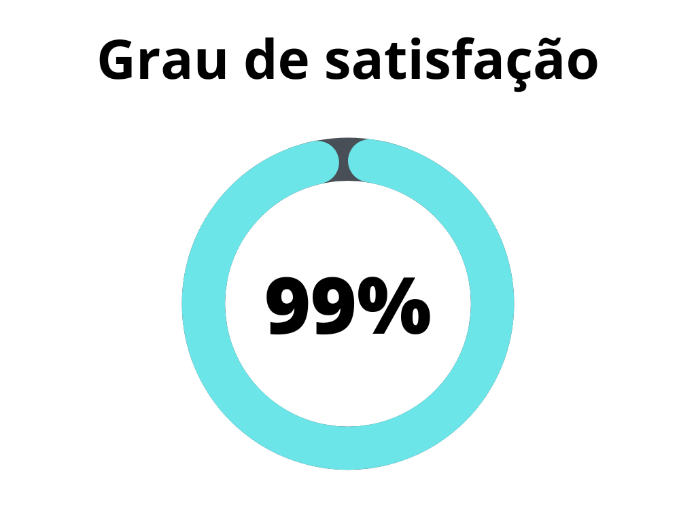
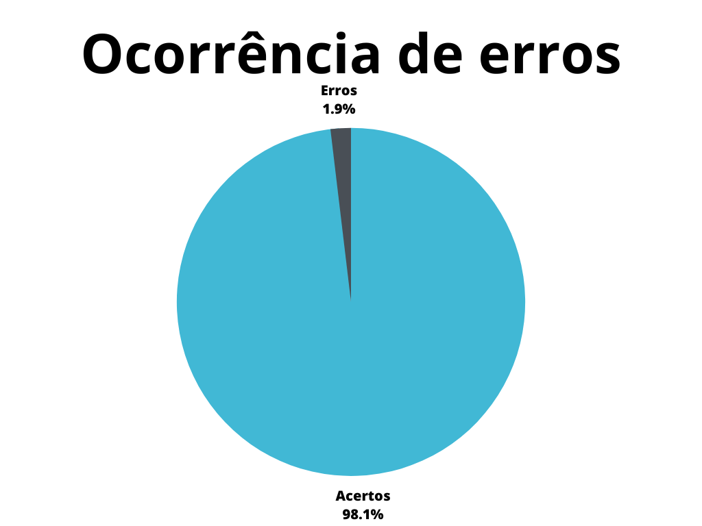

# NFR Framework

## 1. Introdução

O NFR Framework é uma abordagem para representar e analisar requisitos não funcionais de um sistema, buscando representar as dependências para a satisfação de cada requisito[3].

A verificação teve como objeto a versão 1.1 do documento e foi realizada no dia 21 de junho de 2023.

## 2. Metodologia

A verificação a seguir segue a metodologia proposta no [planejamento](./planejamento.md)[1], onde serão utilizados checklists para a verificação dos conteúdos presentes no artefato, buscando encontrar erros e elementos faltantes no mesmo.

Abaixo seguem as verificações de conteúdo elaboradas, contendo a justificativa de cada uma além de sua fonte:

### 2.1 Verificação 1 - O artefato possui a metodologia utilizada?  
É importe que o artefato deixe claro os métodos utilizados para a obtenção e desenvolvimento do conteúdo apresentado, buscando inteirar o leitor acerca do que é tratado pelo mesmo.

`SALES, André Barros. Plano de ensino da disciplina.`

### 2.2 Verificação 2 - O artefato possui os diagramas desenvolvidos?
Como o artefato se refere à modelagem dos requisitos não funcionais através do NFR Framework, espera-se que o mesmo apresente os SIGs(_Softgoal _) utilizados para tal modelagem.

`SALES, André Barros. Plano de ensino da disciplina.`

### 2.3 Verificação 3 - Os diagramas foram retirados e adaptados de fonte confiável?
Para que os diagramas utilizados possuam a garantia de estarem corretos e abordarem todos os objetivos necessários para a satisfação de um requisito, é importante que os mesmos sejam originados de fontes reconhecidas e confiáveis.

`SALES, André Barros. Plano de ensino da disciplina.`

### 2.4 Verificação 4 - O artefato possui a definição de NFR?
Para que um documento técnico seja lido de forma correta, é necessária uma base teórica por parte do leitor, tal base deve ser fornecida pelo próprio documento, através de uma boa introdução contendo todos os dados necessários.

`SALES, André Barros. Plano de ensino da disciplina.`

### 2.5 Verificação 5 - O artefato possui o cartão de especificação para o NFR?
O cartão de especificação é uma maneira eficiente de manter uma rastreabilidade de um requisito não funcional, além de conter informações importantes acerca de cada requisito, portanto o artefato deve conter tais cartões, para que todas as informações pertinentes sejam apresentadas.

`SALES, André Barros. Plano de ensino da disciplina.`

### 2.6 Verificação 6 - Os softgoals condizem com o contexto?
Para manter a coerência nos diagramas, é necessário que os softgoals de cada um seja condizente com o contexto do aplicativo analisado.

`SALES, André Barros. Plano de ensino da disciplina.`

### 2.7 Verificação 7 - Os softgoals são claros e específicos?
Softgoals representam objetivos a serem atingidos pelo sistema, por conta disso devem ser o mais claro e específico possível, para evitar ambiguidade ou confusão por parte do leitor.

`SILVA, Reinaldo Antônio da. NFR4ES: um catálogo de requisitos não-funcionais para sistemas embarcados.`

### 2.8 Verificação 8 - Os impactos foram corretamente propagados?
Os impactos são de extrema importância para um diagrama, pois indicam se um objetivo do sistema foi atendido ou não, além de indicar de qual forma um softgoal pode impactar outros.

`SALES, André Barros. Plano de ensino da disciplina.`

### 2.9 Verificação 9 - Os tipos de softgoals foram corretamente representados?
Para que exista um padrão na bibliografia, foram apresentadas formas específicas de representar cada tipo de softgoal, portanto os diagramas presentes no artefato também devem seguir este padrão.

`SILVA, Reinaldo Antônio da. NFR4ES: um catálogo de requisitos não-funcionais para sistemas embarcados.`

### 2.10 Verificação 10 - As contribuições foram corretamente representadas?
Contribuições são uma forma de representar como cada softgoal impacta positiva ou negativamente os softgoals acima dele, são importantes para a propagação.

`SILVA, Reinaldo Antônio da. NFR4ES: um catálogo de requisitos não-funcionais para sistemas embarcados.`

### 2.11 Verificação 11 - Os impactos levaram em consideração as contribuições?
Como as contribuições representam o papel de um softgoal em relação a outro, é importante que as considerem no momento de propagar os impactos de um softgoal em outro.

`SILVA, Reinaldo Antônio da. NFR4ES: um catálogo de requisitos não-funcionais para sistemas embarcados.`

## 3. Desenvolvimento

### 3.1 Padronização

Na tabela 3, se encontra o _[checklist](../../planejamento/glossario.md#Checklist)_ de padronização preenchido após a realização da verificação.

| ID | Verificação | Realizado |
|--|--|--|
| 1 | Possui ortografia correta e formal? | Não |
| 2 | Possui introdução? | Sim |
| 3 | Possui links necessários? | Sim |
| 4 | As tabelas e imagens possuem legenda padronizada e chamada no texto? | Sim |
| 5 | As tabelas e imagens estão totalmente em português? | Sim |
| 6 | Possui bibliografia? | Sim |
| 7 | A bibliografia está em ordem alfabética? | Sim |
| 8 | Possui histórico de versão padronizado? | Sim |
| 9 | O histórico de versão possui autor(es) e revisor(es)? | Sim |

### 3.2 Conteúdo

Na tabela 4, se encontra o _[checklist](../../planejamento/glossario.md#Checklist)_ de conteúdo preenchido após a realização da verificação. As verificações realizadas foram obtidas a partir do plano de ensino da disciplina[2] e do capítulo 2, seção 2.4 da dissertação de Reinaldo Silva[3].

| ID | Verificação | Ocorrências | Acertos | Erros |
|--|--|--|--|--|
| 1 | O artefato possui a metodologia utilizada?[2] | 1 | 1 | 0 |
| 2 | O artefato possui os diagramas desenvolvidos?[2] | 1 | 1 | 0 |
| 3 | Os diagramas foram retirados e adaptados de fonte confiável?[2] | 1 | 1 | 0 |
| 4 | O artefato possui a definição de NFR?[2] | 1 | 1 | 0 |
| 5 | O artefato possui o cartão de especificação para o NFR?[2] | 1 | 0 | 1 |
| 6 | Os softgoals condizem com o contexto?[2] | 8 | 8 | 0 |
| 7 | Os softgoals são claros e específicos?[3] | 8 | 8 | 0 |
| 8 | Os impactos foram corretamente propagados?[2] | 8 | 8 | 0 |
| 9 | Os tipos de softgoals foram corretamente representados?[3] | 8 | 8 | 0 |
| 10 | As contribuições foram corretamente representadas?[3] | 8 | 8 | 0 |
| 11 | Os impactos levaram em consideração as contribuições?[3] | 8 | 8 | 0 |

## 4. Problemas encontrados

### 4.1 ID 1 Possui ortografia correta e formal?

Possui alguns erros de grafia

## 4.2 Verificação 5 - O artefato possui o cartão de especificação para o NFR?

Artefato não possui cartões de especificações. Os cartões de especificação têm o objetivo de ilustrar os requisitos não funcionais num contexto real do sistema.

## 5. Resultados

Os resultados da verificação do artefato de NFR podem ser encontrados na tabela 3 abaixo, por meio das figuras 1 e 2, onde podem ser verificados o grau de satisfação e a ocorrência de erros no artefato verificado. Estes resultados levam em conta apenas a verificação do conteúdo.

|                |                  |
| ----------------------------------------------------------------------------------------------------- | ------------------------------------------------------------------------------------------------ |
| <h6 align="center">Figura 2: Representação do grau de satisfação no artefato Fonte: Autor, 2023</h6> | <h6 align="center">Figura 3: Gráfico de ocorrência de erros no artefato Fonte: Autor, 2023</h6> |

<h6 align = "center"> Tabela 3: Representações gráficas dos resultados da verificação</h6>
<h6 align = "center"> Fonte: Autor, 2023 </h6>

## 6. Acompanhamento

### 6.1 Acompanhamento versão 1.1

As correções ainda estão em andamento, serão terminadas até dia 03/07/2023.

## 7. Referências bibliográficas

> [1] Artefato de planejamento da verificação, acesso em 21 de junho de 2023. Para mais informações acesse: [link](./planejamento.md)

> [2] SALES, André Barros. Plano de ensino da disciplina. Disponível em: <https://aprender3.unb.br/pluginfile.php/2523005/mod_resource/content/27/Plano_de_Ensino%20RE%20202301%20Turma%202.pdf>. Acesso em: 21 de junho de 2023;

> [3] SILVA, Reinaldo Antônio da. NFR4ES: um catálogo de requisitos não-funcionais para sistemas embarcados. 2019. 155 f. Dissertação (Mestrado) - Curso de Ciência da Computação, Universidade Federal de Pernambuco, Recife, 2019. Cap. 2.

## 8. Histórico de versão

| Versão | Data | Descrição | Autor(es) | Revisor(es) |
|--|--|--|--|--|
| `1.0` | 21/06/23 | Criação do documento de verificação do NFR | Samuel Sato | Magno Luiz |
| `1.1` | 28/06/23 | Padronização da verificação do NFR | Samuel Sato | Lucas Rodrigues |
