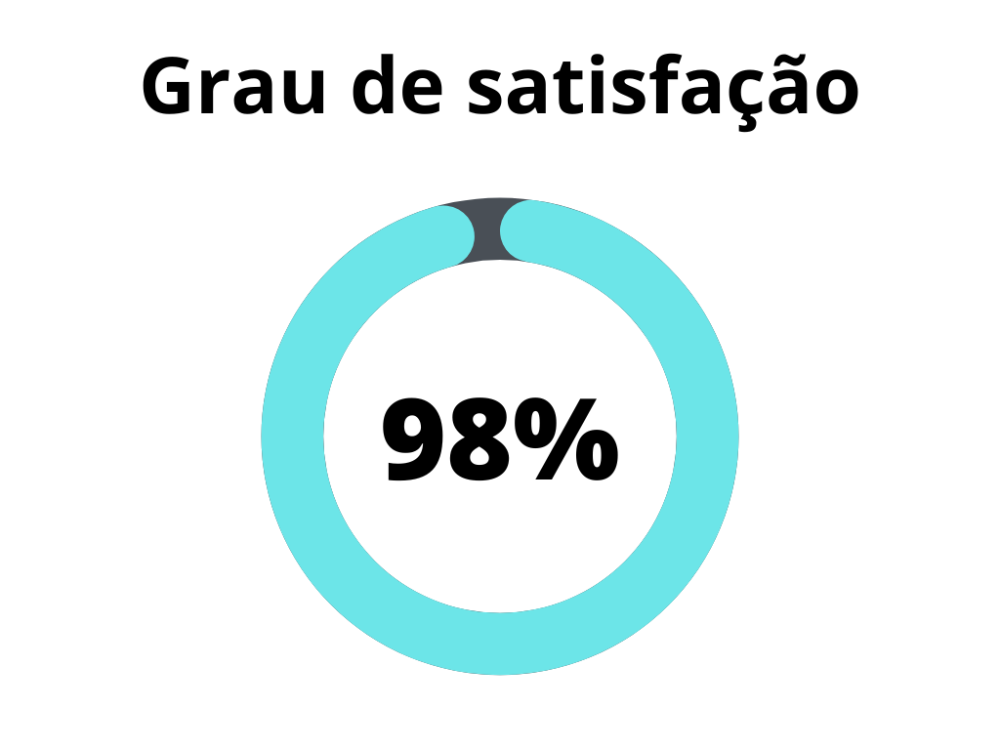
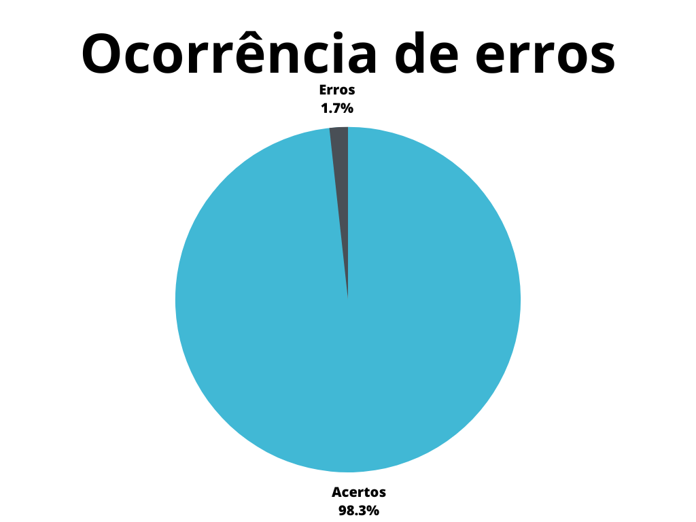

## 1 - Introdução

Este artefato tem como objetivo verificar a composição do documento de personas do Grupo 7 que está analisando a Petz. Com base nisso o objetivo é buscar possíveis erros conceituais e estruturais que possam ter passado despercebidos durante a etapa de desenvolvimento do documento.

## 2 - Metodologia

Como especificado no [planejamento da verificação](../planejamento.md) o método de verificação utilizado será a inspeção, assim produzindo checklists para analisar o conteúdo e a estrutura do documento. A versão do artefato que está sendo verificada é a `1.1` .

## 3 - Checklist

A seguir são apresentadas as perguntas do checklist e suas respectivas definições nas quais foram embasadas, e suas referências.

* 1 - **As personas foram baseadas em pesquisas?**
Assim como em qualquer modelo, as personas devem ser baseadas em uma observação do mundo real. O recurso primário dos dados para sintetizar as personas deve ser retirado de pesquisas utilizando técnicas etnográficas, investigações contextuais ou outros dialogos similares que busquem identificar atuais e potenciais usuários. 

`(Cooper, A., Reimann, R., & Cronin, D. (2007). About Face: The Essentials of Interaction Design. Wiley Publishing, Inc.; Chapter 5: Modeling Users: Personas and Goals, Personas are based on Research. )
`
 

* 2 - **As personas estão representadas como uma pessoa individual?**
Personas são modelos de usuários representados de forma especifica, eles não são realmente pessoas, mas sintetizados a partir da observação do mundo real. Um dos elementos-chave que permitem que as personas sejam bem-sucedidas como modelos de usuário é que são personificações.

`(Cooper, A., Reimann, R., & Cronin, D. (2007). About Face: The Essentials of Interaction Design. Wiley Publishing, Inc.; Chapter 5: Modeling Users: Personas and Goals, Personas are represented as individual people. )
`
 

* 3 - **As personas representam um grupo de usuários?**
Embora as personas sejam representadas como indivíduos específicos, porque funcionam como arquétipos (forma de consciência que, além de possuir energia e informação, também se expressa de diferentes maneiras.), eles representam uma classe ou tipo de usuário de um produto interativo específico.

`(Cooper, A., Reimann, R., & Cronin, D. (2007). About Face: The Essentials of Interaction Design. Wiley Publishing, Inc.; Chapter 5: Modeling Users: Personas and Goals, Personas represent groups of users. )
`
 

* 4 - **As personas exploram intervalos de comportamento?**
O público alvo de um produto descreve demograficamente, também o estilo de vida e as vezes o cargo de trabalho dos usuários. O que não é descrito são os diferentes intervalos de comportamento exibidos pelos usuários do publico alvo em relação ao produto e situações relacionadas. As Personas não buscam estabelecer um usuário médio, mas sim expressar comportamentos diversos.

`(Cooper, A., Reimann, R., & Cronin, D. (2007). About Face: The Essentials of Interaction Design. Wiley Publishing, Inc.; Chapter 5: Modeling Users: Personas and Goals, Personas explore ranges of behavior. )
`

* 5 - **As personas possuem motivações?**
Todos os seres humanos possuem motivações que guiam seus comportamentos, alguns são óbvios e muitos são sutis. É crucial que as personas transmitam estas motivações na forma de objetivos.

`(Cooper, A., Reimann, R., & Cronin, D. (2007). About Face: The Essentials of Interaction Design. Wiley Publishing, Inc.; Chapter 5: Modeling Users: Personas and Goals, Personas must have motivations. )
`

* 6 - **Existem anti-personas?**

Embora usuários e potenciais usuários de um produto devem sempre ser a principal preocupação ao desenvolver as personas, as vezes representar as necessidades e objetivos de pessoas que não usarão o produto podem ser úteis, mesmo que não utilizadas durante o processo de planejamento do produto.

`(Cooper, A., Reimann, R., & Cronin, D. (2007). About Face: The Essentials of Interaction Design. Wiley Publishing, Inc.; Chapter 5: Modeling Users: Personas and Goals, Personas can also represent nonusers. )
`

* 7 -  **As personas apresentam as seguintes variáveis de comportamento: Atividades, Aptidões, Motivações, Habilidades?**
Geralmente, nós observamos as mais importantes distinções dos padrões de comportamento emergindo nas seguintes variáveis:

Atividades — O que o usuário faz; frequência e volume.
Aptidões — Quais treinamentos e preparações o usuário tem; capacidade de aprendizado.
Motivações — O que motiva o usuário a utilizar o produto
Habilidades — Capacidade do usuário relacionada ao dominio intelectual do produto e tecnológico 

`(Cooper, A., Reimann, R., & Cronin, D. (2007). About Face: The Essentials of Interaction Design. Wiley Publishing, Inc.; Chapter 5: Modeling Users: Personas and Goals, 
Part I: Understanding Goal-Directed Design,Step 1: Identify behavioral variables.)
`

* 8 - **Foram mapeados de 6 a 8 variáveis comportamentais da persona?**

Um conjunto de assuntos agrupados em 6 a 8 variáveis que representarão significantes padrões comportamentais e vão compor a base da persona.

`(Cooper, A., Reimann, R., & Cronin, D. (2007). About Face: The Essentials of Interaction Design. Wiley Publishing, Inc.; Chapter 5: Modeling Users: Personas and Goals, 
Part I: Understanding Goal-Directed Design,Step 3: Identify significant behavior patterns.)
`

* 9 - **Foram sintetizadas características relevantes como relações, nome e sobrenome, idade, localização geográfica, cargo?**

Para cada padrão de comportamento significante identificado, deve-se sintetizar detalhes a partir destes dados. Descrever potencial ambiente de uso, tipico dia a dia, e relações relevantes com outros. Um detalhe fictício importante é o nome e sobrenome da persona. Também é recomendado adicionar informações demográficas como idade , localização geográfica, e cargo de trabalho. Esta informação é principalmente utilizada para ajudar na visualização dos detalhes comportamentais da persona.

`(Cooper, A., Reimann, R., & Cronin, D. (2007). About Face: The Essentials of Interaction Design. Wiley Publishing, Inc.; Chapter 5: Modeling Users: Personas and Goals, 
Part I: Understanding Goal-Directed Design,Step 4: Synthesize characteristics and relevant goals)
`

* 10 - **Possui personas com características diferentes?**

Se você encontrar 2 personas que se diferenciam apenas demograficamente é necessário eliminar uma das duas para evitar redundâncias. Uma persona deve se diferenciar em pelo menos um comportamento significante.

`(Cooper, A., Reimann, R., & Cronin, D. (2007). About Face: The Essentials of Interaction Design. Wiley Publishing, Inc.; Chapter 5: Modeling Users: Personas and Goals, 
Part I: Understanding Goal-Directed Design,Step 5: Check for completeness and redundancy)
`

* 11 - **Há uma expansão da descrição dos atributos e comportamentos?**

A melhor narrativa introduz rapidamente a persona em termos de seu trabalho ou estilo de vida, e esboça revemente um dia em sua vida, preocupações e interesses que têm relação direta com o produto

`(Cooper, A., Reimann, R., & Cronin, D. (2007). About Face: The Essentials of Interaction Design. Wiley Publishing, Inc.; Chapter 5: Modeling Users: Personas and Goals, 
Part I: Understanding Goal-Directed Design,Step 6: Expand description of attributes and behaviors)
`

* 12 - **Está definido quem são as personas primárias, secundárias e anti-personas?**

As personas primárias representam o alvo principal para o design do produto. Uma persona secundária está satisfeita com o design para a persona primária, porém tem necessidades adicionais específicas que podem ser acomadas sem modificar os objetivos principais do produto. A anti-persona é aquela para quem o produto não está sendo desenvolvido.

`(Cooper, A., Reimann, R., & Cronin, D. (2007). About Face: The Essentials of Interaction Design. Wiley Publishing, Inc.; Chapter 5: Modeling Users: Personas and Goals, 
Part I: Understanding Goal-Directed Design,Step 7: Designate persona types)
`

* 13 - **Possui de 3 a 12 personas?**

Segundo Courage e Baxter (2005), devemos criar pelo menos uma persona por papel de usuário (e.g., ao menos uma para o professor e outra para o aluno, num ambiente acadêmico). Cada projeto possui seu próprio elenco de personas, que consiste de três a 12 personas distintas.

` Barbosa, S. D. J.; Silva, B. S. da; Silveira, M. S.; Gasparini, I.; Darin, T.; Barbosa, G. D. J. (2021). Interação Humano-Computador e Experiência do usuário. Autopublicação. ISBN: 978-65-00-19677-1. 
`

* 14 - **A persona possui foto?**

identidade: dê a uma persona nome e sobrenome. Forneça uma idade e outros dados demográficos que seriam representativos do perfil do usuário. Inclua também uma foto, para tornar a persona ainda mais realista e memorável.

` Barbosa, S. D. J.; Silva, B. S. da; Silveira, M. S.; Gasparini, I.; Darin, T.; Barbosa, G. D. J. (2021). Interação Humano-Computador e Experiência do usuário. Autopublicação. ISBN: 978-65-00-19677-1. 
`

|Item | Verificação | Ocorrências | Acertos | erros |
|--|--|--| -- | -- |
| 1 | As personas foram baseadas em pesquisas?|1  | 0 | 1 |
| 2 | As personas estão representadas como uma pessoa individual?|5  | 5 | 0|
| 3 | As personas representam um grupo de usuários?| 5 | 5 | 0 |
| 4 | As personas exploram intervalos de comportamento? | 5 | 5| 0 |
| 5 | As personas possuem motivações? |5 | 5| 0|
| 6 | Existem anti-personas? |1| 1| 0 |
| 7 | As personas apresentam as seguintes variáveis de comportamento: Atividades, Aptidões, Motivações, Habilidades? |5 | 5 | 0 |
| 8 | Foram mapeados de 6 a 8 variáveis comportamentais da persona? | 5 | 5 | 0 |
| 9 | Foram sintetizadas características relevantes como relações, nome e sobrenome, idade, localização geográfica, cargo? | 5| 5| 0|
| 10 | Possui personas com características diferentes? | 5 | 5| 0 |
| 11 | Há uma expansão da descrição dos atributos e comportamentos? | 5 | 5 | 0 |
| 12 | Está definido quem são as personas primárias, secundárias e anti-personas | 5 | 5 | 0 |
| 13 | Possui de 3 a 12 personas? | 1 | 1 | 0 |
| 14 | A persona possui foto? | 5 | 5 | 0 |

<h6 align="center">Tabela 1: Checklist do conteúdo</h6>
<h6 align="center">Fonte: Autor, 2023</h6>

| ID  | Verificação  | Realizado | Possíveis correções |
| :-: | --------------------------------------------------------- | --------- | ------------------- |
|  1  | Possui ortografia correta e formal?                                  |    sim     | -                   |
|  2  | Possui introdução?                                                   | sim         | -                   |
|  3  | Possui links necessários?                                            | sim         | -                   |
|  4  | As tabelas e imagens possuem legenda padronizada e chamada no texto? | sim         | -                   |
|  5  | As tabelas e imagens estão totalmente em português?                  | sim         | -                   |
|  6  | Possui bibliografia?                                                 | sim         | -                   |
|  7  | Possui histórico de versão padronizado?                              | sim         | -                   |
|  8  | O histórico de versão possui autor(es) e revisor(es)?                | sim         | -                   |

<h6 align="center">Tabela 2: checklist para padronização</h6>
<h6 align="center">Fonte: Autor, 2023</h6>

## 4. Problemas encotrados - Conteúdo

A verificação conclui que foi feito um trabalho que atende as definições conceituais esperadas para a confecção de uma persona. Porém com uma ressalva:

### 4.1 Verificação 1 - As personas foram baseadas em pesquisa?

Adição relevante é referente a pesquisa de perfil de usuário, pois poderia ser indexado os resultados da pesquisa realizada para definir as personas.

## Resultados

Os resultados da verificação do artefato de Personas podem ser encontrados na tabela 3 abaixo, por meio das figuras 1 e 2, onde podem ser verificados o grau de satisfação e a ocorrência de erros no artefato verificado. Estes resultados levam em conta apenas a verificação do conteúdo.

## 5. Referências Bibliográficas

> [1] Barbosa, S. D. J.; Silva, B. S. da; Silveira, M. S.; Gasparini, I.; Darin, T.; Barbosa, G. D. J. (2021). Interação Humano-Computador e Experiência do usuário. Autopublicação. ISBN: 978-65-00-19677-1.
> [2] Cooper, A., Reimann, R., & Cronin, D. (2007). About Face: The Essentials of Interaction Design. Wiley Publishing, Inc.;

## Histórico de versão

|  Versão  |   Data   |                      Descrição                      |    Autor(es)   |  Revisor(es)  |
| -------- | -------- | --------------------------------------------------- | -------------- | ------------- |
|  `1.0`   | 20/06/23 | Criação da primeira versão do artefato de verificação de personas | Vitor Manoel  | Samuel Sato |
