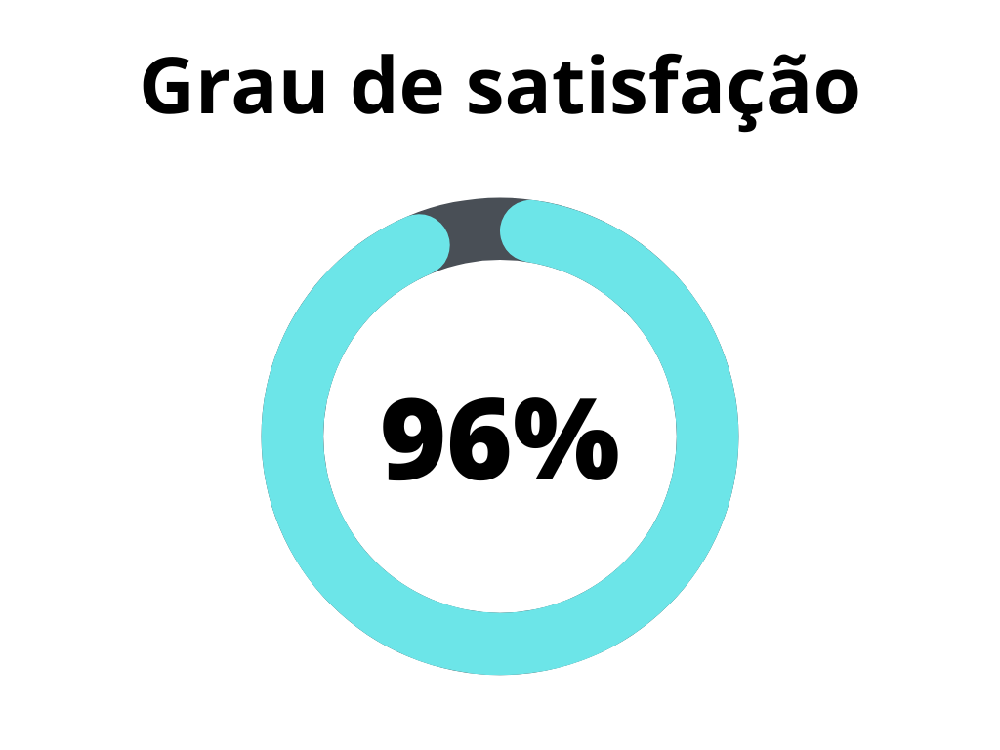
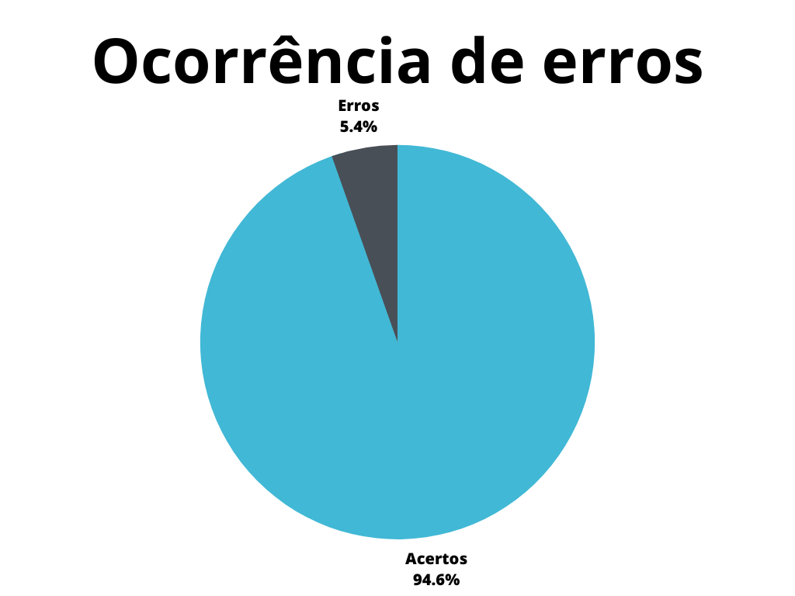

# Verificação dos Aspectos gerais 

## 1. Introdução 

A verificação dos Aspectos gerais é tratada como a inspeção dos artefatos básicos do projeto. Irá envolver as [gravações de reuniões e apresentações](https://requisitos-de-software.github.io/2023.1-Petz/apresentacoes/apresentacao1/), [páginas de reuniões](https://requisitos-de-software.github.io/2023.1-Petz/atas/reuniao12042023/), organização do projeto, e a [página inicial do projeto](https://requisitos-de-software.github.io/2023.1-Petz/). 

## 2. Metodologia

A verificação a seguir segue a metodologia proposta no [planejamento](../planejamento.md)[1], onde serão utilizados _[checklists](../../planejamento/glossario.md#Checklist)_ para a verificação dos conteúdos presentes no artefatos, buscando encontrar erros e elementos faltantes no mesmo.

Abaixo seguem as verificações de conteúdo elaboradas, contendo a justificativa de cada uma além de sua fonte:

## 2.1 Verificação 1: A página inicial apresenta todos os membros do grupo?

É requisitado que a página inical vincule os responsáveis pela realização do projeto. 

`SALES, André Barros. Plano de ensino da disciplina. Página 2, página 7.`

## 2.2 Verificação 2: Os membros relacionados na página principal estão organizados em ordem alfabética?

É requisitado que a página inicial esteja com os membros organizados em ordem alfabética. 

`SALES, André Barros. Plano de ensino da disciplina. Página 2, página 7.`

## 2.3 Verificação 3: Os membros relacionados na página principal estão sem a matrícula? 

É requisitado que a página inicial esteja sem a matrícula da Universidade de Brasília dos membros. 

`SALES, André Barros. Plano de ensino da disciplina. Página 2, página 7.`

## 2.4 Verificação 4: As atas de reunião apresentam as discussões realizadas no momento da reunião?

As atas de reunião são meios importantes de rastreabilidade das decisões do projeto.

`SALES, André Barros. Plano de ensino da disciplina. Página 2, página 7.`

## 2.5 Verificação 5: As atas de reunião apresentam os participantes de cada reunião?

Ter o entendimento de quem participa e organiza cada uma das reuniões ajuda na rastreablidade para entender decisões do projeto.

`SALES, André Barros. Plano de ensino da disciplina. Página 2, página 7.`

## 2.6 Verificação 6: As gravações de apresentações e reuniões estão disponibilizadas no [YouTube](https://www.youtube.com/), de forma "Não listada"?

É requisitado que as gravações e apresentações estejam disponibilizadas no [YouTube](https://www.youtube.com/), e de forma "Não listada", para facilitar a visualização e manter a privacidade. 

`SALES, André Barros. Plano de ensino da disciplina. Página 2, página 7.`

## 2.7 Verificação 7: As apresentações estão disponibilizadas em artefatos que indiquem a etapa da apresentação?

A definição de cada artefato de apresentação contabiliza para a organização do projeto, facilita rastreabilidade e indica a apresentação de cada etapa.

`SALES, André Barros. Plano de ensino da disciplina. Página 2, página 7.`

## 2.8 Verificação 8: A página inicial do projeto introduz o objetivo do projeto?

O objetivo do projeto é a referência para a mudança que deseja-se alcançar com o projeto.

`NUTE-UFSC (2016). Site do Núcleo Multiprojetos de Tecnologia Educacional da Univerisade Federal de Santa Catarina. Disponível em: https://sgmd.nute.ufsc.br/content/portal-aberta-sgmd/e03_m05/pagina-06.html. Acesso em: 19 jun. 2023.`

## 2.9 Verificação 9: Consta a permissão para a realização dos objetivos em relação a aplicação da _[Petz](../../planejamento/glossario.md#Petz)_?

Tratando-se de um domínio que possui termos de uso restritos, é necessária a autorização para a realização do projeto.

`REVERSA, A. VIABILIDADE LEGAL DA ENGENHARIA. Luca Schirru. Diss. Instituto de Economia, Universidade Federal do Rio de Janeiro, 2015.`

## 3. Desenvolvimento

### 3.1 Padronização

Na tabela 1, se encontra o _[checklist](../../planejamento/glossario.md#Checklist)_ de padronização preenchido após a realização da verificação.

| ID  | Verificação                                                          | Realizado |
| --- | -------------------------------------------------------------------- | --------- |
| 1   | Possui ortografia correta e formal?                                  | Incompleto|
| 2   | Possui introdução?                                                   | Sim       |
| 3   | Possui links necessários?                                            | Incompleto       |
| 4   | As tabelas e imagens possuem legenda padronizada e chamada no texto? | Sim|
| 5   | As tabelas e imagens estão totalmente em português?                  | Sim       |
| 6   | Possui bibliografia?                                                 | Não       |
| 7   | A bibliografia está em ordem alfabética?                             | Não       |
| 8   | Possui histórico de versão padronizado?                              | Sim       |
| 9   | O histórico de versão possui autor(es) e revisor(es)?                | Sim|

<h6 align = "center"> Tabela 1: Verificação de padronização dos aspectos gerais </h6>
<h6 align = "center"> Fonte: Autor, 2023 </h6>

### 3.2 Conteúdo

Na tabela 2, se encontra o _[checklist](../../planejamento/glossario.md#Checklist)_ de conteúdo preenchido após a realização da verificação. As verificações realizadas foram obtidas a partir do plano de ensino da disciplina [2].

| ID| Verificação                                | Ocorrências | Acertos | Erros |
| - | ------------------------------------------ | ----------- | ------- | ----- |
| 1 | A página inicial apresenta todos os membros do grupo?[3] | 1 | 1 | 0 |
| 2 | Os membros relacionados na página principal estão organizados em ordem alfabética?[3]| 6 | 6 | 0 |
| 3 | Os membros relacionados na página principal estão sem a matrícula? [3] | 6 | 6 | 0 |
| 4 | As atas de reunião apresentam as discussões realizadas no momento da reunião? [3] | 5 | 5 | 0 |
| 5 | As atas de reunião apresentam os participantes de cada reunião? [3] | 5 | 5 | 0 |
| 6 | As gravações de apresentações e reuniões estão disponibilizadas no [YouTube](https://www.youtube.com/), de forma "Não listada"? [3] | 5 | 4 | 1 |
| 7 | As apresentações estão disponibilizadas em artefatos que indiquem a etapa da apresentação? [2] | 5 | 4 | 1 |
| 8 | A página inicial do projeto introduz o objetivo do projeto? [1] | 1 | 1 | 0 |
| 9 | Consta a permissão para a realização dos objetivos em relação a aplicação da _[Petz](../../planejamento/glossario.md#Petz)_? [2] | 1 | 1 | 0 |

<h6 align = "center"> Tabela 2: Verificação de conteúdo dos aspectos gerais</h6>
<h6 align = "center"> Fonte: Autor, 2023 </h6>

### 3.3 Problemas encontrados - Padronização

#### 3.3.1 Verificação 1 - Possui ortografia correta e formal?

Apresenta erros de ortografia e erros de digitação em diversos artefatos sobre as Atas de reunião. 

#### 3.3.2 Verificação 3 - Possui links necessários?

A tabela 1 do artefato de página inicial do projeto possui links, entretanto, estão com a formatação equivocada.

#### 3.3.3 Verificação 6 - Possui bibliografia?

Nenhum dos artefatos possui bibliografia.

#### 3.3.4 Verificação 7 - A bibliografia está em ordem alfabética? 

Nenhum dos artefatos possui bibliografia.

### 3.4 Problemas encontrados - Conteúdo

#### 3.4.1 Verificação 6 - As gravações de apresentações e reuniões estão disponibilizadas no YouTube, de forma "Não listada"? 

A etapa 5.1 não está disponibilizada.

#### 3.4.2 Verificação 7 - As apresentações estão disponibilizadas em artefatos que indiquem a etapa da apresentação?

Não existe artefato da etapa 5.1.

## 4. Resultados

Os resultados da verificação dos artefatos que compõem os Aspectos gerais do projeto podem ser encontrados na tabela 3 abaixo, por meio das figuras 1 e 2, onde podem ser verificados o grau de satisfação e a ocorrência de erros no artefato verificado. Estes resultados levam em conta apenas a verificação do conteúdo.

|                |                  |
| ----------------------------------------------------------------------------------------------------- | ------------------------------------------------------------------------------------------------ |
| <h6 align="center">Figura 1: Representação do grau de satisfação no artefato Fonte: Autor, 2023</h6> | <h6 align="center">Figura 2: Gráfico de ocorrência de erros no artefato Fonte: Autor, 2023</h6> |

<h6 align = "center"> Tabela 3: Representações gráficas dos resultados da verificação</h6>
<h6 align = "center"> Fonte: Autor, 2023 </h6>

## 5. Acompanhamento

As correções estão em andamento e serão terminadas e versionados até o dia 28 de junho.

## 6. Referências bibliográficas

> [1] NUTE-UFSC (2016). Site do Núcleo Multiprojetos de Tecnologia Educacional da Univerisade Federal de Santa Catarina. Disponível em: https://sgmd.nute.ufsc.br/content/portal-aberta-sgmd/e03_m05/pagina-06.html. Acesso em: 19 jun. 2023.

> [2] REVERSA, A. VIABILIDADE LEGAL DA ENGENHARIA. Luca Schirru. Diss. Instituto de Economia, Universidade Federal do Rio de Janeiro, 2015.

> [3] SALES, André Barros. Plano de ensino da disciplina. Disponível em: https://aprender3.unb.br/pluginfile.php/2523005/mod_resource/content/27/Plano_de_Ensino%20RE%20202301%20Turma%202.pdf. Acesso em: 13 de junho de 2023;

## 6. Histórico de versão

| Versão | Data     | Descrição | Autor(es) | Revisor(es) |
| ------ | -------- | --------- | --------- | ----------- |
| `1.0`  | 19/06/2023 | Criação do artefato e adição do conteúdo | Magno Luiz | Samuel Sato |
