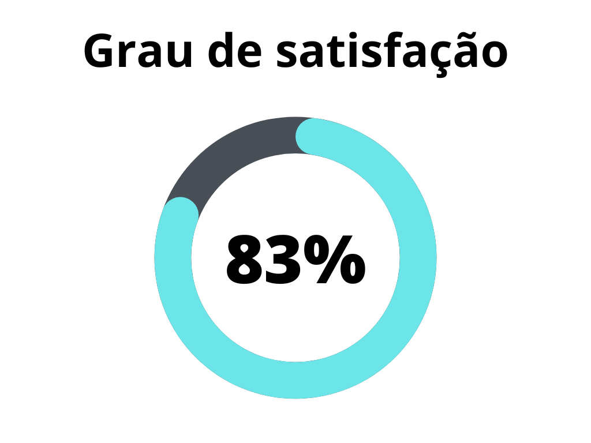
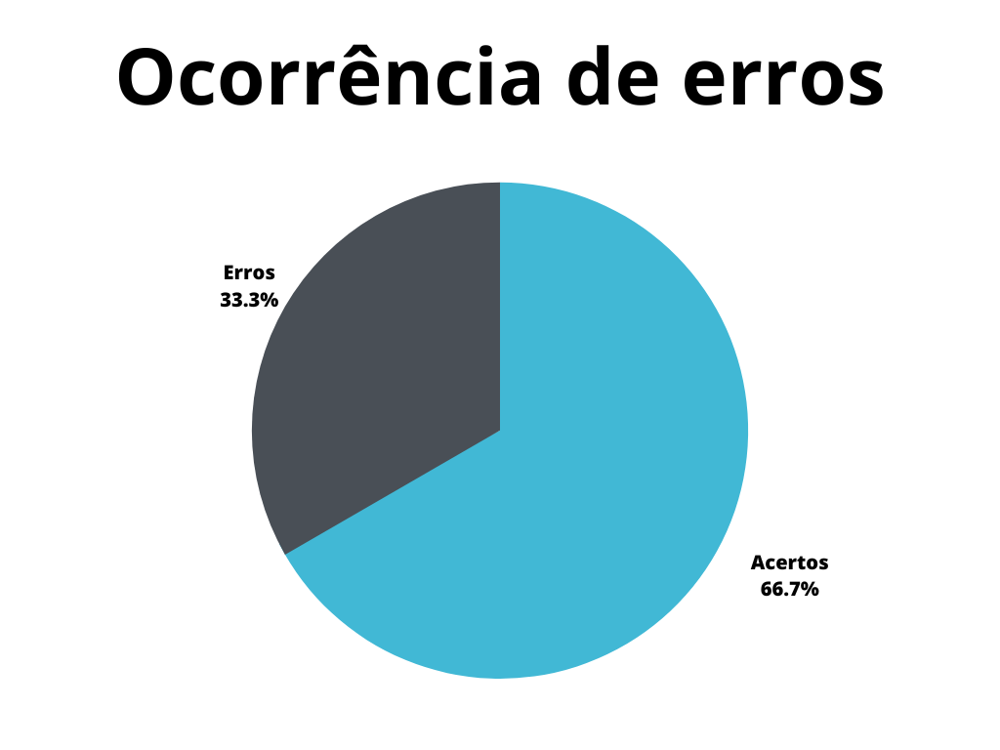

# Verificação - Casos de Uso

## 1. Introdução
Casos de uso são uma forma de modelagem de requisitos que visa representar o comportamento geral do sistema sob a ótica do usuário, fazendo com que qualquer _stakeholder_, mesmo que leigo, seja capaz de ler e interpretar um diagrama[].

Este documento possui a função de verificar o artefato de casos de uso do projeto. A verificação leva em conta a versão 1.0 do artefato realizada em 16 de maio de 2023.

## 2. Metodologia
A verificação a seguir segue a metodologia proposta no [planejamento](../planejamento.md)[1], onde serão utilizados _[checklists](../../planejamento/glossario.md#Checklist)_ para a verificação dos conteúdos presentes no artefato, buscando encontrar erros e elementos faltantes no mesmo.

Abaixo seguem as verificações de conteúdo elaboradas, contendo a justificativa de cada uma além de sua fonte:

### 2.1 Verificação 1 - Os diagramas representam de forma simples e completa as principais funcionalidades do sistema?

A técnica de diagramação de casos de uso visa representar as funcionalidades principais do sistema de forma simples, com o objetivo de permitir que qualquer pessoa possa entender e interpretá-los de forma satisfatória.

`COCKBURN, Alistair. Writing Effective Use Cases. Washington: Addison-Wesley Professional, 1999. 240 p. Disponível em: https://www-public.imtbs-tsp.eu/~gibson/Teaching/Teaching-ReadingMaterial/Cockburn00.pdf. Acesso em: 18 jun. 2023.`

### 2.2 Verificação 2 - Os diagramas possuem todos os elementos essenciais de um caso de uso?

Os diagramas de caso de uso são uma técnica UML de representar requisitos e possuem uma listagem de elementos básicos para que os mesmos sejam realizados de forma correta, tais elementos são:

- **Atores:** Representam os usuários do sistema.
- **Fronteira do sistema:** Divide o que se encontra dentro e fora do sistema.
- **Casos de uso:** Representam as funcionalidades do sistema.
- **Associações:** Ligam os atores e casos de uso, podem possuir características especiais.

`REINEHR, Sheila. Diagrama de casos de uso. In: REINEHR, Sheila. Engenharia de requisitos. Porto Alegre: Sagah, 2020. p. 99-117.`

### 2.3 Verificação 3 - Nos diagramas, os elementos seguem o padrão UML de representação?

Como a diagramação de casos de uso é uma técnica UML de representação, portanto os elementos devem ser representado conforme o padrão estabelecido. Tal padrão é:

- **Atores:** Representados por bonecos.
- **Fronteira do sistema:** Representado por uma forma retangular.
- **Casos de uso:** Representado por uma forma oval.
- **Associações:** Representados por setas contínuas ou pontilhadas.

`REINEHR, Sheila. Diagrama de casos de uso. In: REINEHR, Sheila. Engenharia de requisitos. Porto Alegre: Sagah, 2020. p. 99-117.`

### 2.4 Verificação 4 - Nos diagramas, os atores se encontram fora da fronteira do sistema?

Como os atores representam usuários do sistema, os mesmos devem apenas operar ou reagir ao sistema, ou seja, devem permanecer sempre fora da fronteira do sistema, já que a mesma representa aquilo que se encontra dentro ou fora do sistema.

`REINEHR, Sheila. Diagrama de casos de uso. In: REINEHR, Sheila. Engenharia de requisitos. Porto Alegre: Sagah, 2020. p. 99-117.`

### 2.5 Verificação 5 - Os diagramas possuem ao menos um ator primário?

Atores primários representam usuários que efetivamente operam o sistema, enquanto atores secundários representam os usuários que reagem ao sistema. Portanto é necessário ao menos um ator primário para que a operação do sistema seja representada pelo diagrama.

`REINEHR, Sheila. Diagrama de casos de uso. In: REINEHR, Sheila. Engenharia de requisitos. Porto Alegre: Sagah, 2020. p. 99-117.`

### 2.6 Verificação 6 - Nos diagramas, os atores primários se encontram a esquerda do sistema, enquanto os secundários a direita?

Pelo padrão utilizado pelo UML para a diagramação de casos de uso, atores primários devem ser posicionados a esquerda do sistema, enquanto atores secundários devem ser posicionados a direita.

`REINEHR, Sheila. Diagrama de casos de uso. In: REINEHR, Sheila. Engenharia de requisitos. Porto Alegre: Sagah, 2020. p. 99-117.`

### 2.7 Verificação 7 - Nos diagramas, os cenários de uso são bem definidos?

Cenários de uso representam um fluxo de operação do sistema, para que os diagramas sejam de fácil leitura é necessário que tais fluxos sejam bem definidos.

`COCKBURN, Alistair. Writing Effective Use Cases. Washington: Addison-Wesley Professional, 1999. 240 p. Disponível em: https://www-public.imtbs-tsp.eu/~gibson/Teaching/Teaching-ReadingMaterial/Cockburn00.pdf. Acesso em: 18 jun. 2023.`

### 2.8 Verificação 8 - Nos diagramas, os casos de uso são objetivos e autoexplicativos?

Para que os diagramas sejam de fácil leitura, as funcionalidades do sistema devem ser representadas de forma simples e explicativa, para que sejam de fácil entendimento para que o leitor possa identificar cada funcionalidade de forma clara.

`COCKBURN, Alistair. Writing Effective Use Cases. Washington: Addison-Wesley Professional, 1999. 240 p. Disponível em: https://www-public.imtbs-tsp.eu/~gibson/Teaching/Teaching-ReadingMaterial/Cockburn00.pdf. Acesso em: 18 jun. 2023.`

### 2.9 Verificação 9 - Nos diagramas, é possível observar um cenário principal?

Cada caso de uso deve possuir um cenário principal, uma "caminho perfeito" do usuário pelo sistema, sendo que a partir deste cenário, devem surgir cenários alternativos.

`COCKBURN, Alistair. Writing Effective Use Cases. Washington: Addison-Wesley Professional, 1999. 240 p. Disponível em: https://www-public.imtbs-tsp.eu/~gibson/Teaching/Teaching-ReadingMaterial/Cockburn00.pdf. Acesso em: 18 jun. 2023.`

### 2.10 Verificação 10 - Nos diagramas, é possível observar quais condições levam a cenários alternativos?

Para que surjam cenários alternativos ao principal, é necessário que ocorra alguma situação gatilho para que ocorra uma troca de cenário, tais situações devem estar observáveis nos diagramas desenvolvidos.

`COCKBURN, Alistair. Writing Effective Use Cases. Washington: Addison-Wesley Professional, 1999. 240 p. Disponível em: https://www-public.imtbs-tsp.eu/~gibson/Teaching/Teaching-ReadingMaterial/Cockburn00.pdf. Acesso em: 18 jun. 2023.`

### 2.11 Verificação 11 - Nos diagramas, as associações entre casos de uso são utilizadas de forma correta?
Associações são importantes para ligar os elementos presentes no diagrama, contudo existem dois tipos de associações especiais, as associações _include_ e as associações _extends_, para que o diagrama seja corretamente interpretado, tais associações devem ser corretamente representadas.

`REINEHR, Sheila. Diagrama de casos de uso. In: REINEHR, Sheila. Engenharia de requisitos. Porto Alegre: Sagah, 2020. p. 99-117.`

### 2.12 Verificação 12 - O artefato possui a especificação dos casos de uso?

Por mais que os diagramas sejam ótimos para a visualização e entendimento dos cenários, os mesmos não devem possuir informação muito detalhada, ficando esta função para a especificação dos casos de uso.

`REINEHR, Sheila. Especificação de requisitos funcionais utilizando casos de uso. In: REINEHR, Sheila. Engenharia de requisitos. Porto Alegre: Sagah, 2020. p. 135-155.`

### 2.13 Verificação 13 - A especificação possui os elementos básicos de um caso de uso?
A especificação deve conter todos os elementos básicos de um caso de uso, tais elementos são:

- Identificador único
- Descrição
- Ator primário
- Atores Secundários
- Fluxo Principal
- Pontos de exceção
- Fluxo alternativo
- Fluxo de exceção

`REINEHR, Sheila. Especificação de requisitos funcionais utilizando casos de uso. In: REINEHR, Sheila. Engenharia de requisitos. Porto Alegre: Sagah, 2020. p. 135-155.`

### 2.14 Verificação 14 - Os diagramas de caso de uso foram validados por um usuário ou persona?
Para que se tenha a certeza de que os diagramas e especificação foram realizados corretamente, deve-se validar tais elementos com um usuário, para se certificar que os diagramas refletem o sistema real.

`SALES, André Barros. Plano de ensino da disciplina.`

### 2.15 O artefato possui a gravação da realização da técnica, assim como de sua validação?

Para se registrar a realização da técnica, é interessante a presença de uma gravação em áudio ou vídeo da mesma.

`SALES, André Barros. Plano de ensino da disciplina.`

## 3. Desenvolvimento

### 3.1 Padronização

Na tabela 1, se encontra o _checklist_ de padronização preenchido após a realização da verificação.

| ID | Verificação                                                          | Realizado |
|----|----------------------------------------------------------------------|-----------|
| 1  | Possui ortografia correta e formal?                                  | Sim       |
| 2  | Possui introdução?                                                   | Sim       |
| 3  | Possui links necessários?                                            | Sim       |
| 4  | As tabelas e imagens possuem legenda padronizada e chamada no texto? | Parcialmente       |
| 5  | As tabelas e imagens estão totalmente em português?                  | Sim       |
| 6  | Possui bibliografia?                                                 | Sim       |
| 7  | A bibliografia está em ordem alfabética?                             | Sim       |
| 8  | Possui histórico de versão padronizado?                              | Sim       |
| 9  | O histórico de versão possui autor(es) e revisor(es)?                | Sim       |

<h6 align = "center"> Tabela 1: Verificações de padronização do artefato</h6>
<h6 align = "center"> Fonte: Autor, 2023 </h6>

### 3.2 Conteúdo

Na tabela 2, se encontra o _checklist_ de conteúdo preenchido após a realização da verificação.

| ID | Verificação                                                                                               | Ocorrências | Acertos | Erros |
|----|-----------------------------------------------------------------------------------------------------------|-------------|---------|-------|
| 1  | Os diagramas representam de forma simples e completa as principais funcionalidades do sistema?            | 1           | 0       | 1     |
| 2  | Os diagramas possuem todos os elementos essenciais de um caso de uso?                                     | 4           | 4       | 0     |
| 3  | Nos diagramas, os elementos seguem o padrão UML de representação?                                         | 4           | 4       | 0     |
| 4  | Nos diagramas, os atores se encontram fora da fronteira do sistema?                                       | 4           | 4       | 0     |
| 5  | Os diagramas possuem ao menos um ator primário?                                                           | 4           | 4       | 0     |
| 6  | Nos diagramas, os atores primários se encontram a esquerda do sistema, enquanto os secundários a direita? | 4           | 4       | 0     |
| 7  | Nos diagramas, os cenários de uso são bem definidos?                                                      | 4           | 4       | 0     |
| 8  | Nos diagramas, os casos de uso são objetivos e autoexplicativos?                                          | 4           | 4       | 0     |
| 9  | Nos diagramas, é possível observar um cenário principal?                                                  | 4           | 0       | 4     |
| 10 | Nos diagramas, é possível observar quais condições levam a cenários alternativos?                         | 4           | 0       | 4     |
| 11 | Nos diagramas, as associações entre casos de uso são utilizadas de forma correta?                         | 4           | 4       | 0     |
| 12 | O artefato possui a especificação dos casos de uso?                                                       | 4           | 4       | 0     |
| 13 | A especificação possui os elementos básicos de um caso de uso?                                            | 4           | 0       | 4     |
| 14 | Os diagramas de caso de uso foram validados por um usuário ou persona?                                    | 4           | 0       | 4     |
| 15 | O artefato possui a gravação da realização da técnica, assim como de sua validação?                       | 1           | 0       | 1     |

<h6 align = "center"> Tabela 2: Verificações de conteúdo do artefato</h6>
<h6 align = "center"> Fonte: Autor, 2023 </h6>

## 4. Problemas encontrados - Padronização

### 4.1 Verificação 4 - As tabelas e imagens possuem legenda padronizada e chamada no texto?
As imagens e tabelas presentes no artefato não possuem chamada no texto, apenas legenda.

## 5. Problemas encontrados - Conteúdo

### 5.1 Verificação 1 - Os diagramas representam de forma simples e completa as principais funcionalidades do sistema?
Percebe-se que os diagramas elaborados não cobrem todas as funcionalidades principais do aplicativo analisado, se focando em funções de cadastro e autenticação.

### 5.2 Verificação 9 - Nos diagramas, é possível observar um cenário principal?
Nos diagramas elaborados, se encontra apenas um cenário de execução, sem levar em conta fluxos alternativos ou de exceção, o que acaba por deixá-lo imcompleto. Sem fluxos alternativos, não é possível observar um cenário principal, mesmo que o diagrama o possua.

### 5.3 Verificação 10 - Nos diagramas, é possível observar quais condições levam a cenários alternativos?  
Como não foram representados cenários alternativos ou de exceção nos diagramas apresentados, também não é possível observar pontos de gatilho que levam o sistema à troca de fluxo de atividade.

### 5.4 Verificação 13 - A especificação possui os elementos básicos de um caso de uso?
Por mais que a especificação dos diagramas referencie todos os elementos básicos, a mesma não possui conteúdo nestes elementos, notado principalmente na falta de fluxos alternativos e de exceção.

### 5.5 Verificação 14 - Os diagramas de caso de uso foram validados por um usuário ou persona?
No artefato não há qualquer referência à uma validação dos diagramas por parte de um usuário real ou de uma persona por meio de encenação.

### 5.6 Verificação 15 - O artefato possui a gravação da realização da técnica, assim como de sua validação?
O artefato não apresenta a gravação de vídeo ou áudio da realização da técnica ou da validação da mesma.

## 6. Resultados

Os resultados da verificação do artefato de casos de uso podem ser encontrados na tabela 3 abaixo, por meio das figuras 1 e 2, onde podem ser verificados o grau de satisfação e a ocorrência de erros no artefato verificado. Estes resultados levam em conta apenas a verificação do conteúdo.

|                |                  |
| ----------------------------------------------------------------------------------------------------- | ------------------------------------------------------------------------------------------------ |
| <h6 align="center">Figura 2: Representação do grau de satisfação no artefato Fonte: Autor, 2023</h6> | <h6 align="center">Figura 3: Gráfico de ocorrência de erros no artefato Fonte: Autor, 2023</h6> |

<h6 align = "center"> Tabela 3: Representações gráficas dos resultados da verificação</h6>
<h6 align = "center"> Fonte: Autor, 2023 </h6>

## 7. Acompanhamento
Após a verificação, os problemas relacionados à padronização do artefato foram corrigidas através da versão 1.1 do documento. As correções relacionadas ao conteúdo contudo, não foram realizadas até o momento de escrita da versão 1.0 deste artefato, tais correções possuem o planejamento de serem realizadas até o dia 28 de junho de 2023, através de uma nova versão do documento verificado.

Como não houveram correções de conteúdo, o grau de satisfação e a ocorrência de erros no artefato se mantiveram inalterados, como se percebe através da tabela 4.

|                |                  |
| ----------------------------------------------------------------------------------------------------- | ------------------------------------------------------------------------------------------------ |
| <h6 align="center">Figura 3: Representação do grau de satisfação no artefato após as correções Fonte: Autor, 2023</h6> | <h6 align="center">Figura 4: Gráfico de ocorrência de erros no artefato após as correções Fonte: Autor, 2023</h6> |

<h6 align = "center"> Tabela 4: Representações gráficas dos resultados da verificação após as correções</h6>
<h6 align = "center"> Fonte: Autor, 2023 </h6>

## 8. Referências bibliográficas

> [1] COCKBURN, Alistair. Writing Effective Use Cases. Washington: Addison-Wesley Professional, 1999. 240 p. Disponível em: <https://www-public.imtbs-tsp.eu/~gibson/Teaching/Teaching-ReadingMaterial/Cockburn00.pdf>. Acesso em: 18 jun. 2023.

> [2] REINEHR, Sheila. Especificação de requisitos funcionais utilizando casos de uso. In: REINEHR, Sheila. Engenharia de requisitos. Porto Alegre: Sagah, 2020. p. 135-155.

> [3] SALES, André Barros. Plano de ensino da disciplina. Disponível em: <https://aprender3.unb.br/pluginfile.php/2523005/mod_resource/content/27/Plano_de_Ensino%20RE%20202301%20Turma%202.pdf>. Acesso em: 19 de junho de 2023;

## 9. Histórico de versão

| Versão | Data | Descrição | Autor(es) | Revisor(es) |
|--|--|--|--|--|
| `1.0` | 19/06/23 | Criação do documento e adição do conteúdo | Pedro Muniz | Felipe Corrêa |