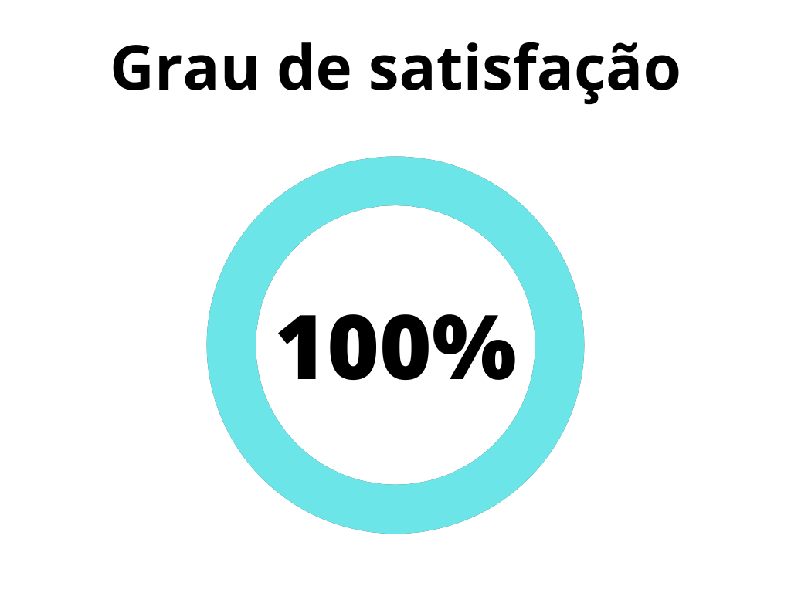
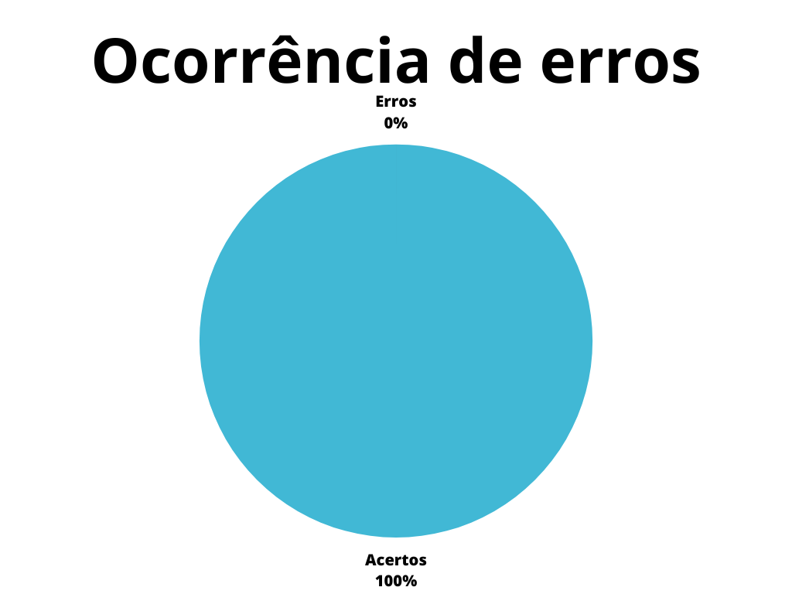

# Verificação - Cenários

## 1. Introdução

Os cenários são importantes nas etapas de modelagem e elicitação de requisitos e ajudam a descrever de maneira evolutiva, situações específicas de certo ambiente.  Ao tratar de sistemas e projetos, os cenários relacionam atores com o meio e o sistema, projetando descrições concretas, baseadas no envolvimento do usuário enquanto realiza uma certa tarefa[1].

Este documento possui a função de verificar o artefato de cenários do projeto. A verificação leva em conta a versão 1.0 do artefato realizada em 10 de junho de 2023.

## 2. Metodologia

A verificação a seguir segue a metodologia proposta no [planejamento](../planejamento.md), onde serão utilizados _[checklists](../../planejamento/glossario.md#Checklist)_ para a verificação dos conteúdos presentes no artefato, buscando encontrar erros e elementos faltantes no mesmo.

Abaixo seguem as verificações de conteúdo elaboradas, contendo a justificativa de cada uma além de sua fonte:

### 2.1 Verificação 1 - O Cenário apresenta Título?

O Título tem a função de identificar o cenário.

`
Leite, J.C.S.P; Bergmann, Ulf (2003). Evolução de Cenários através de um Mecanismo de Rastreamento Baseado 
em Transformações - 3 Cenários. PUC - Rio. Página 49.
`

### 2.2 Verificação 2 - O Cenário apresenta Objetivo?

O Objetivo deve estabelecer a finalidade do cenário, descrevendo de que modo este objetivo deve ser alcançado.

`
Leite, J.C.S.P; Bergmann, Ulf (2003). Evolução de Cenários através de um Mecanismo de Rastreamento Baseado 
em Transformações - 3 Cenários. PUC - Rio. Página 49.
`

### 2.3 Verificação 3 - O Objetivo estabelece a finalidade do cenário?

A finalidade do cenário irá depender do cenário, mas busca-se assegurar a satisfação de modelos projetados para cumprir com os requisitos, de resultados de partes diversas do processo de desenvolvimento e rastrear componentes, subsistemas e entre outros aspectos relacionados aos requisitos designados aos cenários.

`
Leite, J.C.S.P; Bergmann, Ulf (2003). Evolução de Cenários através de um Mecanismo de Rastreamento Baseado 
em Transformações - 3 Cenários. PUC - Rio. Página 57.
`

### 2.4 Verificação 4 - O Cenário apresenta Contexto?

A função do Contexto é descrever o estado inicial de um cenário, demonstrando sua pré-condição, tempo e local físico. 

`
Leite, J.C.S.P; Bergmann, Ulf (2003). Evolução de Cenários através de um Mecanismo de Rastreamento Baseado 
em Transformações - 3 Cenários. PUC - Rio. Página 49.
`

### 2.5 Verificação 5 - O Cenário apresenta Recurso?

O Recurso é definido ao identificar objetivos passivos que sofrem as ações dos atores, podendo especificar restrições sobre os objetos colocados pelo cenário.

`
Leite, J.C.S.P; Bergmann, Ulf (2003). Evolução de Cenários através de um Mecanismo de Rastreamento Baseado 
em Transformações - 3 Cenários. PUC - Rio. Página 49.
`

### 2.6 Verificação 6 - O Cenário apresenta Ator(es)?

Identifica uma estrutura organizacional ou pessoa que realiza ou sofre ações em um cenário.

`
Leite, J.C.S.P; Bergmann, Ulf (2003). Evolução de Cenários através de um Mecanismo de Rastreamento Baseado 
em Transformações - 3 Cenários. PUC - Rio. Página 49.
`

### 2.7 Verificação 7 - O Cenário apresenta Episódio(s)?

Um episódio representa uma ação realizada por um dos atores, em que, possui a participação de outros atores que utilizam dos recursos disponíveis. Também podem referenciar outros cenários e apresentar restrições e exceções. 

`
Leite, J.C.S.P; Bergmann, Ulf (2003). Evolução de Cenários através de um Mecanismo de Rastreamento Baseado 
em Transformações - 3 Cenários. PUC - Rio. Página 49.
`

### 2.8 Verificação 8 - Os cenários se relacionam? 

Os cenários podem se relacionar a partir de complementos, equivalências, contenções, pré-condições, detour (tratando a exceção de outro cenário, retornando ao mesmo ponto do cenário original),exceções, inclusões e possível precedência.

`
Leite, J.C.S.P; Bergmann, Ulf (2003). Evolução de Cenários através de um Mecanismo de Rastreamento Baseado 
em Transformações - 3 Cenários. PUC - Rio. Página 54.
`

### 2.9 Verificação 9 - O Cenário apresenta um modelo de rastreamento?

É representado usando um processo de refinamento, modificação, de forma a capturar o histórico do desenvolvimento do projeto, com uma estrutura que permite facilitar a gestão e avaliação.

`
Leite, J.C.S.P; Bergmann, Ulf (2003). Evolução de Cenários através de um Mecanismo de Rastreamento Baseado 
em Transformações - 3 Cenários. PUC - Rio. Página 60.
`
## 3. Desenvolvimento

### 3.1 Padronização

Na tabela 1, se encontra o _checklist_ de padronização preenchido após a realização da verificação.

| ID | Verificação                                                          | Realizado |
|----|----------------------------------------------------------------------|-----------|
| 1  | Possui ortografia correta e formal?                                  | Sim       |
| 2  | Possui introdução?                                                   | Sim       |
| 3  | Possui links necessários?                                            | Sim       |
| 4  | As tabelas e imagens possuem legenda padronizada e chamada no texto? | Sim       |
| 5  | As tabelas e imagens estão totalmente em português?                  | Sim       |
| 6  | Possui bibliografia?                                                 | Sim       |
| 7  | A bibliografia está em ordem alfabética?                             | Sim       |
| 8  | Possui histórico de versão padronizado?                              | Sim       |
| 9  | O histórico de versão possui autor(es) e revisor(es)?                | Sim       |

<h6 align = "center"> Tabela 1: Verificações de padronização do artefato</h6>
<h6 align = "center"> Fonte: Autor, 2023 </h6>

### 3.2 Conteúdo

Na tabela 2, se encontra o _checklist_ de conteúdo preenchido após a realização da verificação.

| ID | Verificação                                                                                               | Ocorrências | Acertos | Erros |
|----|-----------------------------------------------------------------------------------------------------------|-------------|---------|-------|
|1|O Cenário apresenta Título?[1]|13|13|0|
|2|O Cenário apresenta Objetivo?[1]|13|13|0|
|3|O Objetivo estabelece a finalidade do cenário?[1]|13|13|0|
|4|O Cenário apresenta Contexto?[1]|39|39|0|
|5|O Cenário apresenta Recurso?[1]|13|13|0|
|6|O Cenário apresenta Ator(es)?[1]|13|13|0|
|7|O Cenário apresenta Episódio(s)?[1]|53|53|0|
|8|Os cenários se relacionam?[1] |13|13|0|
|9|O Cenário apresenta um modelo de rastreamento?[1]|13|13|0|

<h6 align = "center"> Tabela 2: Verificações de conteúdo do artefato</h6>
<h6 align = "center"> Fonte: Autor, 2023 </h6>

## 4. Resultados

Os resultados da verificação do artefato de casos de uso podem ser encontrados na tabela 3 abaixo, por meio das figuras 1 e 2, onde podem ser verificados o grau de satisfação e a ocorrência de erros no artefato verificado. Estes resultados levam em conta apenas a verificação do conteúdo.

|                |                  |
| ----------------------------------------------------------------------------------------------------- | ------------------------------------------------------------------------------------------------ |
| <h6 align="center">Figura 2: Representação do grau de satisfação no artefato Fonte: Autor, 2023</h6> | <h6 align="center">Figura 3: Gráfico de ocorrência de erros no artefato Fonte: Autor, 2023</h6> |

<h6 align = "center"> Tabela 3: Representações gráficas dos resultados da verificação</h6>
<h6 align = "center"> Fonte: Autor, 2023 </h6>

## 5. Acompanhamento

Visto que o artefato está condizente com os itens verificados, não há necessidade de correções.

## 6. Referências Bibliográficas

> [1] Leite, J.C.S.P; Bergmann, Ulf (2003). Evolução de Cenários através de um Mecanismo de Rastreamento Baseado em Transformações - 3 Cenários. PUC - Rio.

## Histórico de versão

|  Versão  |   Data   |                      Descrição                      |    Autor(es)   |  Revisor(es)  |
| -------- | -------- | --------------------------------------------------- | -------------- | ------------- |
|  `1.0`   | 07/05/23 | Criação da primeira versão do artefato de verificação dos Cenários | Magno Luiz  | Pedro Muniz |
