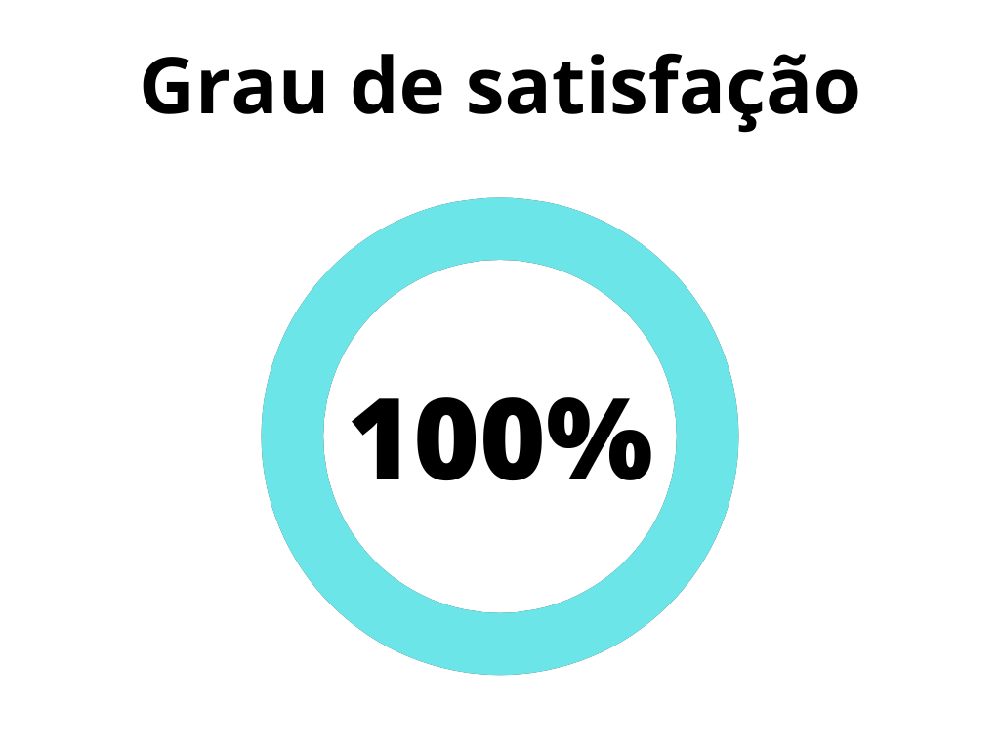

# Verificação - Escala de Três Níveis

## 1. Introdução
A Escala de Três Níveis é uma técnica utilizada para avaliar e classificar o grau de satisfação dos usuários em relação a um determinado produto ou serviço. Ela permite a coleta de feedbacks e opiniões dos usuários em três categorias: positiva, neutra e negativa. A verificação desse artefato tem como objetivo analisar a aplicação correta da Escala de Três Níveis e garantir a qualidade das avaliações realizadas.

A verificação leva em conta a versão 1.1 do artefato realizada em 30 de abril de 2023.

## 2. Metodologia
A verificação a seguir segue a metodologia proposta no [planejamento](../planejamento.md)[1], onde serão utilizados _[checklists](../../planejamento/glossario.md#Checklist)_ para a verificação dos conteúdos presentes no artefato, buscando encontrar erros e elementos faltantes no mesmo.

Abaixo seguem as verificações de conteúdo elaboradas, contendo a justificativa de cada uma além de sua fonte:

### 2.1 Verificação 1 - A técnica da Escala de Três Níveis foi corretamente aplicada?

A Escala de Três Níveis é uma técnica que envolve a classificação de feedbacks e opiniões em três categorias: positiva, neutra e negativa. Para verificar se a técnica foi aplicada corretamente, é necessário analisar se os critérios de classificação foram seguidos adequadamente.

`[1] Cooper, A., Reimann, R., & Cronin, D. (2007). About Face 3: The Essentials of Interaction Design.`

### 2.2 Verificação 2 - As categorias da Escala de Três Níveis foram devidamente definidas?

Para que a avaliação dos feedbacks seja precisa, é fundamental que as categorias de classificação (positiva, neutra e negativa) sejam bem definidas. Isso garante uma interpretação correta dos resultados e facilita a análise posterior.

`[1] Cooper, A., Reimann, R., & Cronin, D. (2007). About Face 3: The Essentials of Interaction Design.`

### 2.3 Verificação 3 - Os critérios de classificação foram aplicados consistentemente?

É importante verificar se os critérios utilizados para classificar os feedbacks em cada uma das categorias foram aplicados de forma consistente. Isso evita discrepâncias na avaliação e garante a precisão dos resultados.

`[1] Cooper, A., Reimann, R., & Cronin, D. (2007). About Face 3: The Essentials of Interaction Design.`

### 2.4 Verificação 4 - O registro dos feedbacks foi realizado de maneira adequada?

O registro dos feedbacks é uma etapa essencial da aplicação da Escala de Três Níveis. Foi necessário verificar se os feedbacks foram registrados de forma completa e organizada, de modo a permitir uma análise posterior eficiente.

`[1] Cooper, A., Reimann, R., & Cronin, D. (2007). About Face 3: The Essentials of Interaction Design.`

### 2.5 Verificação 5 - O artefato contém uma análise dos resultados obtidos?

Além da coleta dos feedbacks, é importante realizar uma análise dos resultados obtidos. Essa análise pode envolver a identificação de padrões, tendências relevantes com base nas avaliações feitas pelos usuários.

`[1] Cooper, A., Reimann, R., & Cronin, D. (2007). About Face 3: The Essentials of Interaction Design.`

### 2.6 Verificação 6 - O artefato apresenta conclusões e recomendações baseadas nos resultados?

As conclusões e recomendações são etapas importantes para fechar o ciclo da Escala de Três Níveis. É importante verificar se o artefato contém conclusões e recomendações embasadas nos resultados obtidos, visando melhorias e tomada de decisões.

`[1] Cooper, A., Reimann, R., & Cronin, D. (2007). About Face 3: The Essentials of Interaction Design.`

## 3. Desenvolvimento

### 3.1 Padronização

Na tabela 1, se encontra o _checklist_ de padronização preenchido após a realização da verificação.

| ID | Verificação                                                          | Realizado |
|----|----------------------------------------------------------------------|-----------|
| 1  | Possui ortografia correta e formal?                                  | Sim       |
| 2  | Possui introdução?                                                   | Sim       |
| 3  | Possui links necessários?                                            | Sim       |
| 4  | As tabelas e imagens possuem legenda padronizada e chamada no texto? | Sim       |
| 5  | As tabelas e imagens estão totalmente em português?                  | Sim       |
| 6  | Possui bibliografia?                                                 | Sim       |
| 7  | A bibliografia está em ordem alfabética?                             | Sim       |
| 8  | Possui histórico de versão padronizado?                              | Sim       |
| 9  | O histórico de versão possui autor(es) e revisor(es)?                | Sim       |

<h6 align = "center"> Tabela 1: Verificações de padronização do artefato</h6>
<h6 align = "center"> Fonte: Autor, 2023 </h6>

### 3.2 Conteúdo

Na tabela 2, se encontra o _checklist_ de conteúdo preenchido após a realização da verificação.

| ID | Verificação                                                          | Realizado |
|----|----------------------------------------------------------------------|-----------|
| 1  | As justificativas para a priorização dos requisitos estão claras e fundamentadas. | Sim       |
| 2  | As tabelas de requisitos de alta, média e baixa prioridade estão completas e organizadas.                                | Sim       |
| 3  | Os requisitos que não serão executados foram corretamente identificados e justificados. | Sim       |
| 4  | A descrição dos quadrantes da matriz (alta prioridade, média prioridade, baixa prioridade) está clara e condizente com o projeto | Sim       |
| 5  | A análise dos resultados obtidos foi apresentada de forma clara e compreensível.            | Sim       |

<h6 align = "center"> Tabela 2: Verificações de conteúdo do artefato</h6>
<h6 align = "center"> Fonte: Autor, 2023 </h6>

## 4. Resultados

Os resultados da verificação do artefato de casos de uso podem ser encontrados na tabela 3 abaixo, por meio das figuras 1, onde podem ser verificados o grau de satisfação, a ocorrência de erros no artefato não se aplica a esse artefato. Estes resultados levam em conta apenas a verificação do conteúdo.

|  |
| ----------------------------------------------------------------------------------------------------- |
| <h6 align="center">Figura 2: Representação do grau de satisfação no artefato Fonte: Autor, 2023</h6> |

## 5. Histórico de versão

| Versão | Data     | Descrição                        | Autor(es)     | Revisor(es) |
| ------ | -------- | -------------------------------- | ------------- | ----------- |
| `1.0`  | 21/06/23 | Criação do documento e adição do conteúdo | Lucas | Pedro Muniz |
| `1.1`  | 22/06/23 | Correção e adição de conteúdo             | Lucas | Pedro Muniz |

