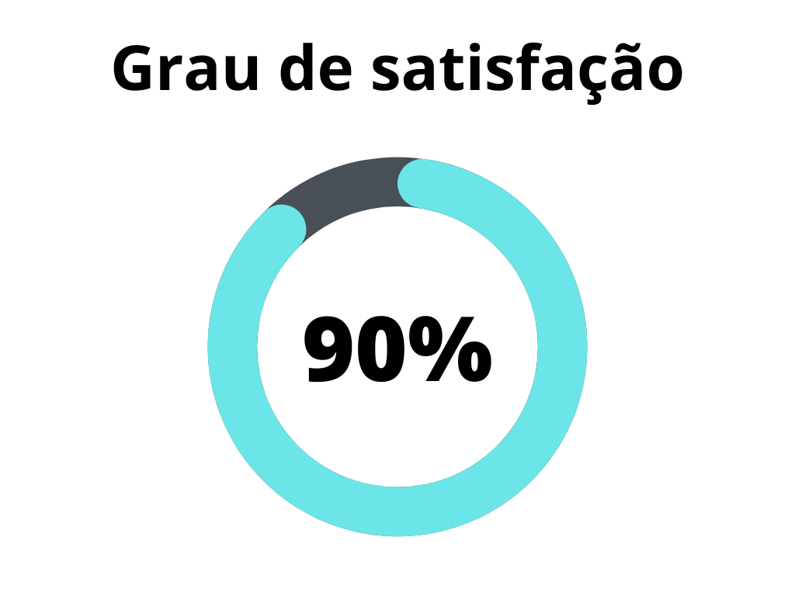

# Verificação - Especificação Suplementar

## 1. Introdução
A Especificação Suplementar é um documento que complementa a Especificação de Requisitos de Software (SRS) para cobrir itens que não foram, ou não puderam ser, mencionados na SRS. Esses itens incluem requisitos não funcionais, como usabilidade, desempenho, segurança, entre outros. Também pode incluir requisitos que se aplicam a todo o sistema, como processos de negócio e regras, ou restrições de licença e regulatórias. A verificação deste artefato tem como objetivo assegurar a qualidade do documento, verificando se todos os pontos necessários foram cobertos e se a metodologia foi corretamente aplicada.

A verificação leva em conta a versão 1.2 do artefato realizada em 16 de maio de 2023.

## 2. Metodologia
A verificação a seguir segue a metodologia proposta no [planejamento](../planejamento.md)[1], onde serão utilizados _[checklists](../../planejamento/glossario.md#Checklist)_ para a verificação dos conteúdos presentes no artefato, buscando encontrar erros e elementos faltantes no mesmo.

Abaixo seguem as verificações de conteúdo elaboradas, contendo a justificativa de cada uma além de sua fonte:

### 2.1 Verificação 1 - A metodologia FURPS+ foi corretamente aplicada?

A metodologia FURPS+ é um modelo usado para classificar e descrever os principais atributos de qualidade de um sistema de software. A verificação deve analisar se a classificação dos requisitos foi feita corretamente de acordo com a metodologia.

`[1] Grady, R. B. (1992). Practical software metrics for project management and process improvement.`

### 2.2 Verificação 2 - As categorias de requisitos foram bem definidas?

Para uma boa especificação suplementar, as categorias de requisitos (funcionalidade, usabilidade, confiabilidade, desempenho e suportabilidade) devem ser bem definidas.

`[1] Grady, R. B. (1992). Practical software metrics for project management and process improvement.`

### 2.3 Verificação 3 - Os requisitos foram organizados de forma eficaz?

Os requisitos devem ser organizados de maneira que facilite a compreensão e a análise. Isso inclui um bom uso de identificação e clareza na descrição.

`[1] Serrano, M., Serrano, M. (2019). Requisitos – Aula 13.`

### 2.4 Verificação 4 - As restrições físicas e requisitos de licença foram considerados?

Esses aspectos são vitais na especificação suplementar, garantindo que o sistema possa operar adequadamente dentro de seu ambiente de hardware e legal.

`[2] Gois, S., Sobrinho, F. (2012). Projeto de Software Floricultura Beija-Flor - Especificação Suplementar.`

## 3. Desenvolvimento

### 3.1 Padronização

Na tabela 1, se encontra o _checklist_ de padronização preenchido após a realização da verificação.

| ID | Verificação                                                          | Realizado |
|----|----------------------------------------------------------------------|-----------|
| 1  | Possui ortografia correta e formal?                                  | Sim       |
| 2  | Possui introdução?                                                   | Sim       |
| 3  | Possui links necessários?                                            | Sim       |
| 4  | As tabelas e imagens possuem legenda padronizada e chamada no texto? | Não       |
| 5  | As tabelas e imagens estão totalmente em português?                  | Sim       |
| 6  | Possui bibliografia?                                                 | Sim       |
| 7  | A bibliografia está em ordem alfabética?                             | Não       |
| 8  | Possui histórico de versão padronizado?                              | Sim       |
| 9  | O histórico de versão possui autor(es) e revisor(es)?                | Sim       |

<h6 align = "center"> Tabela 1: Verificações de padronização do artefato</h6>
<h6 align = "center"> Fonte: Autor, 2023 </h6>

### 3.2 Conteúdo
Na tabela 2, se encontra o _checklist_ de conteúdo preenchido após a realização da verificação.

| ID | Verificação                                                          | Realizado |
|----|----------------------------------------------------------------------|-----------|
| 1  | Todos os requisitos não funcionais foram identificados e estão claramente definidos? |Sim|
| 2  | Os requisitos de usabilidade foram especificados?                                |Sim|
| 3  | Os requisitos de desempenho foram adequadamente descritos? |Sim|
| 4  | As necessidades de segurança foram identificadas e descritas? |Sim|
| 5  | Requisitos que se aplicam a todo o sistema, como processos de negócio e regras, ou restrições de licença e regulatórias, foram incluídos? |Sim|
| 6  | A Especificação Suplementar está em conformidade com o padrão estabelecido para a documentação? |Sim|
| 7  | Todos os termos técnicos utilizados na Especificação Suplementar estão definidos e claros para os stakeholders? |Sim|
| 8  | Os requisitos estão rastreáveis e ligados aos seus respectivos casos de uso, se aplicável? |Sim|
| 9  | Os requisitos incluídos são viáveis e realizáveis dentro do escopo e recursos do projeto? |Sim|
| 10 | A Especificação Suplementar foi revisada e aprovada pelos stakeholders apropriados? |Não|

<h6 align = "center"> Tabela 2: Verificações de conteúdo do artefato</h6>
<h6 align = "center"> Fonte: Autor, 2023 </h6>

## 4. Resultados

Os resultados da verificação do artefato de casos de uso podem ser encontrados na tabela 3 abaixo, por meio das figuras 1, onde podem ser verificados o grau de satisfação, a ocorrência de erros no artefato não se aplica a esse artefato. Estes resultados levam em conta apenas a verificação do conteúdo.

|  |
| ----------------------------------------------------------------------------------------------------- |
| <h6 align="center">Figura 2: Representação do grau de satisfação no artefato Fonte: Autor, 2023</h6> |

## 5. Histórico de versão

| Versão | Data     | Descrição                        | Autor(es)     | Revisor(es) |
| ------ | -------- | -------------------------------- | ------------- | ----------- |
| `1.0`  | 21/06/23 | Criação do documento e adição do conteúdo | Lucas | Samuel Sato |

