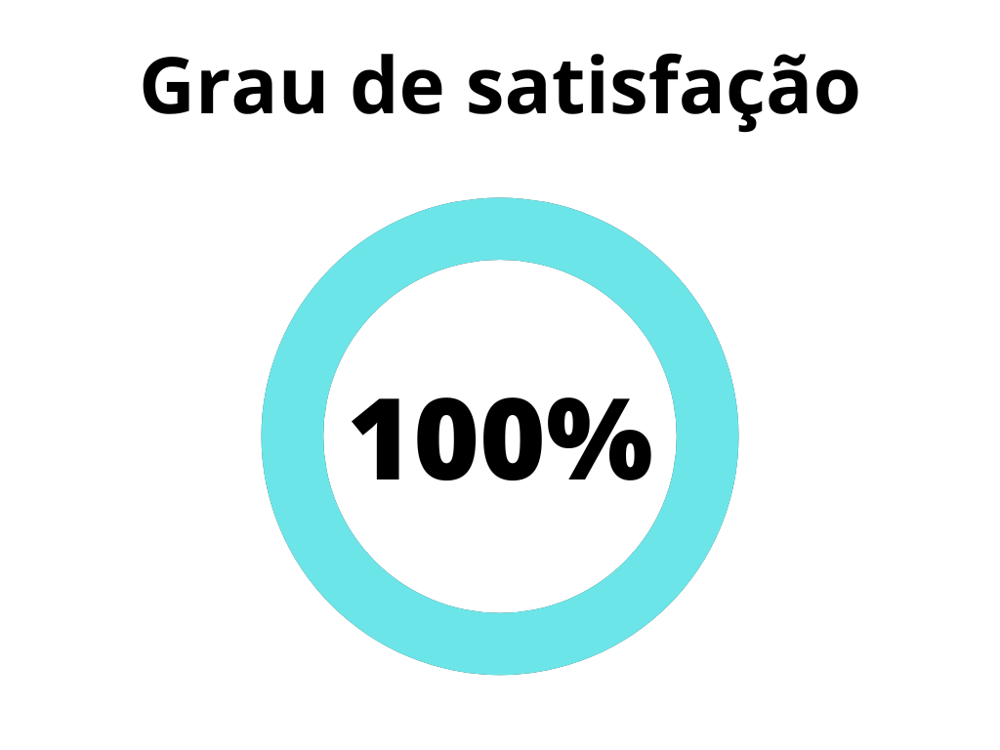
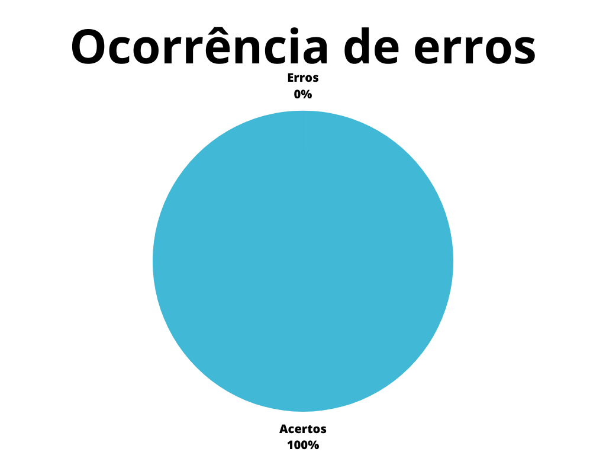

## 1 - Introdução

Este artefato tem como objetivo verificar a composição do documento de histórias de Usuário do Grupo 7 que está analisando a Petz. Com base nisso o objetivo é buscar possíveis erros conceituais e estruturais que possam ter passado despercebidos durante a etapa de desenvolvimento do documento.

## 2 - Metodologia

Como especificado no [planejamento da verificação](../planejamento.md) o método de verificação utilizado será a inspeção, assim produzindo checklists para analisar o conteúdo e a estrutura do documento. A versão do artefato que está sendo verificada é a `1.1` .

## 3 - Checklist

A seguir são apresentadas as perguntas do checklist e suas respectivas definições nas quais foram embasadas, e suas referências.

* 1 - **As histórias de usuário possuem critérios de aceitação?**

Testes de aceitação segundo Cohn (2004) estão associados às histórias do usuário para especificar os requisitos de software. São descritos como os comportamentos que o sistema em desenvolvimento necessita para atender às regras de negócio do cliente. É  um requisito do sistema de software formulado como uma ou duas frases na linguagem cotidiana do usuário de negócios. Idealmente, as histórias de usuário são escritas pelo cliente e são o seu principal método de influência no desenvolvimento dos sistemas. Os 
testes de aceitação fazem parte do aspecto de confirmação e dão origem aos casos de teste do sistema.

`
Longo, H. E. R.; Silva, M. P. (2014). A Utilização de Histórias de Usuários no Levantamento de 
Requisitos Ágeis. Int. J. Knowl. Eng. Manag., ISSN 2316-6517.
`
* 2 - **As histórias possuem quem, o que e porque?**

A sintaxe de uma história de usuário sugerida por Cohn (2004) deve conter:
* Como um... (papel ou ator) (Quem)
* Eu quero... (capacidade ou funcionalidades necessárias) (O que)
* de modo que... (por que é de valor do negócio ou benefício) (Por que)

Cohn (2004) sugere a escrita de uma história de usuário como se estivesse na pele do 
usuário que deseja a história. O uso na perspectiva de primeira pessoa torna a história 
mais compreensível

`
Longo, H. E. R.; Silva, M. P. (2014). A Utilização de Histórias de Usuários no Levantamento de 
Requisitos Ágeis. Int. J. Knowl. Eng. Manag., ISSN 2316-6517.
`

* 3 - **As histórias de usuário foram criadas junto ao cliente?**

Segundo Cohn (2004) as histórias de usuário são criadas pelo cliente, ou com participação dele e apoio da equipe, no momento do levantamento de requisitos.

`
Longo, H. E. R.; Silva, M. P. (2014). A Utilização de Histórias de Usuários no Levantamento de 
Requisitos Ágeis. Int. J. Knowl. Eng. Manag., ISSN 2316-6517.
`

* 4 - **A descrição está escrita de forma clara, lógica e objetiva?**

A escrita da história do usuário deve ocorrer sem o uso de qualquer jargão técnico. Elas devem ser compreensíveis pelos homens de negócios e seu conteúdo deve caber em um cartão de índice. Deve ser possível explicá-los em 30 segundos e implementá-los em
menos de uma semana, de acordo com Cockburn (2002).

`
Longo, H. E. R.; Silva, M. P. (2014). A Utilização de Histórias de Usuários no Levantamento de 
Requisitos Ágeis. Int. J. Knowl. Eng. Manag., ISSN 2316-6517.
`

* 5 - **Conforme está descrito é possível entender a importância da funcionalidade para o usuário?**

O "Quem" e "O que" são essenciais para a história, já o "Por que" só ajuda com clareza na configuração dos testes de aceitação. Histórias de usuário ajudam a fazer as perguntas sobre o contexto e razão para o pedido da pessoa que solicita o requisito.

`
Longo, H. E. R.; Silva, M. P. (2014). A Utilização de Histórias de Usuários no Levantamento de 
Requisitos Ágeis. Int. J. Knowl. Eng. Manag., ISSN 2316-6517.
`

* 6 - **Os critérios de aceite estão escritos de forma clara e simplificada paara o entendimento do usuário?**

`
Lista de Verificação da Qualidade de Artefatos - Checklist Ágil - disponivel em: [link](https://www.gov.br/agricultura/pt-br/acesso-a-informacao/licitacoes-e-contratos/edital/2019/pregao-eletronico-no-05-2018/diretrizes/lista-de-verificacao-da-qualidade-de-artefatos-checklist-agil.xls/view)
`

* 7 - **As Histórias de usuário obedecem a técnica INVEST(Independent, Negotiable, Valuable, Estimable, Sized Appopriately, Testable)?**

Algumas características devem ser observadas ao escrever as histórias de usuário. O acrônimo inglês INVEST (Independent, Negotiable, 
Valuable to users or customers, Estimatable, Small and Testable), sugerido por Bill Wake e citado por Cohn (2004) contém os seis atributos indispensáveis para uma história bem escrita. São eles:

* Independente: uma história deve poder ser desenvolvida, testada e até entregue isoladamente.
* Negociável: as histórias representam oportunidades de discussão dos requisitos.
* de Valor: proporcionar valor para o cliente é a essência dos métodos ágeis.
* Estimável: a equipe deve ser capaz de prover uma estimativa de sua complexidade e quantidade de trabalho necessário para terminar a história.
* São pequenas: As histórias devem ser completadas em uma iteração.
* testáveis: As histórias são testáveis.

`
Carvalho, L.A.C.; Barbosa, M. W.; Silva, V.B (2014). PROPOSTA E AVALIAÇÃO DE UMA ABORDAGEM LÚDICA PARA O ENSINO DE HISTÓRIAS DE USUÁRIO E SCRUM. Revista de Gestão e Projetos - GeP e-ISSN: 2236-0972
`

|Item | Verificação | Ocorrência | Acertos | erros |
|--|--|--|--|--|
| 1 | As histórias de usuário possuem critérios de aceitação? | 20 | 20 | 0 |
| 2 | As histórias possuem quem, o que e porque? | 20 | 20 | 0 |
| 3 | As histórias de usuário foram validadas junto ao cliente? | 20 | 20 | 0 |
| 4 | A descrição está escrita de forma clara, lógica e objetiva? | 20  | 20 | 0 |
| 5 | Conforme está descrito é possível entender a importância da funcionalidade para o usuário? | 20 | 20 | 0 |
| 6 | Os critérios de aceite estão escritos de forma clara e simplificada para o entendimento do usuário?  |20 |20 | 0 |
| 7 | As Histórias de usuário obedecem a técnica INVEST(Independent, Negotiable, Valuable, Estimable, Sized Appopriately, Testable)? |20 | 20 | 0 |

<h6 align="center">Tabela 1: Checklist do conteúdo</h6>
<h6 align="center">Fonte: Autor, 2023</h6>

| ID  | Verificação  | Realizado |
| :-: | --------------------------------------------------------- | --------- | 
|  1  | Possui ortografia correta e formal?                                  | sim        | 
|  2  | Possui introdução?                                                   | sim        | 
|  3  | Possui links necessários?                                            | sim        | 
|  4  | As tabelas e imagens possuem legenda padronizada e chamada no texto? | sim        |
|  5  | As tabelas e imagens estão totalmente em português?                  | sim        | 
|  6  | Possui bibliografia?                                                 | sim        | 
|  7  | Possui histórico de versão padronizado?                              | sim        | 
|  8  | O histórico de versão possui autor(es) e revisor(es)?                | sim        | 

<h6 align="center">Tabela 2: checklist para padronização</h6>
<h6 align="center">Fonte: Autor, 2023</h6>

## Conclusões

A verificação conclui que foi feito um trabalho que atende as definições conceituais de histórias de usuário. 

## Resultados

Os resultados da verificação do artefato de Personas podem ser encontrados na tabela 3 abaixo, por meio das figuras 1 e 2, onde podem ser verificados o grau de satisfação e a ocorrência de erros no artefato verificado. Estes resultados levam em conta apenas a verificação do conteúdo.

## 5. Referências Bibliográficas

> [1] Carvalho, L.A.C.; Barbosa, M. W.; Silva, V.B (2014). PROPOSTA E AVALIAÇÃO DE UMA ABORDAGEM LÚDICA PARA O ENSINO DE HISTÓRIAS DE USUÁRIO E SCRUM. Revista de Gestão e Projetos - GeP e-ISSN: 2236-0972
> [2] Cohn, M., User Stories Applied: For Agile Software Development, Addison-Wesley, 2004
> [3] Longo, H. E. R.; Silva, M. P. (2014). A Utilização de Histórias de Usuários no Levantamento de Requisitos Ágeis. Int. J. Knowl. Eng. Manag., ISSN 2316-6517.
> [4] Lista de Verificação da Qualidade de Artefatos - Checklist Ágil - disponivel em: [link](https://www.gov.br/agricultura/pt-br/acesso-a-informacao/licitacoes-e-contratos/edital/2019/pregao-eletronico-no-05-2018/diretrizes/lista-de-verificacao-da-qualidade-de-artefatos-checklist-agil.xls/view)

## Histórico de versão

|  Versão  |   Data   |                      Descrição                      |    Autor(es)   |  Revisor(es)  |
| -------- | -------- | --------------------------------------------------- | -------------- | ------------- |
|  `1.0`   | 21/06/23 | Criação da primeira versão do artefato de verificação de Histórias de usuário | Vitor Manoel  | Samuel Sato |
