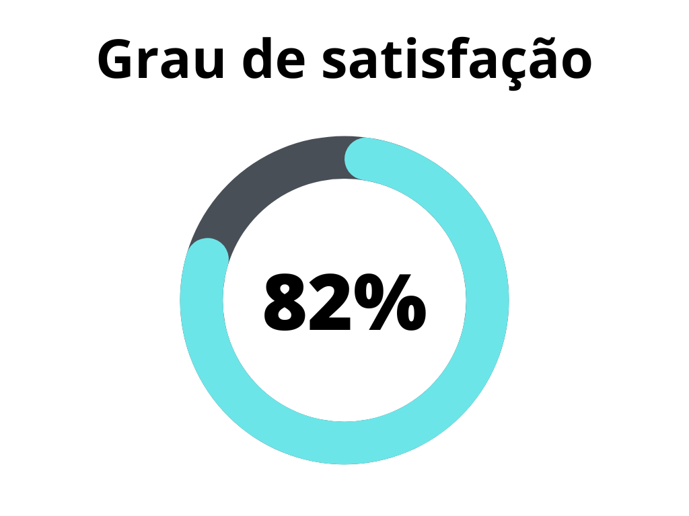
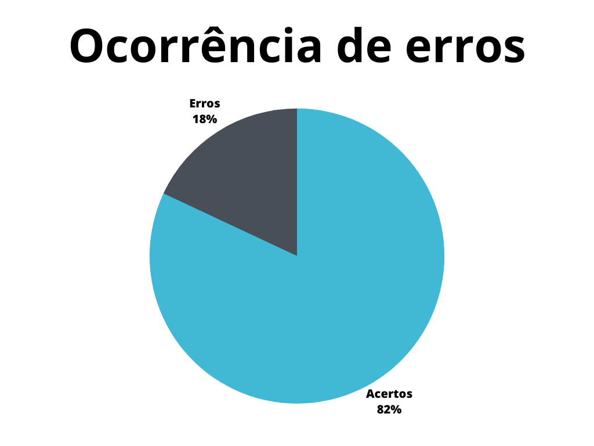

# Verificação da Introspecção

## 1. Introdução

A introspecção é uma técnica de elicitação de requisitos utilizada pelo analista ao desenvolver requisitos, baseando-se na perspectiva do usuário. Neste artefato será realizada a verificação utilizando inspeção do artefato de [Introspecção](https://requisitos-de-software.github.io/2023.1-Petz/elicitacao/introspeccao/). A versão verificada é a 1.1.

## 2. Metodologia

A verificação a seguir segue a metodologia proposta no [planejamento](../planejamento.md)[1], onde serão utilizados _[checklists](../../planejamento/glossario.md#Checklist)_ para a verificação dos conteúdos presentes no artefatos, buscando encontrar erros e elementos faltantes no mesmo.

Abaixo seguem as verificações de conteúdo elaboradas, contendo a justificativa de cada uma além de sua fonte:

## Verificação 1 - A introspecção é utilizada como técnica complementar na elicitação de requisitos?

A introspecção é uma excelente técnica para iniciar a elicitação de requisitos, mas ela deve ser utilizada de forma complementar, visto que possui pouca ou nenhuma participação do usuário na sua elaboração.

`Shams-ul-Arif, Qadeem Khan, and S. A. K. Gahyyur. "Requirements engineering processes, tools/technologies, & methodologies." International Journal of reviews in computing 2.6 (2009): 41-56.`

## Verificação 2 - A introspecção realizada reflete ideias que possam significar as necessidades dos usuários?

A introspecção aborda a perspectiva de um analista em como um possível usuário utilizaria a aplicação e as suas necessidades e vontades no uso.

`Shams-ul-Arif, Qadeem Khan, and S. A. K. Gahyyur. "Requirements engineering processes, tools/technologies, & methodologies." International Journal of reviews in computing 2.6 (2009): 41-56.`

## Verificação 3 - Os requisitos elicitados refletem tarefas que desejam ser completadas na utilização da aplicação?

Tratando-se de uma técnica que visa as necessidades do usuário a partir de uma análise de um Engenheiro de Requisitos, os requisitos devem refletir as tarefas para quais a aplicação é utilizada.

`SERRANO, Maurício; SERRANO, Milene; Requisitos - Aula 07;`

## Verificação 4 - Os requisitos elicitados refletem a diversidade de funcionalidades que a aplicação busca desempenhar?

Tratando-se de uma técnica com baixo custo de operação e que elenca inicialmente diversos requisitos que diversos usuários possam necessitar, a diversidade de funcionalidades da aplicação é uma característica que a técnica categoriza.

`SHARMA, Shreta; PANDEY, S. K. Revisiting requirements elicitation techniques. International Journal of Computer Applications, v. 75, n. 12, 2013.`

## Verificação 5 -  Os requisitos estão categorizados adequadamente?

É importante para a rastreabilidade e utilização no projeto categorizar os requisitos adequadamente em funcionais e não funcionais.

`Tribunal Regional do Trabalho do Paraná. Disponível em: https://www.trt9.jus.br/pds/index.htm. Acesso em 21 de jun. 2023.`

## Verificação 6 - Os requisitos funcionais estão padronizados para facilitar a identificação e rastreabilidade?

Importante para a organização e rastreabilidade do projeto.

`Tribunal Regional do Trabalho do Paraná. Disponível em: https://www.trt9.jus.br/pds/index.htm. Acesso em 21 de jun. 2023.`

## Verificação 7 - Os requisitos não funcionais estão padronizados para facilitar a identificação e rastreabilidade?

Importante para a organização e rastreabilidade do projeto.

`Tribunal Regional do Trabalho do Paraná. Disponível em: https://www.trt9.jus.br/pds/index.htm. Acesso em 21 de jun. 2023.`

## Verificação 8 - Os requisitos funcionais elicitados foram validados por um usuário ou utilizando as personas?

Após a definição dos requisitos, idealmente, é consultado usuários para refletir se a técnica gerou resultados compatíveis com a realidade da aplicação, visto que a introspecção pode não refletir a experiência dos reais interessados.

`SERRANO, Maurício; SERRANO, Milene; Requisitos - Aula 07;`

## Verificação 9 - O artefato apresenta os participantes que realizaram a técnica?

A técnica é realizada por analistas, logo é importante explicitar os responsáveis pela sua realização, já que os resultados tendem a refletir a experiência do Engenheiro de Requisitos.

`SHARMA, Shreta; PANDEY, S. K. Revisiting requirements elicitation techniques. International Journal of Computer Applications, v. 75, n. 12, 2013`

## 3. Desenvolvimento

### 3.1 Padronização

Na tabela 1, se encontra o _[checklist](../../planejamento/glossario.md#Checklist)_ de padronização preenchido após a realização da verificação.

| ID  | Verificação                                                          | Realizado |
| --- | -------------------------------------------------------------------- | --------- |
| 1   | Possui ortografia correta e formal?                                  | Incompleto |
| 2   | Possui introdução?                                                   | Sim       |
| 3   | Possui links necessários?                                            | Não       |
| 4   | As tabelas e imagens possuem legenda padronizada e chamada no texto? | Sim|
| 5   | As tabelas e imagens estão totalmente em português?                  | Sim       |
| 6   | Possui bibliografia?                                                 | Sim       |
| 7   | A bibliografia está em ordem alfabética?                             | Sim       |
| 8   | Possui histórico de versão padronizado?                              | Sim       |
| 9   | O histórico de versão possui autor(es) e revisor(es)?                | Sim|

<h6 align = "center"> Tabela 1: Verificação de padronização da Introspecção </h6>
<h6 align = "center"> Fonte: Autor, 2023 </h6>

### 3.2 Conteúdo

Na tabela 2, se encontra o _[checklist](../../planejamento/glossario.md#Checklist)_ de conteúdo preenchido após a realização da verificação. As verificações realizadas foram obtidas a partir do plano de ensino da disciplina [2].

| ID| Verificação                                | Ocorrências | Acertos | Erros |
| - | ------------------------------------------ | ----------- | ------- | ----- |
| 1 | A introspecção é utilizada como técnica complementar na elicitação de requisitos?| 1 | 1 | 0 |
| 2 | A introspecção realizada reflete ideias que possam significar as necessidades dos usuários?| 1 | 1 | 0 |
| 3 | Os requisitos elicitados refletem tarefas que desejam ser completadas na utilização da aplicação?| 1 | 1 | 0 |
| 4 | Os requisitos elicitados refletem a diversidade de funcionalidades que a aplicação busca desempenhar? | 24 | 24 | 0 |
| 5 | Os requisitos estão categorizados adequadamente?| 24 | 24 | 0 |
| 6 | Os requisitos funcionais estão padronizados para facilitar a identificação e rastreabilidade?| 22 | 22 | 0 |
| 7 | Os requisitos não funcionais estão padronizados para facilitar a identificação e rastreabilidade?| 2 | 2 | 0 |
| 8 | Os requisitos funcionais elicitados foram validados por um usuário ou utilizando as personas?| 22 | 0 | 22 |
| 9 | O artefato apresenta os participantes que realizaram a técnica?| 3 | 3 | 0 |

<h6 align = "center"> Tabela 2: Verificação de conteúdo da Introspecção </h6>
<h6 align = "center"> Fonte: Autor, 2023 </h6>

## 4. Problemas encontrados - Padronização

## 4.1 Verificação 1 - Possui ortografia correta e formal?    

Existem alguns erros de pontuação na escrita do artefato, principalmente na lista dos requisitos elicitados.

## 5. Problemas encontrados - Conteúdo

## 5.1 Verificação 8 - Os requisitos funcionais elicitados foram validados por um usuário ou utilizando as personas?

Idealmente, deve exisitir a validação dos requisitos elicitados no artefato da elicitação ou em artefatos que utilizem os requisitos elicitados que complementam a lista total dos requisitos. No caso do artefato verificado, não há referência a essa validação.

## 6. Resultados 

Os resultados da verificação do artefato de Introspecção podem ser encontrados na tabela 3 abaixo, por meio das figuras 1 e 2, onde podem ser verificados o grau de satisfação e a ocorrência de erros no artefato verificado. Estes resultados levam em conta apenas a verificação do conteúdo.

|                |                  |
| ----------------------------------------------------------------------------------------------------- | ------------------------------------------------------------------------------------------------ |
| <h6 align="center">Figura 2: Representação do grau de satisfação no artefato Fonte: Autor, 2023</h6> | <h6 align="center">Figura 3: Gráfico de ocorrência de erros no artefato Fonte: Autor, 2023</h6> |

<h6 align = "center"> Tabela 3: Representações gráficas dos resultados da verificação</h6>
<h6 align = "center"> Fonte: Autor, 2023 </h6>

## 7. Acompanhamento 

A correção da validação dos requisitos será realizada utilizando todos os requisitos elicitados para facilitar a rastreabilidade e o trabalho a ser realizado.Tem previsão de correção para o dia 28 de junho de 2023.

## 8. Referências bibliográficas

> [1] SERRANO, Maurício; SERRANO, Milene; Requisitos - Aula 07;

> [2] Shams-ul-Arif, Qadeem Khan, and S. A. K. Gahyyur. "Requirements engineering processes, tools/technologies, & methodologies." International Journal of reviews in computing 2.6 (2009): 41-56.

> [3] SHARMA, Shreta; PANDEY, S. K. Revisiting requirements elicitation techniques. International Journal of Computer Applications, v. 75, n. 12, 2013.

> [4] Tribunal Regional do Trabalho do Paraná. Disponível em: https://www.trt9.jus.br/pds/index.htm. Acesso em 21 de jun. 2023.

| Versão | Data     | Descrição | Autor(es) | Revisor(es) |
| ------ | -------- | --------- | --------- | ----------- |
| `1.0`  | 21/06/2023 | Criação do artefato e adição do conteúdo | Magno Luiz | Vitor Manoel |
