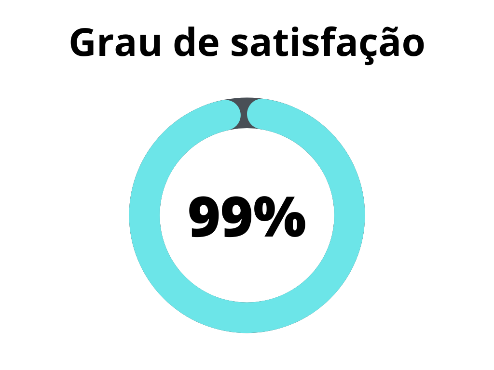
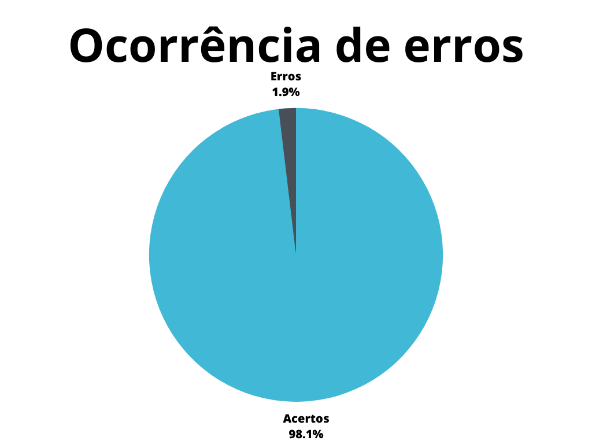
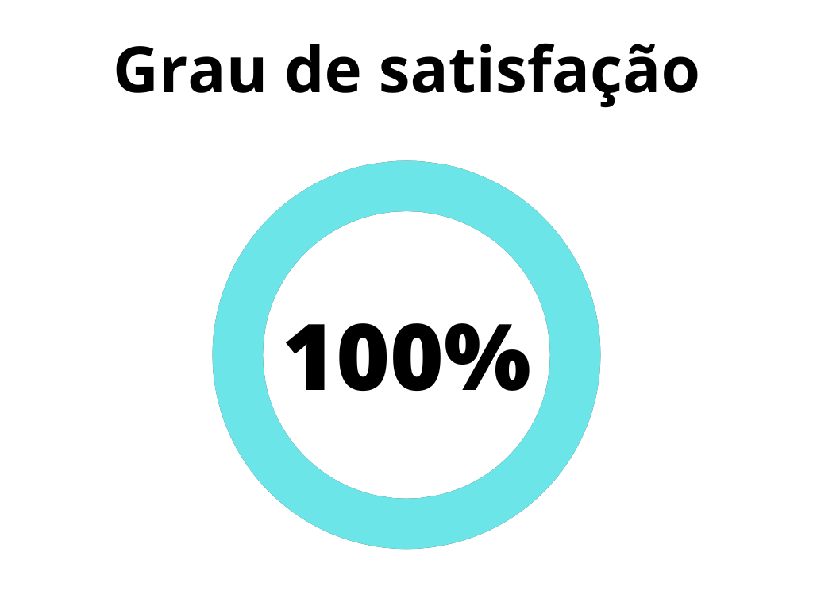
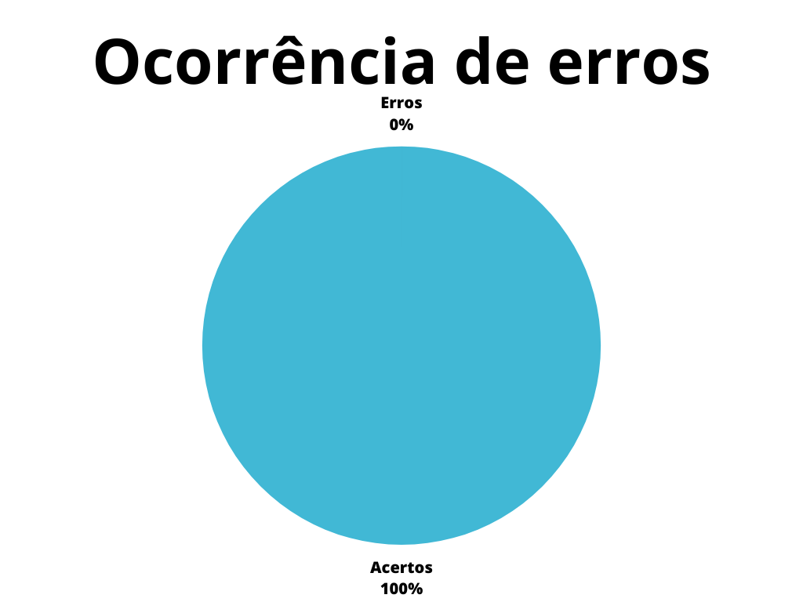

# Léxicos

## 1. Introdução

O Léxico é uma técnica que procura descrever os símbolos de uma linguagem. O objetivo principal é identificar palavras e frases características do ecosistema da aplicação[4].

Este artefato apresenta a verificação do artefato Léxico. A versão do artefato verificado é a [1.1] do dia 21 de junho de 2023.

## 2. Metodologia 

A metodologia segue como base, o artefato de [planejamento](./planejamento.md) de verificação. 

Este artefato apresenta duas _[checklist](../planejamento/glossario.md#Checklist)s_ , que podem ser preenchidas com "Sim", caso tenha sido realizado, ou "Não, caso não tenha sido realizado. Se "Não" for preenchido, serão sugeridas possíveis correções ou motivos para a não realização da atividade apresentada. 

Abaixo seguem as verificações de conteúdo elaboradas, contendo a justificativa de cada uma além de sua fonte:

### 2.1 Verificação 1 - Os léxicos estão especificados?

A definição de um léxico é importante para entender a linguagem do sistema.

`LEITE, Julio; FRANCO, Ana. A Strategy for Conceptual Model Aquisition`
`SALES, André Barros. Plano de ensino da disciplina.`

### 2.1 Verificação 2 - Existe definição do usuário nos léxicos?

Usuário faz parte da linguagem do sistema.

`SALES, André Barros. Plano de ensino da disciplina.`

### 2.1 Verificação 3 - É adotada a estrutura de dicionário(verbo,objeto,estado) nos léxicos?

Cada entrada no léxico pertence a um tipo[4].

`SALES, André Barros. Plano de ensino da disciplina.`

### 2.1 Verificação 4 - Os léxicos possuem ligação entre si?

Os léxicos devem possuir ligação entre eles de modo que haja links[4].

`SALES, André Barros. Plano de ensino da disciplina.`

### 2.1 Verificação 5 - A definição dos léxicos está coerente com a aplicação?

A construção do léxico é baseada na aquisição do vocabulário tipico da aplicação[2].

`SERRANO, Milene; SERRANO, Maurício. Requisitos – Aula 10. Apresentação em PowerPoint. Disponível em: https://aprender3.unb.br/pluginfile.php/2523091/mod_resource/content/1/Aula%2010.pdf`

### 2.1 Verificação 6 - Os léxicos possuem nome?

O nome do léxico auxilia na navegação entre o documento.

`SERRANO, Milene; SERRANO, Maurício. Requisitos – Aula 10. Apresentação em PowerPoint. Disponível em: https://aprender3.unb.br/pluginfile.php/2523091/mod_resource/content/1/Aula%2010.pdf`

### 2.1 Verificação 7 - Os léxicos possuem Classificação?

Cada entrada no léxico pertence a um tipo.

`SERRANO, Milene; SERRANO, Maurício. Requisitos – Aula 10. Apresentação em PowerPoint. Disponível em: https://aprender3.unb.br/pluginfile.php/2523091/mod_resource/content/1/Aula%2010.pdf`

### 2.1 Verificação 8 - Os léxicos possuem Impacto?

Léxico aplicado da Linguagem (LAL) é uma estrutura em que auxilia na construção do léxico. Impacto é um compo dessa estrutura

`SERRANO, Milene; SERRANO, Maurício. Requisitos – Aula 10. Apresentação em PowerPoint. Disponível em: https://aprender3.unb.br/pluginfile.php/2523091/mod_resource/content/1/Aula%2010.pdf`

### 2.1 Verificação 9 - Os léxicos possuem Noção?

Léxico aplicado da Linguagem (LAL) é uma estrutura em que auxilia na construção do léxico. Impacto é um compo dessa estrutura

`SERRANO, Milene; SERRANO, Maurício. Requisitos – Aula 10. Apresentação em PowerPoint. Disponível em: https://aprender3.unb.br/pluginfile.php/2523091/mod_resource/content/1/Aula%2010.pdf`

### 2.1 Verificação 10 - A Noção de cada léxico permite identificar os símbolos?

Noção de um léxico diz respeito a explicação como uma definição quase de dicionário [4].

`SERRANO, Milene; SERRANO, Maurício. Requisitos – Aula 10. Apresentação em PowerPoint. Disponível em: https://aprender3.unb.br/pluginfile.php/2523091/mod_resource/content/1/Aula%2010.pdf`

### 2.1 Verificação 11 - Os símbolos estão classificados corretamente?

Cada símbolo no léxico deve ser classificado corretamente.

`SERRANO, Milene; SERRANO, Maurício. Requisitos – Aula 10. Apresentação em PowerPoint. Disponível em: https://aprender3.unb.br/pluginfile.php/2523091/mod_resource/content/1/Aula%2010.pdf`

### 2.1 Verificação 12 - Os léxicos possuem sinônimos?

Os sinônimos de cada simbolo léxico auxiliam na compreenção dos vocabulários da aplicação

`SERRANO, Milene; SERRANO, Maurício. Requisitos – Aula 10. Apresentação em PowerPoint. Disponível em: https://aprender3.unb.br/pluginfile.php/2523091/mod_resource/content/1/Aula%2010.pdf`

### 2.1 Verificação 13 - Os sinônimos estão compatíveis?

Cada simbolo deve possuir um sinônimo compatível.

`SERRANO, Milene; SERRANO, Maurício. Requisitos – Aula 10. Apresentação em PowerPoint. Disponível em: https://aprender3.unb.br/pluginfile.php/2523091/mod_resource/content/1/Aula%2010.pdf`

## 3. Desenvolvimento

### 3.1 Padronização

Esta  _[checklist](../planejamento/glossario.md#Checklist)_ é responsável por verificar a padronização do artefato [léxicos]

| ID | Verificação | Realizado | 
|:-:|--|--|
| 1 | Possui ortografia correta e formal? | Sim | 
| 2 | Possui introdução? | Sim |
| 3 | Possui links necessários? | Sim |
| 4 | As tabelas e imagens possuem legenda padronizada e chamada no texto? | Não |
| 5 | As tabelas e imagens estão totalmente em português? | Não | 
| 6 | Possui bibliografia? | Sim | 
| 7 | A bibliografia está em ordem alfabética? | Sim | 
| 8 | Possui histórico de versão padronizado? | Sim |
| 9 | O histórico de versão possui autor(es) e revisor(es)? | Não |

<h6 align="center">Tabela 1: Checklist para padronização</h6>
<h6 align="center">Fonte: Autor, 2023</h6>

### 3.2 Conteúdo

Esta  _[checklist](../planejamento/glossario.md#Checklist)_ é responsável por verificar o conteúdo abordado baseado na construção de léxicos[1] de aplicações.

| ID | Verificação | Ocorrências | Acertos | Erros | 
| :-: | ------- | -------- | -------- | ------ | 
| 1 | Os léxicos estão especificados? | 22 |22 | 0 |
| 2 | Existe definição do usuário nos léxicos? | 1 | 1 | 0 |
| 3 | É adotada a estrutura de dicionário(verbo,objeto,estado) nos léxicos? | 22  | 22 | 0 | 
| 4 | Os léxicos possuem ligação entre si? | 1  | 1 | 0 | 
| 5 | A definição dos léxicos está coerente com a aplicação? | 22  | 22 | 0 |
| 6 | Os léxicos possuem nome? | 22 | 0 | 22 | 
| 7 | Os léxicos possuem Classificação? | 22  | 22 | 0 | 
| 8 | Os léxicos possuem Impacto? |  22 | 22 | 0 | 
| 9 | Os léxicos possuem Noção? | 22  | 22 | 0 |
| 10 | A Noção de cada léxico permite identificar os símbolos? | 22  | 22 | 0 |
| 11 | Os símbolos estão classificados corretamente? |  22 | 22 | 0 | 
| 12 | Os léxicos possuem sinônimos? | 22  | 18 | 4 | 
| 13 | Os sinônimos estão compatíveis? | 22  | 22 | 0 |

<h6 align="center">Tabela 2: Verificação do artefato sobre Léxicos </h6>
<h6 align="center">Fonte: Autor, 2023</h6>

## 4. Problemas encontrados

### 4.1 Verificação 6 - Os léxicos possuem nome?

Os léxicos não possuem nome.

### 4.2 Verificação 12 - Os léxicos possuem sinônimos?

Existiam alguns símbolos que não possuiam sinônimos.

## 5. Resultados

Os resultados da verificação do artefato de léxicos podem ser encontrados na tabela 3 abaixo, por meio das figuras 1 e 2, onde podem ser verificados o grau de satisfação e a ocorrência de erros no artefato verificado. Estes resultados levam em conta apenas a verificação do conteúdo.

|                |                  |
| ----------------------------------------------------------------------------------------------------- | ------------------------------------------------------------------------------------------------ |
| <h6 align="center">Figura 2: Representação do grau de satisfação no artefato Fonte: Autor, 2023</h6> | <h6 align="center">Figura 3: Gráfico de ocorrência de erros no artefato Fonte: Autor, 2023</h6> |

<h6 align = "center"> Tabela 3: Representações gráficas dos resultados da verificação</h6>
<h6 align = "center"> Fonte: Autor, 2023 </h6>

## 6. Acompanhamento

Após a verificação, tanto os problemas de padronização quanto os de conteúdo encontrados foram corrigidos através da versão 1.2 do documento, a qual foi submetida à outra verificação pelos checklists apresentados acima, que não encontraram demais problemas.

Após as correções realizadas, foi possível aferir um novo grau de satisfação e ocorrência de erros, os quais estão representados na tablea 4 abaixo, através das figuras 3 e 4.

|                |                  |
| ----------------------------------------------------------------------------------------------------- | ------------------------------------------------------------------------------------------------ |
| <h6 align="center">Figura 3: Representação do grau de satisfação no artefato após as correções Fonte: Autor, 2023</h6> | <h6 align="center">Figura 4: Gráfico de ocorrência de erros no artefato após as correções Fonte: Autor, 2023</h6> |

<h6 align = "center"> Tabela 4: Representações gráficas dos resultados da verificação após as correções </h6>
<h6 align = "center"> Fonte: Autor, 2023 </h6>

## 7. Referências Bibliográficas

> [1] CONSTRUÇÃO do léxico de aplicações. Proceedings of the International Joint Conference IBERAMIA/SBIA/SBRN 2006 : 4th Workshop in Information and Human Language Technology, Ribeirão Preto, Brazil, 23 out. 2006. CD-ROM. Disponível em: http://www.nilc.icmc.usp.br/til/til2006/0030.pdf. Acesso em: 4 de junho de 2023.

> [2] LEITE, Julio; FRANCO, Ana. A Strategy for Conceptual Model Aquisition

> [3] SALES, André Barros. Plano de ensino da disciplina. Disponível em: <https://aprender3.unb.br/pluginfile.php/2523005/mod_resource/content/31/Plano_de_Ensino%20RE%20202301%20Turma%202.pdf>. Acesso em: 19 de junho de 2023;

> [4] SERRANO, Milene; SERRANO, Maurício. Requisitos – Aula 10. Apresentação em PowerPoint. Disponível em: https://aprender3.unb.br/pluginfile.php/2523091/mod_resource/content/1/Aula%2010.pdf

## 5. Histórico de versão

| Versão | Data     | Descrição                                        | Autor(es)   | Revisor(es)   |
| ------ | -------- | ------------------------------------------------ | ----------- | ------------- |
| `1.0`  | 21/06/23 | Criação do artefato de verificação sobre léxicos | Samuel Sato | Magno Luiz |
| `1.1` | 28/06/23 | Padronização da verificação do Léxico | Samuel Sato | Lucas Rodrigues |
