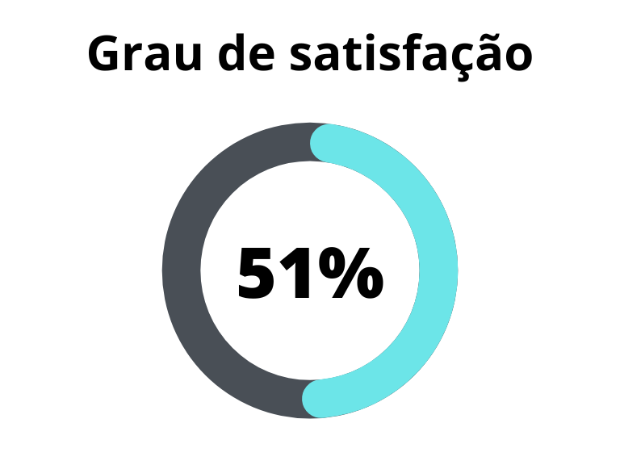

# Verificação - MoSCoW

## 1. Introdução

Artefato apresenta os resultados a verificação do MoSCoW, elaborado pelo grupo 7 - Petz, [grupo 7](https://requisitos-de-software.github.io/2023.1-Petz).

Verificação realizada na versão `1.0` do artefato realizado no dia 20/06/2023.

## 2. Metodologia

Conforme explanado no [planejamento](../planejamento.md) a verificação será feita por meio de inspeção. Este artefato apresenta duas _[checklist](../planejamento/glossario.md#Checklist)s_ , que podem ser preenchidas com "Sim", caso tenha sido realizado, ou "Não, caso não tenha sido realizado. Se "Não" for preenchido, serão sugeridas possíveis correções ou motivos para a não realização da atividade apresentada.

### 2.1 Verificação 1 - Há participação do cliente e/ou persona no processo de priorização?

É necessário que a priorização seja com base nos requisitos que tenham maior valor de negócio para os clientes.

`SERRANO M., SERRANO M. Requisitos - Aula 07. Página 31.`

### 2.2 Verificação 2 - Todos os requisitos possuem classificação?

Todos os requisitos devem ser priorizados.

`SERRANO M., SERRANO M. Requisitos - Aula 07. Página 33.`

### 2.3 Verificação 3 - Existe alguma justificativa ou motivo para priorização dos requisitos?

Justificativas dos clientes para a priorização.

`MoSCoW - Software Requirements, Third Edition. Karl Wiegers and Joy Beatty.`

## 3. Checklists

### 3.1 Padronização

Esta  _[checklist](../planejamento/glossario.md#Checklist)_ é responsável por verificar a padronização do artefato [MoSCoW](https://requisitos-de-software.github.io/2023.1-Twitch/elicitacao/priorizacao)[2]. Tabela 1 apresenta o resultado da verificação de padronização.

| ID | Verificação | Realizado | Possíveis correções | 
|:-:|--|--|--|
| 1 | Possui ortografia correta e formal? | Sim | - |
| 2 | Possui introdução? | Sim | - |
| 3 | Possui links necessários? | Não | - |
| 4 | As tabelas e imagens possuem legenda padronizada e chamada no texto? | Não | - |
| 5 | As tabelas e imagens estão totalmente em português? | Sim | - |
| 6 | Possui bibliografia? | Sim | - |
| 7 | A bibliografia está em ordem alfabética? | Sim | - |
| 8 | Possui histórico de versão padronizado? | Sim | - |
| 9 | O histórico de versão possui autor(es) e revisor(es)? | Sim | - |

<h6 align="center">Tabela 1: Checklist para padronização</h6>
<h6 align="center">Fonte: Autor, 2023</h6>

### 3.2 Conteúdo abordado

Tabela 2 apresenta o resultado da verificação de conteúdo.

| ID | Verificação | Ocorrências | Acertos | Erros |
|:-:|--|--|--|--|
| 1 | Há participação do cliente e/ou persona no processo de priorização? | 1 | 0 | 1 |
| 2 | Todos os requisitos possuem classificação(Must,Should, Could, Won't) ? | 48 | 48 | 0 |
| 3 | Existe alguma justificativa ou motivo para priorização dos requisitos? | 48 | 0 | 48 |
| 4 | O artefato explica a técnica de priorização Moscow| 1 | 1 | 0 |

<h6 align="center">Tabela 2: Verificação do artefato MosCow</h6>
<h6 align="center">Fonte: Autor, 2023</h6>

### 3.3 Problemas encontrados - conteúdo

### 3.3.1 Verificação 1 - Há participação do cliente e/ou persona no processo de priorização?

Não há nenhuma referência de que houve apoio do cliente ou persona na hora de realizar a priorização.

### 3.3.2 Verificação 3 - Existe alguma justificativa ou motivo para priorização dos requisitos?

Não há nenhuma referência de quais foram as motivações para a definição da prioridade dos requisitos.

## Resultados

Os resultados da verificação do artefato de Personas podem ser encontrados na tabela 3 abaixo, por meio das figuras 1 e 2, onde podem ser verificados o grau de satisfação e a ocorrência de erros no artefato verificado. Estes resultados levam em conta apenas a verificação do conteúdo.

## 4. Referências Bibliográficas

> [1] SERRANO M., SERRANO M. Requisitos - Aula 07. Disponível na plataforma Aprender3.

> [2] Repositório Petz do semestre 2023.1, acesso em: 20 de junho de 2023. Para mais informações acesse: <https://requisitos-de-software.github.io/2023.1-Petz>

## 5. Histórico de versão

| Versão | Data     | Descrição                                        | Autor(es)   | Revisor(es)   |
| ------ | -------- | ------------------------------------------------ | ----------- | ------------- |
| `1.0`  | 20/06/23 | Criação da verificação do MoSCoW do grupo 7 - Petz | Vitor Manoel | Samuel Sato |