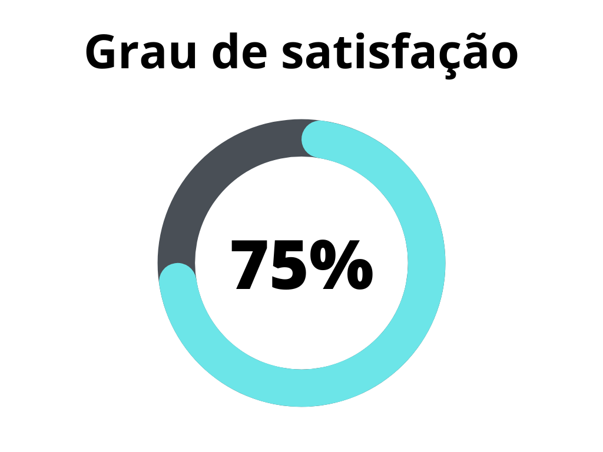

# Verificação - Perfil de Usuário

## 1. Introdução
Perfis de usuário são uma forma de modelagem de requisitos que visa representar a visão e necessidades do usuário em relação ao sistema, fazendo com que qualquer _stakeholder_, mesmo que leigo, seja capaz de ler e interpretar um perfil.

Este documento possui a função de verificar o artefato de perfis de usuário do projeto. A verificação leva em conta a versão 1.0 do artefato realizada em 16 de maio de 2023.

## 2. Metodologia
A verificação a seguir segue a metodologia proposta no [planejamento](../planejamento.md)[1], onde serão utilizados _[checklists](../../planejamento/glossario.md#Checklist)_ para a verificação dos conteúdos presentes no artefato, buscando encontrar erros e elementos faltantes no mesmo.

Abaixo seguem as verificações de conteúdo elaboradas, contendo a justificativa de cada uma além de sua fonte:

### 2.1 Verificação 1 - Os perfis de usuário representam claramente as diferentes categorias de usuários do sistema?

Os perfis de usuário têm como objetivo representar diferentes categorias de usuários, seus papéis, responsabilidades e necessidades. 

`Cooper, A., Reimann, R., & Cronin, D. (2007). About Face 3: The Essentials of Interaction Design.`

### 2.2 Verificação 2 - Os perfis de usuário detalham os cenários de uso para cada categoria de usuário?

Os cenários de uso representam uma sequência típica de interações entre os usuários e o sistema.

`Cooper, A., Reimann, R., & Cronin, D. (2007). About Face 3: The Essentials of Interaction Design.`

### 2.3 Verificação 3 - Os perfis de usuário descrevem as necessidades e objetivos dos usuários?

Os perfis de usuário devem conter informações sobre as necessidades e objetivos dos usuários para garantir que o sistema seja projetado para atender a essas necessidades e objetivos.

`Cooper, A., Reimann, R., & Cronin, D. (2007). About Face 3: The Essentials of Interaction Design.`

### 2.4 Verificação 4 - Os perfis de usuário detalham os comportamentos dos usuários?

Os comportamentos dos usuários ajudam a entender como os usuários interagem com o sistema e como ele pode ser otimizado para acomodar esses comportamentos.

`Cooper, A., Reimann, R., & Cronin, D. (2007). About Face 3: The Essentials of Interaction Design.`

### 2.5 Verificação 5 - Os perfis de usuário descrevem as capacidades dos usuários?

As capacidades dos usuários, como experiência técnica e conhecimento do domínio, são importantes para entender como projetar um sistema que seja fácil de usar para o usuário.

`Cooper, A., Reimann, R., & Cronin, D. (2007). About Face 3: The Essentials of Interaction Design.`

### 2.6 Verificação 6 - Os perfis de usuário são consistentes com os dados coletados durante a pesquisa com usuários?

Os perfis de usuário devem ser baseados em dados reais coletados durante a pesquisa com usuários

## 3. Desenvolvimento

### 3.1 Padronização

Na tabela 1, se encontra o _checklist_ de padronização preenchido após a realização da verificação.

| ID | Verificação                                                          | Realizado |
|----|----------------------------------------------------------------------|-----------|
| 1  | Possui ortografia correta e formal?                                  | Sim       |
| 2  | Possui introdução?                                                   | Sim       |
| 3  | Possui links necessários?                                            | Sim       |
| 4  | As tabelas e imagens possuem legenda padronizada e chamada no texto? | Sim       |
| 5  | As tabelas e imagens estão totalmente em português?                  | Sim       |
| 6  | Possui bibliografia?                                                 | Sim       |
| 7  | A bibliografia está em ordem alfabética?                             | Sim       |
| 8  | Possui histórico de versão padronizado?                              | Sim       |
| 9  | O histórico de versão possui autor(es) e revisor(es)?                | Sim       |

<h6 align = "center"> Tabela 1: Verificações de padronização do artefato</h6>
<h6 align = "center"> Fonte: Autor, 2023 </h6>

### 3.2 Conteúdo

Na tabela 2, se encontra o _checklist_ de conteúdo preenchido após a realização da verificação.

| Número | Pergunta | Resposta | Justificativa |
|--------|----------|----------|---------------|
| 1      | Os dados do perfil do usuário foram obtidos por meio de pesquisas, entrevistas, observação ou análise de dados existentes? Se sim, esses métodos estão documentados? | Sim | O documento menciona a aplicação de um questionário aos usuários e potenciais usuários do aplicativo para detalhar o perfil inicial. O questionário aplicado também está disponível. |
| 2      | Os usuários foram agrupados em segmentos com base em características comuns? Se sim, essas características estão explicitamente mencionadas? | Sim | Os usuários foram segmentados com base em características como Faixa etária, Ocupação, Função, Faixa Salarial, Conhecimento de tecnologia e Objetivo no aplicativo. |
| 3      | Foram criadas personas fictícias que representam perfis típicos de usuários, com base nas informações coletadas? | Sim | O documento apresenta um perfil de usuário, e também menciona a criação de personas fictícias. |
| 4      | As porcentagens de usuários em cada segmento foram determinadas? Se sim, a metodologia para determinar essas porcentagens está documentada? | Não | O documento não apresenta porcentagens de usuários em cada segmento. |

<h6 align = "center"> Tabela 2: Verificações de conteúdo do artefato</h6>
<h6 align = "center"> Fonte: Autor, 2023 </h6>

## 4. Resultados

Os resultados da verificação do artefato de casos de uso podem ser encontrados na tabela 3 abaixo, por meio das figuras 1, onde podem ser verificados o grau de satisfação, a ocorrência de erros no artefato não se aplica a esse artefato. Estes resultados levam em conta apenas a verificação do conteúdo.

|  |
| ----------------------------------------------------------------------------------------------------- |
| <h6 align="center">Figura 2: Representação do grau de satisfação no artefato Fonte: Autor, 2023</h6> |

## 5. Acompanhamento

Ainda não foram feitas as correções em cima deste artefato.

## 6. Histórico de versão

| Versão | Data | Descrição | Autor(es) | Revisor(es) |
|--|--|--|--|--|
| `1.0` | 21/06/23 | Criação do documento e adição do conteúdo | Lucas | Felipe Corrêa |

