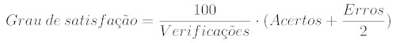
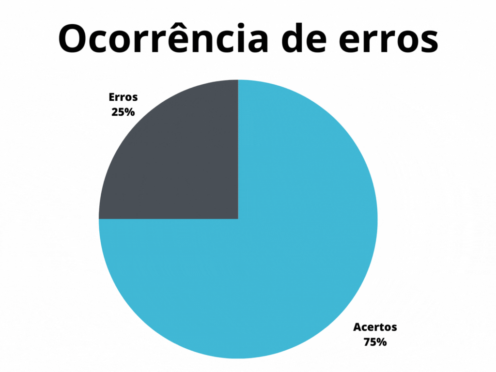

# Planejamento da verificação

## 1. Introdução

A fase de análise de requisitos é de extrema importância para que um produto de software possua uma boa qualidade, no caso dos requisitos uma boa análise impede que erros cometidos durante a manipulação dos requisistos se alastrem para o desenvolvimento, criando grandes obstáculos nas etapas mais adiante no processo, o que pode gerar retrabalhos custosos. Na engenharia de requisitos, a análise pode ser dividida em duas áreas, verificação e validação. Enquanto a verificação atua para analisar se os documentos de requisitos estão em conformidade com os padrões do projeto, a validação busca analisar se todas as necessidades do cliente foram especificadas na forma de requisitos[2].

Este artefato detalha o planejamento da verificação para este projeto, apresentando a metodologia, estruturas e padrões que serão utilizados para verificar a estrutura do projeto realizado até então. Este documento possui como inspiração o artefato de planejamento da verificação do repositório [Lichess do semestre 2022.2](https://github.com/Requisitos-de-Software/2022.2-Lichess)[3].

## 2. Metodologia

Para a verificação do projeto, será utilizado o método de inspeção. Que consiste na utilização de _checklists_ para verificar os padrões especificados, assim como a presença correta de elementos e conceitos nos artefatos analisados. Para a elaboração do _checklist_, foi utilizada a proposta de Fagan[1], onde o _checklist_ deve ponderar os erros mais comuns identificados em projetos semelhantes. Por fim, para que a verificação do projeto seja realizada de forma correta, será executado um teste piloto onde será verificada a estrutura e conteúdo do projeto realizado pelo [grupo 8 da disciplina](https://github.com/Requisitos-de-Software/2023.1-Twitch)[4], o qual é responsável pela análise do aplicativo [Twitch]()[5].

Através dos dados coletados pelo método do _checklist_, pode-se calcular numericamente o grau de satisfação com os padrões propostos, sendo este cálculo descrito pela fórmula presente na figura 1, a representação gráfica do grau de satisfação será realizada atráves de um anel de progresso, como o apresentado na figura 2. Além do grau de satisfação, pode-se calcular a porcentagem de ocorrência de erros, que deve ser representado em cada verificação por um gráfico de pizza, assim como o representado pela figura 3.

<center>



<h6 align="center">Figura 1: Equação para cálculo do grau de satisfação</h6>
<h6 align="center">Fonte: Autor, 2023</h6>

|                |                  |
| ----------------------------------------------------------------------------------------------------- | ------------------------------------------------------------------------------------------------ |
| <h6 align="center">Figura 2: Modelo de representação do grau de satisfação<br>Fonte: Autor, 2023</h6> | <h6 align="center">Figura 3: Modelo de gráfico de ocorrência de erros<br>Fonte: Autor, 2023</h6> |

</center>

<h6 align="center">Tabela 1: Modelos para representação gráfica</h6>
<h6 align="center">Fonte: Autor, 2023</h6>

## 3. _Checklist_

Para a verificação de cada artefato, serão utilizados dois _checklists_ distintos, onde um será responsável pelos parâmetros de padronização para cada artefato, sendo este idêntico para cada documento. O segundo _checklist_ será exclusivo para cada artefato, e analisará o documento de acordo com as necessidades previstas no plano de ensino da disciplina[6]. A tabela 2 abaixo, demonstra a estrutura do _checklist_ de padronização que será utilizado.

<center>

| ID  | Verificação                                                          | Realizado | Possíveis correções |
| :-: | -------------------------------------------------------------------- | --------- | ------------------- |
|  1  | Possui ortografia correta e formal?                                  | -         | -                   |
|  2  | Possui introdução?                                                   | -         | -                   |
|  3  | Possui links necessários?                                            | -         | -                   |
|  4  | As tabelas e imagens possuem legenda padronizada e chamada no texto? | -         | -                   |
|  5  | As tabelas e imagens estão totalmente em português?                  | -         | -                   |
|  6  | Possui bibliografia?                                                 | -         | -                   |
|  7  | Possui histórico de versão padronizado?                              | -         | -                   |
|  8  | O histórico de versão possui autor(es) e revisor(es)?                | -         | -                   |

</center>

<h6 align="center">Tabela 2: Modelo de checklist para padronização</h6>
<h6 align="center">Fonte: Autor, 2023</h6>

## 4. Padrões do projeto

Para verificar se o projeto segue um padrão consiso em todos os seus artefatos, segue abaixo o padrão adotado para legenda, bibliografia e histórico de versão

### 4.1 Legenda

Todas as tabelas e imagens presentes no projeto, além de serem chamadas de forma coesa pelo texto, devem possuir a legnda padronizada. Tal padrão pode ser encontrado abaixo.

Para tabelas:

```html
<h6 align="center">Tabela X: Descrição</h6>
<h6 align="center">Fonte: Autor, 2023</h6>
```

Para imagens:

```html
<h6 align="center">Figura X: Descrição</h6>
<h6 align="center">Fonte: Autor, 2023</h6>
```

### 4.2 Bibliografia

A bibliografia de cada artefato deve estar em ordem alfabética e identificada com numeração crescente. Abaixo se encontra um exemplo de bibliografia

> [1] Referência A

> [2] Referência B

> [3] Referência C

### 4.3 Histórico de versão

Abaixo se encontra o padrão de histórico de versão adotado no projeto.

<center>

| Versão | Data     | Descrição | Autor(es) | Revisor(es) |
| ------ | -------- | --------- | --------- | ----------- |
| `1.0`  | XX/XX/XX | Descrição | Autor(es) | Revisor(es) |

</center>

<h6 align="center">Tabela 3: Padrão para histórico de versão</h6>
<h6 align="center">Fonte: Autor, 2023</h6>

## 5. Teste piloto

Para a verificação seja feita de forma correta, primeiramente será executado um teste piloto, onde serão analisados os artefatos criados pelo [grupo 8](https://github.com/Requisitos-de-Software/2023.1-Twitch)[4], na tabela 4 apresentada abaixo se encontram os artefatos que serão analisados, assim como o responsável por cada verificação.

<center>

| Artefato                  | Revisor |
| ------------------------- | ------- |
| Planejamento              | Magno   |
| Aspectos gerais           | Felipe  |
| Rich Picture              | Samuel  |
| Perfil de usuário         | Lucas   |
| Personas                  | Vitor   |
| Brainstorm                | Pedro   |
| Observação                | Felipe  |
| Análise documental        | Magno   |
| MosCow                    | Samuel  |
| First things First        | Lucas   |
| Escala de três níveis     | Pedro   |
| Cenários                  | Vitor   |
| Léxicos                   | Magno   |
| Casos de uso              | Lucas   |
| Especificação suplementar | Samuel  |
| Histórias de usuário      | Vitor   |
| Backlog                   | Felipe  |
| NFR Framework             | Pedro   |

</center>

<h6 align="center">Tabela 4: Artefatos a serem verificados</h6>
<h6 align="center">Fonte: Autor, 2023</h6>

## 6. Referências Bibliográficas

> [1] Gerência e Qualidade de Software - Aula 06 - Técnica de revisão – UNIVESP

> [2] REINEHR, Sheila. Engenharia de Requisitos. Porto Alegre: Sagah, 2020.

> [3] Repositório Lichess do semestre 2022.2, acesso em: 24 de maio de 2023. Para mais informações acesse: <https://github.com/Requisitos-de-Software/2022.2-Lichess>

> [4] Repositório Twitch do semestre 2023.1, acesso em: 24 de maio de 2023. Para mais informações acesse: <https://github.com/Requisitos-de-Software/2023.1-Twitch>

> [5] Twitch, acesso em: 24 de maio de 2023. Para mais informações acesse: <https://www.twitch.tv/>

## 7. Histórico de versão

| Versão | Data     | Descrição                                        | Autor(es)   | Revisor(es)   |
| ------ | -------- | ------------------------------------------------ | ----------- | ------------- |
| `1.0`  | 24/05/23 | Criação da página de planejamento da verificação | Pedro Muniz | Felipe Correa |
