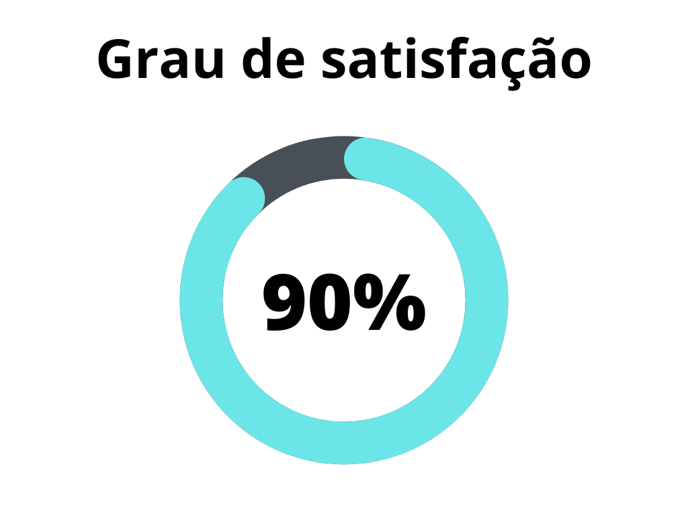
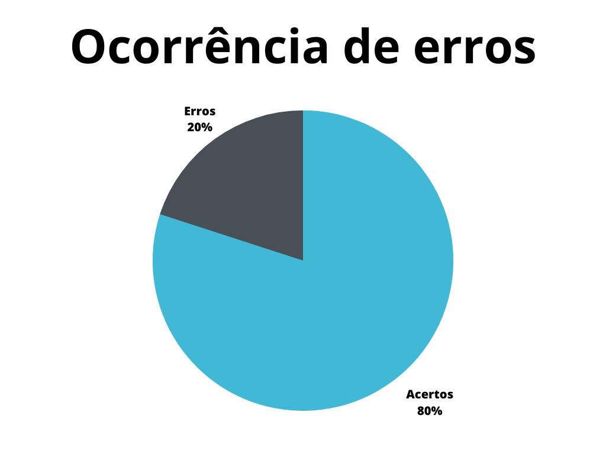

# Questionário

## 1. Introdução

O questionário é uma técnica que permite obter informações de um numeroso público-alvo de forma rápida.

Este artefato apresenta a verificação do artefato Questionário. A versão do artefato verificado é a [1.2] do dia 21 de junho de 2023.

## 2. Metodologia 

A metodologia segue como base, o artefato de [planejamento](https://requisitos-de-software.github.io/2023.1-Petz/analise/planejamento/) de verificação.

Este artefato apresenta duas _[checklist](../planejamento/glossario.md#Checklist)s_ , que podem ser preenchidas com "Sim", caso tenha sido realizado, ou "Não, caso não tenha sido realizado. Se "Não" for preenchido, serão sugeridas possíveis correções ou motivos para a não realização da atividade apresentada.

Na checklists de conteúdo abordado as verificações foram retiradas da verificação realizada pelo grupo 6 [1].

### 2.1 Verificação 1 - Foi aplicado um termo de consentimento?

É importante ter o consentimento do entrevistado.

`VALQUEZ, Carlos; SINÕES, Guilherme. Engenharia de Requisitos: Software Orientado ao negócio`

### 2.1 Verificação 2 - Foram aplicadas perguntas referente ao uso da plataforma?

O questionário deve ser ter um objetivo. Nesse caso, deve obter informações a respeito do aplicativo petz.

`VALQUEZ, Carlos; SINÕES, Guilherme. Engenharia de Requisitos: Software Orientado ao negócio`

### 2.1 Verificação 3 - Foram aplicadas perguntas referentes a quais recursos os usuários utilizam?

O questionário deve ser ter um objetivo. Nesse caso, deve obter informações sobre o uso dos recursos do aplicativo petz.

`VALQUEZ, Carlos; SINÕES, Guilherme. Engenharia de Requisitos: Software Orientado ao negócio`

### 2.1 Verificação 4 - Foram elicitados requisitos funcionais e não funcionais?

O questionário deve ser ter um objetivo. Nesse caso, servir de auxilio para elicitar requisitos funcionais e não funcionais.

`VALQUEZ, Carlos; SINÕES, Guilherme. Engenharia de Requisitos: Software Orientado ao negócio`

### 2.1 Verificação 5 - Os resultados do questionário foram devidamente documentados?

A devida documentação impede que informações sejam perdidas.

`VALQUEZ, Carlos; SINÕES, Guilherme. Engenharia de Requisitos: Software Orientado ao negócio`

## 3. Desenvolvimento

### 3.1 Padronização

Esta  _[checklist](../planejamento/glossario.md#Checklist)_ é responsável por verificar a padronização do artefato [Questionário]

| ID | Verificação | Realizado | Possíveis correções |
|:-:|--|--|--|
| 1 | Possui ortografia correta e formal? | Sim | - |
| 2 | Possui introdução? | Sim | - |
| 3 | Possui links necessários? | Não | Poderia ter links sobre o conteúdo na metodologia |
| 4 | As tabelas e imagens possuem legenda padronizada e chamada no texto? | Sim | - |
| 5 | As tabelas e imagens estão totalmente em português? | Sim | - |
| 6 | Possui bibliografia? | Sim | - |
| 7 | A bibliografia está em ordem alfabética? | Sim | - |
| 8 | Possui histórico de versão padronizado? | Sim | - |
| 9 | O histórico de versão possui autor(es) e revisor(es)? | Sim | - |

<h6 align="center">Tabela 1: Checklist para padronização</h6>
<h6 align="center">Fonte: Autor, 2023</h6>

### 3.2 Conteúdo

Esta  _[checklist](../planejamento/glossario.md#Checklist)_ é responsável por verificar o conteúdo abordado baseado na construção de Questionário[1] da aplicação.

| ID | Verificação | Ocorrências | Acertos | Erros | 
| :-: | ------- | -------- | -------- | ------ | 
| 1 | Foi aplicado um termo de consentimento? | 1 |0 | 1 |
| 2 | Foram aplicadas perguntas referente ao uso da plataforma? | 1 | 1 | 0 |
| 3 | Foram aplicadas perguntas referentes a quais recursos os usuários utilizam? | 1  | 1 | 0 | 
| 4 | Foram elicitados requisitos funcionais e não funcionais?| 1  | 1 | 0 | 
| 5 | Os resultados do questionário foram devidamente documentados? | 1  | 1 | 0 |

<h6 align="center">Tabela 2: Verificação do artefato sobre Questionário </h6>
<h6 align="center">Fonte: Autor, 2023</h6>

## 4.0 Problemas encontrados

### 4.1 Verificação 1 - Foi aplicado um termo de consentimento?

O questionário não possui termo de consentimento.

## 5.0 Resultados;

Os resultados da verificação do artefato de questionário podem ser encontrados na tabela 3 abaixo, por meio das figuras 1 e 2, onde podem ser verificados o grau de satisfação e a ocorrência de erros no artefato verificado. Estes resultados levam em conta apenas a verificação do conteúdo.

|                |                  |
| ----------------------------------------------------------------------------------------------------- | ------------------------------------------------------------------------------------------------ |
| <h6 align="center">Figura 2: Representação do grau de satisfação no artefato Fonte: Autor, 2023</h6> | <h6 align="center">Figura 3: Gráfico de ocorrência de erros no artefato Fonte: Autor, 2023</h6> |

<h6 align = "center"> Tabela 3: Representações gráficas dos resultados da verificação</h6>
<h6 align = "center"> Fonte: Autor, 2023 </h6>

## 6.0 Acompanhamento

Não foram realizadas correções. O grau de satisfação e porcentagem de erros se mantiveram inalterados.

## 5. Referências Bibliográficas

> [1] Grupo 6 - Verificação <https://requisitos-de-software.github.io/2023.1-Letterboxd/Verificação e Validação/etapa2>

> [2] VALQUEZ, Carlos; SIMÕES, Guilherme. Engenharia de Requisitos: Software Orientado ao negócio <https://aprender3.unb.br/pluginfile.php/2523071/mod_resource/content/3/Elicitacao%20de%20Req%202.pdf>

## 5. Histórico de versão

| Versão | Data     | Descrição                                        | Autor(es)   | Revisor(es)   |
| ------ | -------- | ------------------------------------------------ | ----------- | ------------- |
| `1.0`  | 21/06/23 | Criação do artefato de verificação do questionário | Samuel Sato | Magno Luiz |
| `1.1` | 28/06/23 | Padronização da verificação do questionário | Samuel Sato | Lucas Rodrigues |
