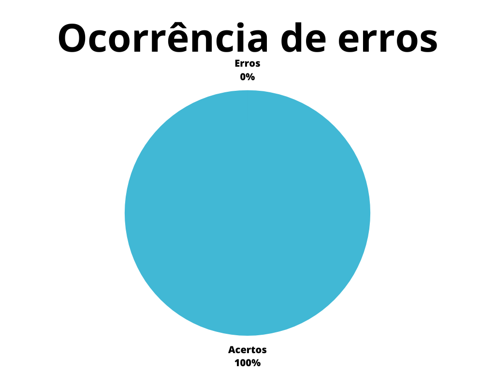

# Richpicture

## 1. Introdução

Richpictures são uma forma de representação simples para situações complexas, de forma a transmitir da forma mais eficiente possível ideias de funcionamento de um sistema, identificando atores, atividades e relacionamentos entre elementos de um sistema.

Este documento possui a função de verificar o artefato de casos de uso do projeto. A verificação leva em conta a versão 1.1 do artefato realizada em 30 de abril de 2023.

## 2. Metodologia

A verificação a seguir segue a metodologia proposta no [planejamento](../planejamento.md)[1], onde serão utilizados _[checklists](../../planejamento/glossario.md#Checklist)_ para a verificação dos conteúdos presentes no artefato, buscando encontrar erros e elementos faltantes no mesmo.

Abaixo seguem as verificações de conteúdo elaboradas, contendo a justificativa de cada uma além de sua fonte:

### 2.1 Verificação 1 - A Rich Picture elaborada representa o funcionamento do sistema de forma simples?

A premissa principal de uma richpicture é representar de uma forma simples e de fácil entendimento o funcionamento de um sistema, para que qualquer leitor possa entendê-lo.

`Introducing Rich Pictures - Rich Picture Drawing Guidelines, acesso em 20 de junho de 2023. Para mais informações acesse: https://aprender3.unb.br/pluginfile.php/2523045/mod_resource/content/2/1_5145791542719414573.pdf`

### 2.2 Verificação 2 - A Rich Picture possui todos os elementos básicos?

Para que uma Rich Picture seja elaborado da forma correta, ele deve possuir cinco elementos básicos e obrigatórios:

- **Título:** Apresentando a rich picture.
- **Atores:** Representam os usuários do sistema.
- **Operações:** Representam as ações do sistema.
- **Bancos de dados:** Representam o armazenamento das informações no sistema.
- **Setas:** Representam a direção do uso do sistema e das informações.
- **Fronteira do sistema:** Divide o que se encontra dentro e fora do sistema.

`Introducing Rich Pictures - Rich Picture Drawing Guidelines, acesso em 20 de junho de 2023. Para mais informações acesse: https://aprender3.unb.br/pluginfile.php/2523045/mod_resource/content/2/1_5145791542719414573.pdf`

### 2.3 Verificação 3 - Os elementos da Rich Picture são representados de forma correta?

Por mais que a bibliografia não possua um padrão para o desenho de Rich Pictures, comumente os elementos básicos são representados da mesma forma, buscando uma maior legibilidade.

- **Atores:** Não possuem padrão de representação, porém costumam ser representados por bonecos nomeados.
- **Operações:** Representados por elipses.
- **Bancos de dados:** Representados por retângulos.
- **Setas:** Representados por setas simples.
- **Fronteira do sistema:** Representado por uma forma fechada.

`Introducing Rich Pictures - Rich Picture Drawing Guidelines, acesso em 20 de junho de 2023. Para mais informações acesse: https://aprender3.unb.br/pluginfile.php/2523045/mod_resource/content/2/1_5145791542719414573.pdf`

### 2.4 Verificação 4 - Os atores são representados do lado de fora da fronteira?

Como os atores representam os usuários do sistema, os mesmos não devem ser representados dentro da fronteira do sistema, já que neste cenário os mesmos estariam dentro do sistema.

`Introducing Rich Pictures - Rich Picture Drawing Guidelines, acesso em 20 de junho de 2023. Para mais informações acesse: https://aprender3.unb.br/pluginfile.php/2523045/mod_resource/content/2/1_5145791542719414573.pdf`

### 2.5 Verificação 5 - O artefato possui uma legenda com os elementos e suas funções?

Para que o leitor do artefato possa compreender totalmente a rich picture elaborada, é necessária uma legneda contendo a explicação de cada elemento presente na mesma.

`Introducing Rich Pictures - Rich Picture Drawing Guidelines, acesso em 20 de junho de 2023. Para mais informações acesse: https://aprender3.unb.br/pluginfile.php/2523045/mod_resource/content/2/1_5145791542719414573.pdf`

## 3. Desenvolvimento

### 3.1 Padronização

Na tabela 1, se encontra o _checklist_ de padronização preenchido após a realização da verificação.

| ID | Verificação                                                          | Realizado    |
|----|----------------------------------------------------------------------|--------------|
| 1  | Possui ortografia correta e formal?                                  | Não          |
| 2  | Possui introdução?                                                   | Sim          |
| 3  | Possui links necessários?                                            | Não          |
| 4  | As tabelas e imagens possuem legenda padronizada e chamada no texto? | Parcialmente |
| 5  | As tabelas e imagens estão totalmente em português?                  | Sim          |
| 6  | Possui bibliografia?                                                 | Sim          |
| 7  | A bibliografia está em ordem alfabética?                             | Sim          |
| 8  | Possui histórico de versão padronizado?                              | Sim          |
| 9  | O histórico de versão possui autor(es) e revisor(es)?                | Sim          |

<h6 align = "center"> Tabela 1: Verificações de padronização do artefato</h6>
<h6 align = "center"> Fonte: Autor, 2023 </h6>

### 3.2 Conteúdo

Na tabela 2, se encontra o _checklist_ de conteúdo preenchido após a realização da verificação.

| ID | Verificação                                                                      | Ocorrências | Acertos | Erros |
|----|----------------------------------------------------------------------------------|-------------|---------|-------|
| 1  | A Rich Picture elaborada representa o funcionamento do sistema de forma simples? | 1           | 0       | 1     |
| 2  | A Rich Picture possui todos os elementos básicos?                                | 1           | 1       | 0     |
| 3  | Os elementos da Rich Picture são representados de forma correta?                 | 1           | 0       | 1     |
| 4  | Os atores são representados do lado de fora da fronteira?                        | 1           | 1       | 0     |
| 5  | O artefato possui uma legenda com os elementos e suas funções?                   | 1           | 1       | 0     |

<h6 align = "center"> Tabela 2: Verificações de conteúdo do artefato</h6>
<h6 align = "center"> Fonte: Autor, 2023 </h6>

## 4. Problemas encontrados - Padronização

### 4.1 Verificação 1 - Possui ortografia correta e formal?
Foram identificados alguns erros de concordância, além palavras com letras trocadas.

### 4.2 Verificação 3 - Possui links necessários?
O artefato faz diversas referências ao aplicativo analisado pela equipe, porém não possui uma forma de levar o leitor até o mesmo.

### 4.3 Verificação 4 - As tabelas e imagens possuem legenda padronizada e chamada no texto?
A tabela 1 não possui legenda dentro do padrão utilizado no restante do projeto.

## 5. Problemas encontrados - Conteúdo

### 5.1 Verificação 1 - A Rich Picture elaborada representa o funcionamento do sistema de forma simples?
A versão final da rich picture apresentada pode ser um tantao quanto confusa quando vista por um leitor leigo quanto a técnica ou que não posui conhecimento acerca do aplicativo representado.

### 5.2 Verificação 3 - Os elementos da Rich Picture são representados de forma correta?
Na richpicture apresentada, a fronteira do sistema é representado por uma elipse, o que é contrário ao recomendado pela bibliografia, já que pode confundir o leitor por conta de ser a mesma notação de uma operação.

## 6. Resultados

Os resultados da verificação do artefato de richpicture podem ser encontrados na tabela 3 abaixo, por meio das figuras 1 e 2, onde podem ser verificados o grau de satisfação e a ocorrência de erros no artefato verificado. Estes resultados levam em conta apenas a verificação do conteúdo.

|                |                  |
| ----------------------------------------------------------------------------------------------------- | ------------------------------------------------------------------------------------------------ |
| <h6 align="center">Figura 2: Representação do grau de satisfação no artefato Fonte: Autor, 2023</h6> | <h6 align="center">Figura 3: Gráfico de ocorrência de erros no artefato Fonte: Autor, 2023</h6> |

<h6 align = "center"> Tabela 3: Representações gráficas dos resultados da verificação</h6>
<h6 align = "center"> Fonte: Autor, 2023 </h6>

## 7. Acompanhamento
Após a verificação, tanto os problemas de padronização quanto os de conteúdo encontrados foram corrigidos através da versão 1.2 do documento, a qual foi submetida à outra verificação pelos _checklists_ apresentados acima, que não encontraram demais problemas.

Após as correções realizadas, foi possível aferir um novo grau de satisfação e ocorrência de erros, os quais estão representados na tablea 4 abaixo, através das figuras 3 e 4.

|                |                  |
| ----------------------------------------------------------------------------------------------------- | ------------------------------------------------------------------------------------------------ |
| <h6 align="center">Figura 3: Representação do grau de satisfação no artefato após as correções Fonte: Autor, 2023</h6> | <h6 align="center">Figura 4: Gráfico de ocorrência de erros no artefato após as correções Fonte: Autor, 2023</h6> |

<h6 align = "center"> Tabela 4: Representações gráficas dos resultados da verificação após as correções </h6>
<h6 align = "center"> Fonte: Autor, 2023 </h6>

## 8. Referências bibliográficas

> [1] Introducing Rich Pictures - Rich Picture Drawing Guidelines, acesso em 20 de junho de 2023. Para mais informações acesse: <https://aprender3.unb.br/pluginfile.php/2523045/mod_resource/content/2/1_5145791542719414573.pdf>

## 9. Histórico de versão

| Versão | Data | Descrição | Autor(es) | Revisor(es) |
|--|--|--|--|--|
| `1.0` | 20/06/23 | Criação do documento e adição do conteúdo | Pedro Muniz | Felipe Corrêa |
