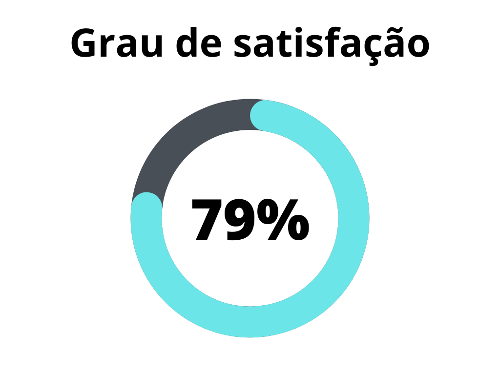
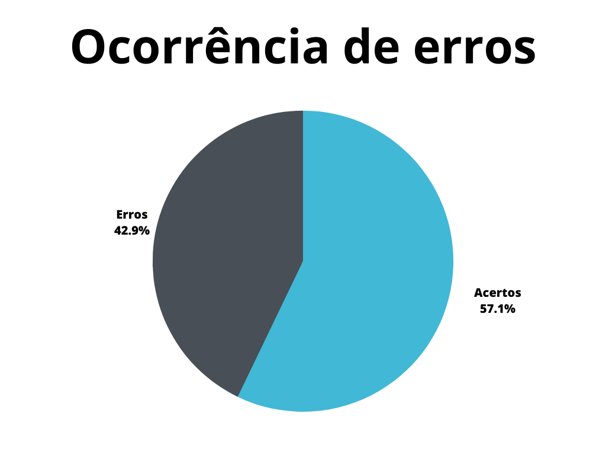

# Storytelling

## 1. Introdução

Storytelling é uma técnica de elicitação de requisitos de realização extremamente simples, onde o engenheiro de requisitos cria uma narrativa de uso do sistema, ou seja uma história onde um usuário necessita de algo e o sistema planejado o atende, é necessário citar que para a correta realização desta técnica, é imprescindível que o engenheiro tenha em mãos personas bem definidas, a fim de representá-las corretamente nas histórias criadas.

Este documento possui a função de verificar o artefato de casos de uso do projeto. A verificação leva em conta a versão 1.1 do artefato realizada em 30 de abril de 2023.

## 2. Metodologia

A verificação a seguir segue a metodologia proposta no [planejamento](../planejamento.md)[1], onde serão utilizados _[checklists](../../planejamento/glossario.md#Checklist)_ para a verificação dos conteúdos presentes no artefato, buscando encontrar erros e elementos faltantes no mesmo.

Abaixo seguem as verificações de conteúdo elaboradas, contendo a justificativa de cada uma além de sua fonte:

### 2.1 As histórias criadas seguem uma ordem lógica?

Como são narrativas, é de extrema importância que as histórias criadas possuam uma coesão e coerência. Além de poderem ser lidas de forma a criar uma linha temporal de acontecimentos.

`READE, Dennis et al. Storytelling. In: READE, Dennis et al. Marketing: novas tendências. São Paulo: Saraiva, 2015. Cap. 2. p. 30-43.`

### 2.2 As histórias contém os elementos necessários para uma boa história?

Para que uma narrativa seja realizada de forma satisfatória, é necessário que se tenham elementos básicos que levam ao entendimento da mesma, tais elementos são:

- **Mensagem:** Representa a ideia da narrativa, aquilo que deve ser passado ao leitor.
- **Ambiente:** Contexto da narrativa.
- **Personagem:** Aquele que participa da história, no caso do artefato, uma persona.
- **Conflito:** Situação a ser superada pelo personagem da narrativa.

`VIEIRA, Dimitri. O que é Storytelling? O guia para você dominar a arte de contar histórias e se tornar um excelente Storyteller. 2023. Disponível em: https://rockcontent.com/br/blog/o-que-e-storytelling-guia-para-voce-dominar-a-arte-de-contar-historias/. Acesso em: 20 jun. 2023.`

### 2.3 As histórias possuem mais de um autor?

Para criar histórias capazes de transmitir diversas ideias e por fim inspirar a elicitação, é necessário que as mesmas sejam revisadas e complementadas por mais de um autor, buscando diversos pontos de vista.

`SIMPÓSIO BRASILEIRO DE QUALIDADE DE SOFTWARE, 12., 2013, Salvador. Uso de Storytelling para Apoiar a Gestão de Conhecimento no Desenvolvimento de Software. Salvador: Sociedade Brasileira de Computação, 2013. 14 p.`

### 2.4 Os personagens das histórias são personas ou usuários?

Por se tratarem de narrativas propostas sobre o sistema a ser projetado, é necessário que as histórias circulem sobre aqueles que utilizarão o mesmo.

`READE, Dennis et al. Storytelling. In: READE, Dennis et al. Marketing: novas tendências. São Paulo: Saraiva, 2015. Cap. 2. p. 30-43.`

### 2.5 O artefato sumariza de forma organizada os requisitos provenientes da técnica?

Para que se tenha uma leitura limpa do artefato, é interessante que os requisitos obtidos a partir do storytelling sejão apresentados de forma organizada.

`SALES, André Barros. Plano de ensino da disciplina.`

### 2.6 As histórias foram validadas com um usuário ou persona?

Para garantir que as histórias elaboradas são condizentes com a realidade e contexto dos usuários reais do sistema, é necessária uma validação da técnica junto aos mesmos.

`SALES, André Barros. Plano de ensino da disciplina.`

### 2.7 O artefato possui a gravação da realização da técnica, assim como de sua validação?

Para se registrar a realização da técnica, é interessante a presença de uma gravação em áudio ou vídeo da mesma.

`SALES, André Barros. Plano de ensino da disciplina.`

## 3. Desenvolvimento

### 3.1 Padronização

Na tabela 1, se encontra o _checklist_ de padronização preenchido após a realização da verificação.

| ID | Verificação                                                          | Realizado |
|----|----------------------------------------------------------------------|-----------|
| 1  | Possui ortografia correta e formal?                                  | Sim       |
| 2  | Possui introdução?                                                   | Sim       |
| 3  | Possui links necessários?                                            | Sim       |
| 4  | As tabelas e imagens possuem legenda padronizada e chamada no texto? | Sim       |
| 5  | As tabelas e imagens estão totalmente em português?                  | Sim       |
| 6  | Possui bibliografia?                                                 | Sim       |
| 7  | A bibliografia está em ordem alfabética?                             | Sim       |
| 8  | Possui histórico de versão padronizado?                              | Sim       |
| 9  | O histórico de versão possui autor(es) e revisor(es)?                | Sim       |

<h6 align = "center"> Tabela 1: Verificações de padronização do artefato</h6>
<h6 align = "center"> Fonte: Autor, 2023 </h6>

### 3.2 Conteúdo

Na tabela 2, se encontra o _checklist_ de conteúdo preenchido após a realização da verificação.

| ID | Verificação                                                                         | Ocorrências | Acertos | Erros |
|----|-------------------------------------------------------------------------------------|-------------|---------|-------|
| 1  | As histórias criadas seguem uma ordem lógica?                                       | 2           | 2       | 0     |
| 2  | As histórias contém os elementos necessários para uma boa história?                 | 2           | 2       | 0     |
| 3  | As histórias possuem mais de um autor?                                              | 2           | 0       | 2     |
| 4  | Os personagens das histórias são personas ou usuários?                              | 2           | 2       | 0     |
| 5  | O artefato sumariza de forma organizada os requisitos provenientes da técnica?      | 2           | 2       | 0     |
| 6  | As histórias foram validadas com um usuário ou persona?                             | 2           | 0       | 2     |
| 7  | O artefato possui a gravação da realização da técnica, assim como de sua validação? | 2           | 0       | 2     |

<h6 align = "center"> Tabela 2: Verificações de conteúdo do artefato</h6>
<h6 align = "center"> Fonte: Autor, 2023 </h6>

## 4. Problemas encontrados - Padronização
Não foram encontrados problemas de padronização no documento.

## 5. Problemas encontrados - Conteúdo

### 5.1 Verificação 3 - As histórias possuem mais de um autor?
O artefato não possui indicação de que as narrativas elaboradas foram analisadas e alteradas ou complementadas por outros auteores além do principal.

### 5.2 Verificação 6 - As histórias foram validadas com um usuário ou persona?
No artefato não há qualquer referência à uma validação das narrativas por parte de um usuário real ou de uma persona por meio de encenação.

### 5.3 Verificação 7 - O artefato possui a gravação da realização da técnica, assim como de sua validação?
O artefato não apresenta a gravação de vídeo ou áudio da realização da técnica ou da validação da mesma.

## 6. Resultados

|                |                  |
| ----------------------------------------------------------------------------------------------------- | ------------------------------------------------------------------------------------------------ |
| <h6 align="center">Figura 2: Representação do grau de satisfação no artefato Fonte: Autor, 2023</h6> | <h6 align="center">Figura 3: Gráfico de ocorrência de erros no artefato Fonte: Autor, 2023</h6> |

  
## 7. Acompanhamento
Após a verificação, foram iniciadas as correções de conteúdo necessárias, desta forma, é planejado que tais correções sejam realizadas até o dia 28 de junho de 2023, através de uma nova versão do documento verificado.

Como não houveram correções de conteúdo, o grau de satisfação e a ocorrência de erros no artefato se mantiveram inalterados, como se percebe através da tabela 4.

|                |                  |
| ----------------------------------------------------------------------------------------------------- | ------------------------------------------------------------------------------------------------ |
| <h6 align="center">Figura 3: Representação do grau de satisfação no artefato após as correções Fonte: Autor, 2023</h6> | <h6 align="center">Figura 4: Gráfico de ocorrência de erros no artefato após as correções Fonte: Autor, 2023</h6> |

<h6 align = "center"> Tabela 4: Representações gráficas dos resultados da verificação após as correções</h6>
<h6 align = "center"> Fonte: Autor, 2023 </h6>

## 8. Referências bibliográficas

> [1] READE, Dennis et al. Storytelling. In: READE, Dennis et al. Marketing: novas tendências. São Paulo: Saraiva, 2015. Cap. 2. p. 30-43.

> [2] SALES, André Barros. Plano de ensino da disciplina. Disponível em: <https://aprender3.unb.br/pluginfile.php/2523005/mod_resource/content/27/Plano_de_Ensino%20RE%20202301%20Turma%202.pdf>. Acesso em: 19 de junho de 2023;

> [3] SIMPÓSIO BRASILEIRO DE QUALIDADE DE SOFTWARE, 12., 2013, Salvador. Uso de Storytelling para Apoiar a Gestão de Conhecimento no Desenvolvimento de Software. Salvador: Sociedade Brasileira de Computação, 2013. 14 p.

> [4] VIEIRA, Dimitri. O que é Storytelling? O guia para você dominar a arte de contar histórias e se tornar um excelente Storyteller. 2023. Disponível em: <https://rockcontent.com/br/blog/o-que-e-storytelling-guia-para-voce-dominar-a-arte-de-contar-historias/>. Acesso em: 20 jun. 2023.

## 9. Histórico de versão

| Versão | Data | Descrição | Autor(es) | Revisor(es) |
|--|--|--|--|--|
| `1.0` | 20/06/23 | Criação do documento e adição do conteúdo | Pedro Muniz | Felipe Corrêa |