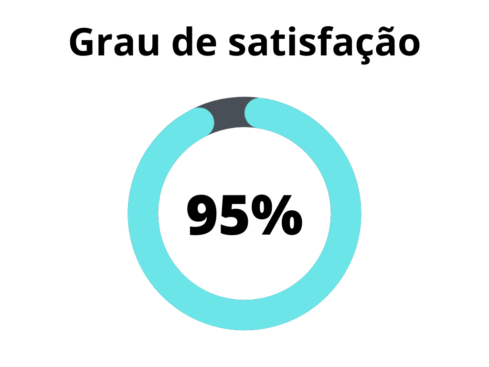
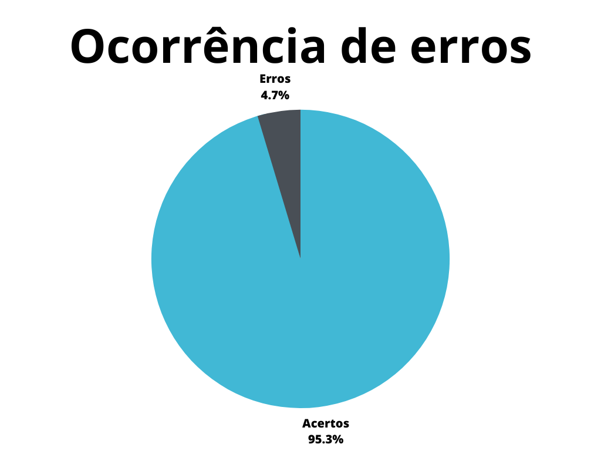

# Verificação do Storytelling

## 1. Introdução

A verificação do [Storytelling](https://requisitos-de-software.github.io/2023.1-Petz/elicitacao/Storytelling/#1-introducao) é tratada pela inspeção do artefato relacionado. Envolvendo a descrição da técnica que consiste no uso de contagem de histórias em grupos de pessoas[1], com o objetivo de elicitar requisitos que serão utilizados na concepção do projeto. A versão verificada é a 1.1.

## 2. Metodologia

A verificação a seguir segue a metodologia proposta no [planejamento](../planejamento.md)[1], onde serão utilizados _[checklists](../../planejamento/glossario.md#Checklist)_ para a verificação dos conteúdos presentes no artefatos, buscando encontrar erros e elementos faltantes no mesmo.

Abaixo seguem as verificações de conteúdo elaboradas, contendo a justificativa de cada uma além de sua fonte:

## 2.1 Verificação 1 - O Storytelling está dividido em eventos?

Eventos são importantes para definir os acontecimentos das histórias.

`Santos, Venícios Gustavo, and Nesley Daher. "Utilização de storytelling como ferramenta de aquisição de requisitos em processo de desenvolvimento de software apoiados em modelos ágeis: o uso apoiado no extreme programming." e-Tec 1.1 (2008).`

## 2.2 Verificação 2 - Existe uma estrutura de causalidade desenvolvida?

A causalidade é necessária para estabelecer as motivações e razões de acontecimentos.

`Santos, Venícios Gustavo, and Nesley Daher. "Utilização de storytelling como ferramenta de aquisição de requisitos em processo de desenvolvimento de software apoiados em modelos ágeis: o uso apoiado no extreme programming." e-Tec 1.1 (2008).`

## 2.3 Verificação 3 - O Storytelling apresenta uma estrutura que desenvolve o início,meio e fim da história compartilhada?

Para que a história gerada seja compreensível e tenha valor para a elicitação, ela deve possuir início, meio e fim.

`Santos, Venícios Gustavo, and Nesley Daher. "Utilização de storytelling como ferramenta de aquisição de requisitos em processo de desenvolvimento de software apoiados em modelos ágeis: o uso apoiado no extreme programming." e-Tec 1.1 (2008).`

## 2.4 Verificação 4 - O Storytelling contém personagens desenvolvidos no método?

A utilização de personagens é importante para definir quem realiza e sofre as ações das histórias.

`Migon, Lilian Bitton, and Luiz Carlos SILVA JUNIOR. "De histórias a processos: Utilização da técnica de Group Storytelling para apoio à elicitação de processos de negócios." Brazilian Workshop on Business Process Management, I. 2007.`

## 2.5 Verificação 5 - O Storytelling é interativo (Existe interação entre usuário,história e personagens)?

A interação é importante para que a história alcance coesão em sua criação, tenha direcionamento e gerencie os agentes.

`Santos, Venícios Gustavo, and Nesley Daher. "Utilização de storytelling como ferramenta de aquisição de requisitos em processo de desenvolvimento de software apoiados em modelos ágeis: o uso apoiado no extreme programming." e-Tec 1.1 (2008).`

## 2.6 Verificação 6 - No desenvolvimento do Storytelling, teve a utilização de personas contextualizadas?

As personas podem ser utilizadas para enriquecer o desenvolvimento das histórias.

`Santos, Venícios Gustavo, and Nesley Daher. "Utilização de storytelling como ferramenta de aquisição de requisitos em processo de desenvolvimento de software apoiados em modelos ágeis: o uso apoiado no extreme programming." e-Tec 1.1 (2008).`

## 2.7 Verificação 7 - Os requisitos elicitados estão expressados em sentenças que definem critérios de aceitação da aplicação?

Para que os requisitos elicitados sejam relevantes, é necessário que façam sentido ao redor dos critérios de aceitação para a aplicação ser um sucesso.

`Santos, Venícios Gustavo, and Nesley Daher. "Utilização de storytelling como ferramenta de aquisição de requisitos em processo de desenvolvimento de software apoiados em modelos ágeis: o uso apoiado no extreme programming." e-Tec 1.1 (2008).`

## 2.8 Verificação 8 - Os requisitos elicitados estão padronizados para facilitar a identificação?

Importante para a organização e rastreabilidade do projeto.

`Tribunal Regional do Trabalho do Paraná. Disponível em: https://www.trt9.jus.br/pds/index.htm. Acesso em 21 de jun. 2023.`

## 2.9 Verificação 9 - Os requisitos funcionais estão adequados a sua categorização?

A caracterização de requisitos funcionais existe para identificar soluções para a aplicação em forma de funcionalidades que a aplicação apresenta.

`Tribunal Regional do Trabalho do Paraná. Disponível em: https://www.trt9.jus.br/pds/index.htm. Acesso em 21 de jun. 2023.`

## 2.10 Verificação 10 - Os requisitos não-funcionais estão adequados a sua categorização?

Os requisitos não-funcionais abordam problemáticas que a aplicação apresenta em relação a desempenho, usabilidade, confiabilidade, segurança, disponibilidade, manutenibilidade e tecnologias envolvidas.

`Tribunal Regional do Trabalho do Paraná. Disponível em: https://www.trt9.jus.br/pds/index.htm. Acesso em 21 de jun. 2023.`

``
## 3. Desenvolvimento

### 3.1 Padronização

Na tabela 1, se encontra o _[checklist](../../planejamento/glossario.md#Checklist)_ de padronização preenchido após a realização da verificação.

| ID  | Verificação                                                          | Realizado |
| --- | -------------------------------------------------------------------- | --------- |
| 1   | Possui ortografia correta e formal?                                  | Sim |
| 2   | Possui introdução?                                                   | Sim       |
| 3   | Possui links necessários?                                            | Sim       |
| 4   | As tabelas e imagens possuem legenda padronizada e chamada no texto? | Sim|
| 5   | As tabelas e imagens estão totalmente em português?                  | Sim       |
| 6   | Possui bibliografia?                                                 | Sim       |
| 7   | A bibliografia está em ordem alfabética?                             | Sim       |
| 8   | Possui histórico de versão padronizado?                              | Sim       |
| 9   | O histórico de versão possui autor(es) e revisor(es)?                | Sim|

<h6 align = "center"> Tabela 1: Verificação de padronização do Storytelling </h6>
<h6 align = "center"> Fonte: Autor, 2023 </h6>

### 3.2 Conteúdo

Na tabela 2, se encontra o _[checklist](../../planejamento/glossario.md#Checklist)_ de conteúdo preenchido após a realização da verificação. As verificações realizadas foram obtidas a partir do plano de ensino da disciplina [2].

| ID| Verificação                                | Ocorrências | Acertos | Erros |
| - | ------------------------------------------ | ----------- | ------- | ----- |
| 1 | O Storytelling está dividido em eventos?[2]| 2 | 2 | 0 |
| 2 | Existe uma estrutura de causalidade desenvolvida?[2] | 2 | 2 | 0 |
| 3 | O Storytelling apresenta uma estrutura que desenvolve o início,meio e fim da história compartilhada?[2] | 2 | 2 | 0 |
| 4 | O Storytelling contém personagens desenvolvidos no método?[2] | 2 | 2 | 0 |
| 5 | O Storytelling é interativo (Existe interação entre usuário,história e personagens)?[2] | 2 | 2 | 0 |
| 6 | No desenvolvimento do Storytelling, teve a utilização de personas contextualizadas?[1] | 2 | 2 | 0 |
| 7 | Os requisitos elicitados estão expressados em sentenças que definem critérios de aceitação da aplicação?[2] | 1 | 1 | 0 |
| 8 | Os requisitos elicitados estão padronizados para facilitar a identificação?[3] | 15 | 14 | 1 |
| 9 | Os requisitos funcionais estão adequados a sua categorização?[3] | 8 | 8 | 0 |
| 10 | Os requisitos não-funcionais estão adequados a sua categorização?[3]| 7 | 6 | 1 |

<h6 align = "center"> Tabela 2: Verificação de conteúdo do Storytelling </h6>
<h6 align = "center"> Fonte: Autor, 2023 </h6>

## 4. Problemas encontrados - Conteúdo

## 4.1 Verificação 8 - Os requisitos elicitados estão padronizados para facilitar a identificação?

O requisitos não funcional [ST15](https://requisitos-de-software.github.io/2023.1-Petz/elicitacao/Storytelling/#32-requisitos-nao-funcionais) está categorizado com padronização diferente dos demais.

## 4.2 Verificação 10 - Os requisitos não-funcionais estão adequados a sua categorização?

O requisitos não funcional [ST15](https://requisitos-de-software.github.io/2023.1-Petz/elicitacao/Storytelling/#32-requisitos-nao-funcionais) deveria ser categorizado como requisito funcional e deve ter maior nível de abstração.

## 5. Resultados

Os resultados da verificação do artefato de Storytelling podem ser encontrados na tabela 3 abaixo, por meio das figuras 1 e 2, onde podem ser verificados o grau de satisfação e a ocorrência de erros no artefato verificado. Estes resultados levam em conta apenas a verificação do conteúdo.

|                |                  |
| ----------------------------------------------------------------------------------------------------- | ------------------------------------------------------------------------------------------------ |
| <h6 align="center">Figura 1: Representação do grau de satisfação no artefato Fonte: Autor, 2023</h6> | <h6 align="center">Figura 2: Gráfico de ocorrência de erros no artefato Fonte: Autor, 2023</h6> |

<h6 align = "center"> Tabela 3: Representações gráficas dos resultados da verificação</h6>
<h6 align = "center"> Fonte: Autor, 2023 </h6>

## 7. Acompanhamento

Por se tratar de uma pequena correção no artefato em questão, ela já foi realizada e consta na versão [1.2](https://requisitos-de-software.github.io/2023.1-Petz/elicitacao/Storytelling/#5-historico-de-versao) do artefato. Entretanto a reação em cadeia que gera ao aderir dois novos requisitos funcionais para o projeto ainda será corrigida, com previsão para o dia 28 de junho de 2023.

## 5. Referências bibliográficas

> [1] Migon, Lilian Bitton, and Luiz Carlos SILVA JUNIOR. "De histórias a processos: Utilização da técnica de Group Storytelling para apoio à elicitação de processos de negócios." Brazilian Workshop on Business Process Management, I. 2007.

> [2] Santos, Venícios Gustavo, and Nesley Daher. "Utilização de storytelling como ferramenta de aquisição de requisitos em processo de desenvolvimento de software apoiados em modelos ágeis: o uso apoiado no extreme programming." e-Tec 1.1 (2008).

> [3] Tribunal Regional do Trabalho do Paraná. Disponível em: https://www.trt9.jus.br/pds/index.htm. Acesso em 21 de jun. 2023.

| Versão | Data     | Descrição | Autor(es) | Revisor(es) |
| ------ | -------- | --------- | --------- | ----------- |
| `1.0`  | 21/06/2023 | Criação do artefato e adição do conteúdo | Magno Luiz | Vitor Manoel |
