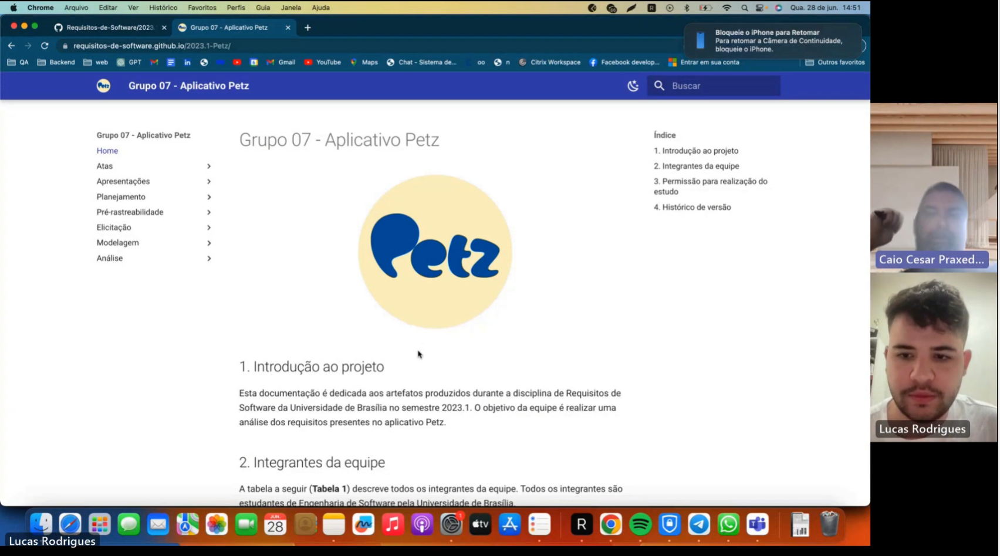

# Validação Informal

## 1. Introdução

No dia 28/06/2023, o integrante Lucas realizou uma chamada via Teams com o Head de engenharia do ecommerce da Petz. Nesta reunião todos os artefatos criados foram apresentados.  - [Link do vídeo](https://youtu.be/an_ftWnX1Dk)

### 2. Apresentação dos artefatos

<h6 align = "center"> Figura 1: Reunião via Teams </h6>
<h6 align = "center"> Fonte: Autor, 2023 </h6>

## 5. Conclusão

Após a apresentação de todos os artefatos para o Head de engenharia da Petz, Caio Praxedes, forneceu um feedback positivo para a equipe. 

 
## 7. Histórico de Versão

| Versão | Data     | Descrição                                  | Autor(es)     | Revisor(es)   |
| ------ | -------- | ------------------------------------------ | ------------- | ------------- |
| `1.0`  | 28/06/23 | Criação e adição do conteúdo               | Lucas Rodrigues |  Samuel Sato |