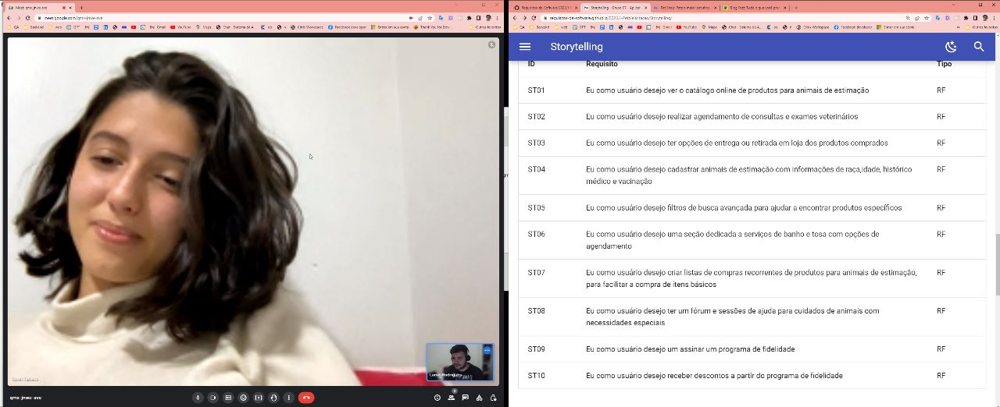

# Introspecção

## 1. Introdução

A introspecção é uma técnica de elicitação de requisitos utilizada pelo analista ao desenvolver requisitos com base na perspectiva do usuário,considerando seus objetivos e necessidades para o sucesso de um sistema específico. Esta técnica é usualmente utilizada com outras técnicas de elicitação para iniciar o processo de elicitação de requisitos, sendo uma prática de observação focada no usuário.  

A técnica de introspecção é considerada mais fácil de ser utilizada em comparação com outras técnicas de elicitação de requisitos, devido ao seu baixo custo de implementação. Ela pode ser um passo inicial no processo de elicitação de requisitos, permitindo a geração de ideias sobre a interação dos usuários com o sistema e o entendimento da duração de tarefas. No entanto, é importante notar que esta técnica pode não refletir precisamente as necessidades de diferentes usuários. Além disso, ao utilizar a observação passiva, pode ser difícil entender as razões por trás das decisões dos usuários.

## 2. Metodologia

Utilizando o conceito definido na técnica de elicitação por introspecção, a atividade de elicitação foi realizada por um integrante do grupo e revisada por dois outros integrantes.

## 3. Participantes

- Magno Luiz
- Samuel Sato
- Vitor Manoel

## 4. Resultados

Ao realizar a técnica de introspecção, os resultados da elicitação estão contidos na Tabela 1 para requisitos funcionais(RF) e requisitos Não-funcionais(RNF) na Tabela 2. Também estão caracterizados como requisitos contidos na técnica de introspecção(INT), dado o índice(ID).

| ID    | Tipo  | Descrição |
| ------|-------|-----------|
| INT01 | RF01  |O usuário deve ser capaz de se cadastrar na aplicação.|
| INT02 | RF02  |O usuário deve ser capaz de visualizar itens de produtos e serviços.|
| INT03 | RF03  |O usuário deve ser capaz de cadastrar-se para promoções.|
| INT04 | RF04  |O usuário deve ser capaz de repetir um pedido anterior.|
| INT05 | RF05  |O usuário deve ser capaz de pesquisar produtos.|
| INT06 | RF06  |O usuário deve ser capaz de pesquisar serviços.|
| INT07 | RF07  |O usuário deve ser capaz de selecionar itens.|
| INT08 | RF08  |O usuário deve ser capaz de adicionar itens ao sacola de compras.|
| INT09 | RF09  |O usuário deve ser capaz de acompanhar a situação do pedido.|
| INT10 | RF10  |O usuário deve ser capaz de adicionar uma opção de pagamento.|
| INT11 | RF11  |O usuário deve ser capaz de realizar um pedido na loja.|
| INT12 | RF12  |O usuário deve ser capaz de realizar uma compra na aplicação.|
| INT13 | RF13  |O usuário deve ser capaz de cadastrar um perfil para o Pet.|
| INT14 | RF14  |O usuário deve ser capaz de entrar em sua conta cadastrada.|
| INT15 | RF15  |O usuário deve ser capaz de remover itens da sacola de compras.|
| INT16 | RF16  |O usuário deve ser capaz de favoritar itens. |
| INT17 | RF17  |O usuário deve ser capaz de visualizar o preço de itens. |
| INT18 | RF18  |O usuário deve ser capaz de agendar um serviço.|
| INT19 | RF19  |O usuário deve ser capaz de assinar um serviço.|
| INT20 | RF20  |O usuário deve ser capaz de recuperar sua conta através do endereço de email cadastrado.|
| INT21| RF21  |O usuário deve ser capaz de cancelar um pedido.|
| INT22| RF22  |O usuário deve ser capaz de escolher como receber um produto.|

<h6 align = "center"> Tabela 1: Requisitos funcionais </h6>
<h6 align = "center"> Fonte: Autor, 2023 </h6>

| ID    | Tipo  | Descrição |
| ------|-------|-----------|
| INT23 |RNF01  |O sistema deve estar disponível para os sistemas Android e iOS.|
| INT24 |RNF02  |O sistema deve ser responsivo|

<h6 align = "center"> Tabela 2: Requisitos não-funcionais </h6>
<h6 align = "center"> Fonte: Autor, 2023 </h6>

## 5. Validação com usuário real

Foi realizado uma validação com a usuária Sarah Veras, que é estudante de relações internacionais na unb e também usuária do aplicativo da Petz. Neste vídeo foi apresentado o artefato de introspecção juntamente com o artefato de storytelling. Após a explicação do estudo realizado a Sarah nos forneceu um feedback do artefato criado. - [Link do vídeo da validação](https://youtu.be/an_ftWnX1Dk)

|  |
| ----------------------------------------------------------------------------------------------------- |
|<h6 align="center">Figura 4: Reunião de validação com usuário Fonte: Lucas, 2023</h6> |

## 6. Bibliografia
> [1] SHARMA, Shreta; PANDEY, S. K. Revisiting requirements elicitation techniques. International Journal of Computer Applications, v. 75, n. 12, 2013.

> [2] YOUSUF, Masooma; ASGER, M. Comparison of various requirements elicitation techniques. International Journal of Computer Applications, v. 116, n. 4, 2015.

> [3] ZOWGHI, Didar; COULIN, Chad. Requirements elicitation: A survey of techniques, approaches, and tools. Engineering and managing software requirements, 2005.

## 7. Histórico de versão
 
 |  Versão  |   Data   |                      Descrição                      |    Autor(es)   |  Revisor(es)  |
| -------- | -------- | --------------------------------------------------- | -------------- | ------------- |
| `1.0`    |27/04/2023|Criação do artefato de técnica de introspecção |Magno Luiz|Vitor Manoel e Samuel Sato|
| `1.1`    | 30/04/23 | Padronização de legendas | Pedro Muniz | Felipe Corrêa |
| `1.2`    | 05/07/2023 | Adição da validação com usuário | Lucas Rodrigues | Magno Luiz |
