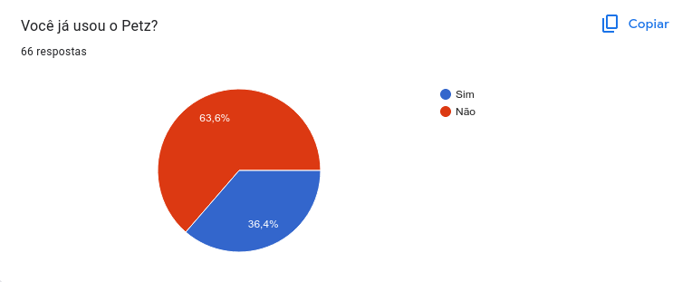
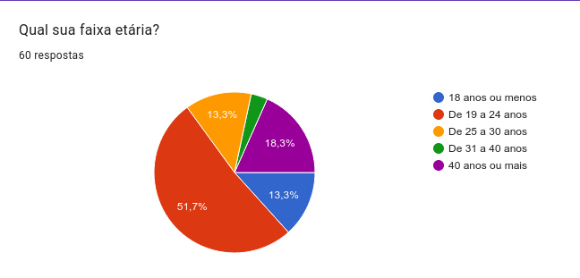
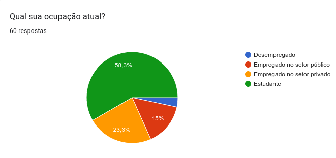
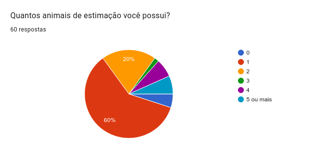
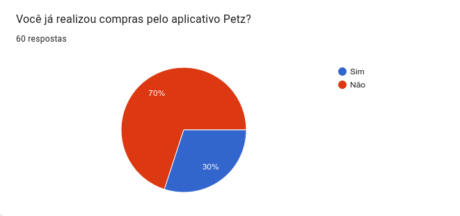
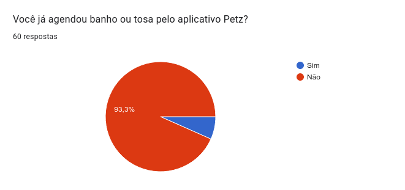
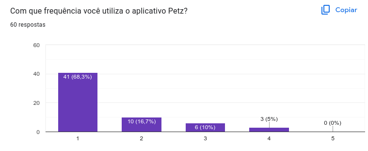
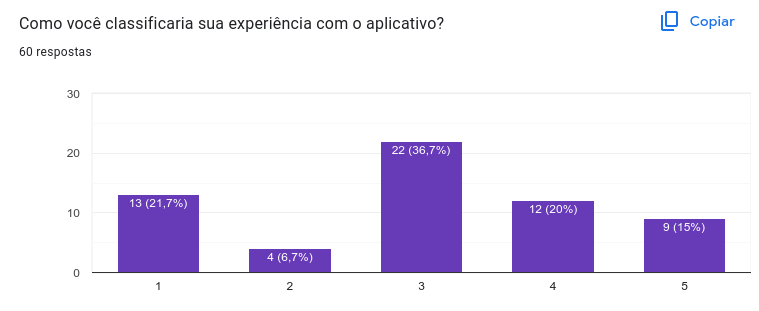
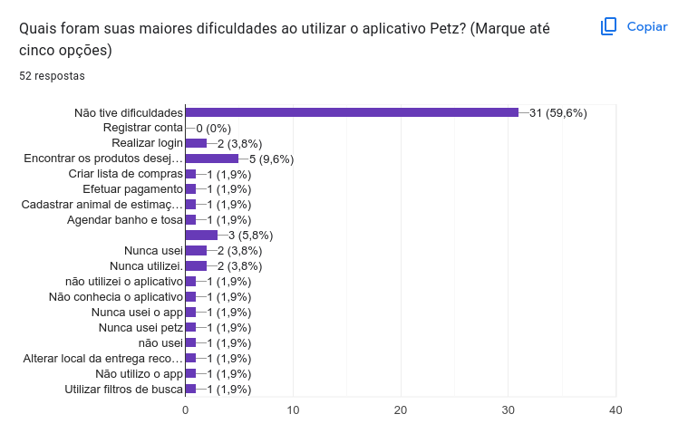
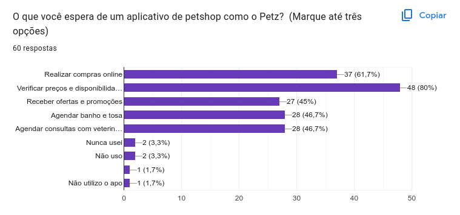

# Questionário

## 1. Introdução

O questionário é uma técnica que permite obter informações de um numeroso público-alvo de forma rápida. Tal técnica possibilita analisar as resposta de uma amostra da população. Assim, a análise das respostas do questionário auxiliam a definir entender o público alvo.

## 2. Metodologia 

Para a coleta de dados, foi utilizado a plataforma Google Forms. Foram criadas perguntas a fim de entender os usuários e potenciais usuários do aplicativo Petz. Dessa forma, as perguntas realizadas têm dois objetivos: Feedback do funcionamento do aplicativo e obtenção de dados sobre o perfil dos usuários.

Foram aplicadas duas condições para tratativa dos dados obtidos pelas respostas do questionário. É necessário que a resposta da questão 1 seja positiva ou que possua algum pet.

Questionário aplicado no grupo de Engenharia de Software do Telegram e grupos familiares e de instituições que os integrantes do grupo participam. O intervalo de data que o questionário ficou disponível foi de 27/04/2023 até 29/04/2023.

## 3. Questões

1. Você já usou o Petz? (sim/não)
2. Qual sua faixa etária? (até 18, 19-24, 25-30, 30-40, 40 ou mais)
3. Qual sua ocupação atual? (Desempregado, Empregado do setor público, Empregado do setor privado, Estudante)
4. Quantos animais de estimação você possui? (0,1,2,3,4, 5 ou mais)
5. Você já realizou compras pelo aplicativo Petz? (sim/não)
6. Você já agendou banho ou tosa pelo aplicativo Petz? (sim/não)
7. Com que frequência você utiliza o aplicativo Petz? (1,2,3,4,5)[Nunca utilizo o aplicativo / Utilizo com muita frequência]
8. Como você classificaria sua experiência com o aplicativo? [insatisfeito / muito satisfeito]
9. Quais foram suas maiores dificuldades ao utilizar o aplicativo Petz? (Marque até cinco opções)
10. O que você espera de um aplicativo de petshop como o Petz?  (Marque até três opções)

## 4. Respostas

### 4.1 Questão 1
A Figura abaixo descreve as respostas para a questão "Você já usou o Petz?". Os dados estão representados através de um gráfico de pizza.

<h6 align = "center"> Figura 1: Respostas para a questão 1 </h6>
<h6 align = "center"> Fonte: Autor, 2023 </h6>

### 4.2 Questão 2
A Figura abaixo descreve as respostas para a questão "Qual sua faixa etária?". Os dados estão representados através de um gráfico de pizza.

<h6 align = "center"> Figura 2: Respostas para a questão 2 </h6>
<h6 align = "center"> Fonte: Autor, 2023 </h6>

### 4.3 Questão 3
A Figura abaixo descreve as respostas para a questão "Qual sua ocupação atual?". Os dados estão representados através de um gráfico de pizza.

<h6 align = "center"> Figura 3: Respostas para a questão 3 </h6>
<h6 align = "center"> Fonte: Autor, 2023 </h6>

### 4.4 Questão 4
A Figura abaixo descreve as respostas para a questão "Quantos animais de estimação você possui?". Os dados estão representados através de um gráfico de pizza.

<h6 align = "center"> Figura 4: Respostas para a questão 4 </h6>
<h6 align = "center"> Fonte: Autor, 2023 </h6>

### 4.5 Questão 5
A Figura abaixo descreve as respostas para a questão "Você já realizou compras pelo aplicativo Petz?". Os dados estão representados através de um gráfico de pizza.

<h6 align = "center"> Figura 5: Respostas para a questão 5 </h6>
<h6 align = "center"> Fonte: Autor, 2023 </h6>

### 4.6 Questão 6
A Figura abaixo descreve as respostas para a questão "Você já agendou banho ou tosa pelo aplicativo Petz?". Os dados estão representados através de um gráfico de pizza.

<h6 align = "center"> Figura 6: Respostas para a questão 6 </h6>
<h6 align = "center"> Fonte: Autor, 2023 </h6>

### 4.7 Questão 7
A Figura abaixo descreve as respostas para a questão "Com que frequência você utiliza o aplicativo Petz?". Os dados estão representados através de um gráfico de barras verticais.

<h6 align = "center"> Figura 7: Respostas para a questão 7 </h6>
<h6 align = "center"> Fonte: Autor, 2023 </h6>

### 4.8 Questão 8
A Figura abaixo descreve as respostas para a questão "Como você classificaria sua experiência com o aplicativo?". Os dados estão representados através de um gráfico de barras verticais.

<h6 align = "center"> Figura 8: Respostas para a questão 8 </h6>
<h6 align = "center"> Fonte: Autor, 2023 </h6>

### 4.9 Questão 9
A Figura abaixo descreve as respostas para a questão "Quais foram suas maiores dificuldades ao utilizar o aplicativo Petz?". Os dados estão representados através de um gráfico de barras horizontais.

<h6 align = "center"> Figura 6: Respostas para a questão 9 </h6>
<h6 align = "center"> Fonte: Autor, 2023 </h6>

###  4.10 Questão 10
A Figura abaixo descreve as respostas para a questão "O que você espera de um aplicativo de petshop como o Petz?". Os dados estão representados através de um gráfico de barras horizontais.

<h6 align = "center"> Figura 10: Respostas para a questão 10 </h6>
<h6 align = "center"> Fonte: Autor, 2023 </h6>

### 5. Tabela de respostas

A Tabela 1 detalha as respostas recolhidas de usuários que tiveram experiências anteriores com o aplicativo já implementado.

| Faixa etária | Ocupação | Número de Pets | Já realizou compras pelo app | Já agendou banho ou tosa pelo app | Frequência de uso do app | Classificação da experiência com o app | Maiores dificuldades ao usar o app | O que esperar de um app como Petz |
|--------------|----------|----------------|------------------------------|----------------------------------|--------------------------|---------------|---------------|-------------------------|
|De 19 a 24 anos|	Estudante|	1	|Sim	|Não|	2|	5|	Não tive dificuldades|	Realizar compras online, Verificar preços e disponibilidade de produtos, Agendar consultas com veterinários|
|De 25 a 30 anos|	Estudante|	2|	Sim	|Não|	1	|5|	Não tive dificuldades|	Realizar compras online, Verificar preços e disponibilidade de produtos, Receber ofertas e promoções|
|De 19 a 24 anos|	Estudante|	5 ou mais|	Não|	Não|	2|	3	|Não tive dificuldades|	Realizar compras online, Verificar preços e disponibilidade de produtos|
|40 anos ou mais|	Estudante|	1|	Sim|	Não|	3|	4|	Encontrar os produtos desejados|	Verificar preços e disponibilidade de produtos|
|18 anos ou menos|	Estudante|	2|	Sim|	Não|	3|	4|	Não tive dificuldades|	Realizar compras online, Receber ofertas e promoções|
|40 anos ou mais|	Empregado no setor público|	4|	Não|	Sim|	1|	3|	Não tive dificuldades|	Verificar preços e disponibilidade de produtos|
|40 anos ou mais|	Estudante|	1|	Não|	Não|	1|	5|		|Verificar preços e disponibilidade de produtos, Receber ofertas e promoções, Agendar consultas com veterinários|
|De 19 a 24 anos|	Empregado no setor privado|	0|	Sim|	Não|	2|	4|	Não tive dificuldades|	Realizar compras online, Verificar preços e disponibilidade de produtos, Receber ofertas e promoções|
|De 19 a 24 anos|	Estudante|	1|	Sim|	Não|	3|	5|	Não tive dificuldades|	Realizar compras online, Verificar preços e disponibilidade de produtos, Receber ofertas e promoções, Agendar banho e tosa, Agendar consultas com veterinários|
|De 19 a 24 anos|	Estudante|	1|	Sim|	Não|	2|	4|	Não tive dificuldades| Encontrar os produtos desejados	Realizar compras online, Verificar preços e disponibilidade de produtos|
|40 anos ou mais|	Empregado no setor privado|	1|	Não|	Sim|	1|	2|	Não tive dificuldades| 	Verificar preços e disponibilidade de produtos, Receber ofertas e promoções, Agendar banho e tosa, Agendar consultas com veterinários|
|40 anos ou mais|	Empregado no setor privado|	1|	Não|	Não|	1|	2|	Não tive dificuldades|	Verificar preços e disponibilidade de produtos, Receber ofertas e promoções|
|De 19 a 24 anos|	Estudante|	5 ou mais|	Sim|	Não|	4|	5|	Não tive dificuldades|	Realizar compras online, Verificar preços e disponibilidade de produtos, Receber ofertas e promoções|
|De 19 a 24 anos|	Estudante|	2|	Sim|	Não|	2|	2|	Efetuar pagamento, Cadastrar animal de estimação|	Realizar compras online, Receber ofertas e promoções, Agendar banho e tosa|
|De 19 a 24 anos|	Estudante|	1|	Sim|	Não|	1|	4|	Não tive dificuldades|	Realizar compras online, Verificar preços e disponibilidade de produtos, Agendar consultas com veterinários|
|18 anos ou menos|	Estudante|	0|	Sim|	Não|	2|	4|	Não tive dificuldades|	Realizar compras online, Agendar banho e tosa, Agendar consultas com veterinários|
|De 19 a 24 anos|	Estudante|	1|	Não|	Não|	2|	4|	Não tive dificuldades|	Realizar compras online, Verificar preços e disponibilidade de produtos, Receber ofertas e promoções, Agendar banho e tosa, Agendar consultas com veterinários|
|De 25 a 30 anos|	Estudante|	1|	Sim|	Não|	3|	4|	Realizar login, Criar lista de compras|	Verificar preços e disponibilidade de produtos|
|De 19 a 24 anos|	Estudante|	1|	Sim|	Não|	2|	5|	Não tive dificuldades|	Realizar compras online, Verificar preços e disponibilidade de produtos, Receber ofertas e promoções|
|De 19 a 24 anos|	Empregado no setor privado|	2|	Sim|	Não|	4|	4|	Alterar local da entrega recorrente|	Realizar compras online, Verificar preços e disponibilidade de produtos, Receber ofertas e promoções|
|De 25 a 30 anos|	Empregado no setor privado|	2|	Sim|	Não|	3|	4|	|Encontrar os produtos desejados|	Realizar compras online, Verificar preços e disponibilidade de |produtos
|De 19 a 24 anos|	Estudante|	1|	Sim|	Não|	2|	5|	Não tive dificuldades|	Realizar compras online, Verificar preços e disponibilidade de produtos, Receber ofertas e promoções, Agendar banho e tosa, Agendar consultas com veterinários|
|De 31 a 40 anos|	Empregado no setor público|	2|	Sim|	Sim|	3|	3|	Agendar banho e tosa|	Realizar compras online, Verificar preços e disponibilidade de produtos, Agendar banho e tosa
|De 19 a 24 anos|	Estudante|	3|	Sim|	Sim|	4|	3|	Utilizar filtros de busca|	Realizar compras online, Verificar preços e disponibilidade de produtos, Agendar banho e tosa|

<h6 align = "center"> Tabela 1: Respostas de usuários ao questionário </h6>
<h6 align = "center"> Fonte: Autor, 2023 </h6>

## 6. Análise

Levando em consideração o ambiente de aplicação do questionário, é possível compreender que os usuários são em sua maioria estão na faixa etária de 18 até 25 anos, possuem 1 animal de estimação, já realizaram compras pelo aplicativo e nunca agendaram banho ou tosa pelo aplicativo. Além disso, a maioria das respostas teve boa experiência com o aplicativo.

Conforme a tabela acima e com base nos dados coletados, os usuários de aplicativos buscam se manter informados sobre preços e promoções de produtos, além de buscarem serviços como consultas veterinárias e banho e tosa de seus pets.

Observação: Algumas pessoas se confundiram as perguntas sobre o aplicativo Petz com a Loja física Petz. Contudo, é possível observar alguns padrões dos donos de pet na pesquisa.

## 7. Requisitos

A Tabela 2 detalha os requisitos que foram elicitados a partir das respostas ao questionário submetido.

Legenda:

* QST - Questionário
* RF - Requisito Funcional
* RNF - Requisito Não Funcional

| ID | Requisito | Tipo |
| -------- | -------- | ---------- |
| QST01 | O usuário deve ser capaz de se cadastrar na aplicação. | RF |
| QST02 | O usuário deve ser capaz de cadastrar mais de um animal de estimação na aplicação. | RF |
| QST03 | O usuário deve ser capaz de filtrar produtos. | RF |
| QST04 | O usuário deve ser capaz de buscar produtos. | RF |
| QST05 | O usuário deve ser capaz de criar lista de compras. | RF |
| QST06 | O usuário deve ser capaz de editar lista de compras. | RF |
| QST07 | O usuário deve ser capaz de comprar produtos adicionados a lista de compras. | RF |
| QST08 | O usuário deve ser capaz de alterar local de entrega do produto. | RF |
| QST09 | O usuário deve ser capaz de verificar preço e disponibilidade do produto. | RF |
| QST10 | O usuário deve ser capaz de agendar banho e tosa. | RF |
| QST11 | O usuário deve ser capaz de reportar falhas e erros. | RF |
| QST12 | O sistema deve ser capaz de informar sobre promoções e descontos. | RF |
| QST13 | O sistema deve ser capaz de manter seguro as informações do usuário. | RNF |

<h6 align = "center"> Tabela 2: Requisitos elicitados </h6>
<h6 align = "center"> Fonte: Autor, 2023 </h6>

## 8. Bibliografia

> [1] VAZQUEZ, Carlos; SIMÕES, Guilherme. Engenharia de Requisitos: Software Orientado ao Negócio. Brasport, 10 de agosto de 2016.

## 9. Histórico de versão

|  Versão  |   Data   |                      Descrição                      |    Autor(es)   |  Revisor(es)  |
| -------- | -------- | --------------------------------------------------- | -------------- | ------------- |
|  `1.0`   | 27/04/23 | Criação da versão inicial do questionário | Samuel Sato      | Magno Luiz  |
|  `1.1`   | 29/04/23 | Adição de dados sobre as respostas | Samuel Sato      | Magno Luiz  |
|  `1.2`   | 30/04/23 | Padronização de legendas | Pedro Muniz | Felipe Corrêa |

