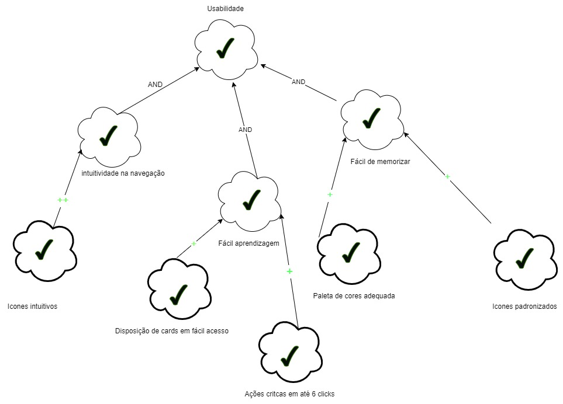
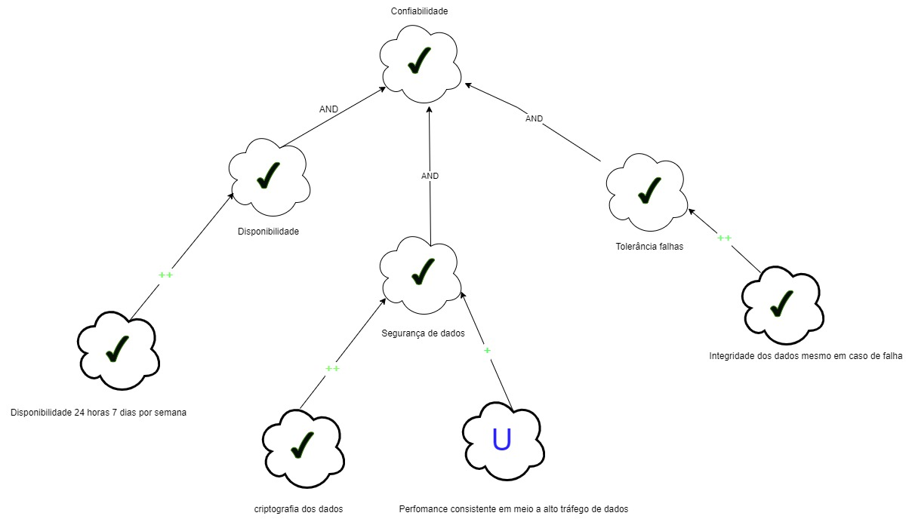
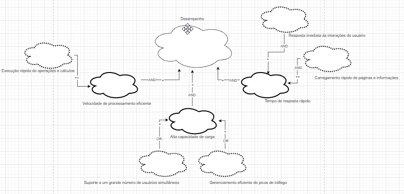
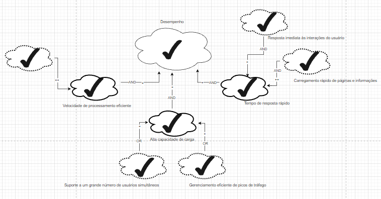
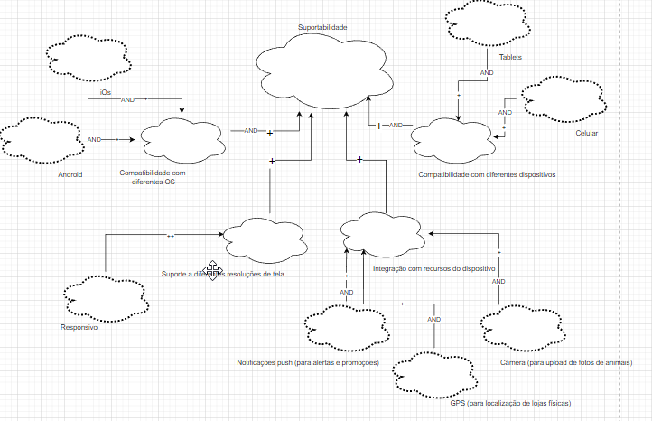
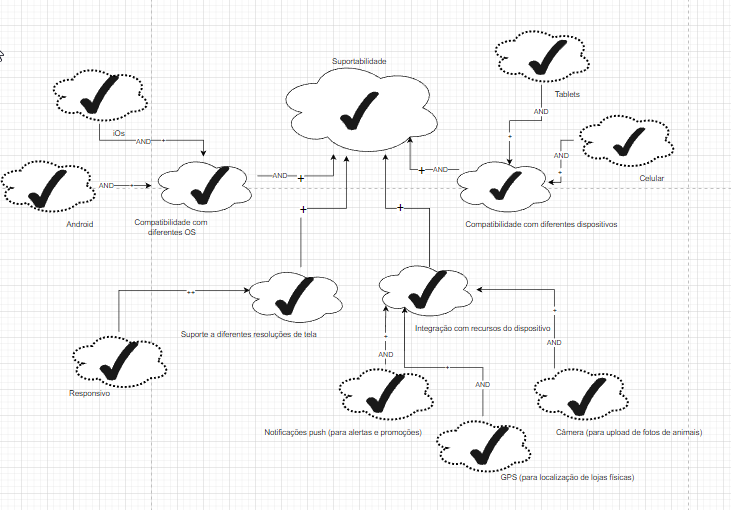

# NFR Framework

## 1. Introdução

O NFR Framework, sigla para Non-Functional Requirements Framework, é uma abordagem estruturada para a gestão e análise de requisitos não funcionais em projetos de desenvolvimento de software. Requisitos não funcionais são critérios que descrevem as características do sistema que não estão diretamente relacionadas com sua funcionalidade, mas sim com sua qualidade, desempenho, segurança, usabilidade e outros aspectos que afetam sua eficácia e eficiência.
Ao utilizar o NFR Framework, os profissionais de desenvolvimento de software podem melhorar a compreensão e a especificação dos requisitos não funcionais, bem como garantir que esses requisitos sejam levados em consideração ao longo do ciclo de vida do projeto. Isso ajuda a evitar problemas e retrabalhos futuros, além de aumentar a qualidade e a satisfação dos usuários finais.

## 2. Metodologia 

Os diagramas SIG (softgoal interdependency Graph)  que serão representados adiante, foram elaborados a partir dos requisitos não funcionais já apresentados anteriormente no documento da [Especificação Suplementar](EspecificacaoSup.md).

Existem três tipos de softgoals: Softgoals NFR, Softgoals de Operacionalização e Softgoals de Afirmação. Estes são descritos a seguir:

* **Softgoals NFR**: representam os Requisitos Não- Funcionais  e podem estar inter-relacionados, organizados em catálogos e apresentados de forma hierárquica no desenvolvimento do projeto.

* **Softgoals de Operacionalização**: representam soluções de implementação para satisfazer softgoals NFR ou outros softgoals de operacionalização. Essas soluções incluem operações, processos, representações de dados, estruturações e restrições no sistema alvo para atender às necessidades indicadas pelos softgoals NFR e de operacionalização.

* **Softgoals de Afirmação**: permitem que as características do domínio (como prioridades e carga de trabalho) sejam consideradas e devidamente refletidas no processo de tomada de decisão. Eles servem como justificativa para apoiar ou negar a forma como os softgoals são priorizados, refinados e os componentes são selecionados. Os softgoals de afirmação fornecem as razões para as decisões de desenvolvimento, facilitando a revisão, a justificativa e a mudança do sistema, bem como o aprimoramento da rastreabilidade

<h6 align = "center"> Figura 1: representação Softgoals </h6>
<h6 align = "center"> Fonte: SILVA, Reinaldo Antônio da. NFR4ES: Um Catálogo de Requisitos Não-Funcionais para Sistemas Embarcados, 2019 </h6>

No NFR framework é possível a utilização de diversos tipos de contribuições que descrevem como a satisfação ou não de um softgoal descendente contribui para a satisfação do softgoal ascendente. A seguir apresentamos os tipos de  contribuição utilizadas pelo framework.

<h6 align = "center"> Figura 2: Tipos de contribuição </h6>
<h6 align = "center"> Fonte: SILVA, Reinaldo Antônio da. NFR4ES: Um Catálogo de Requisitos Não-Funcionais para Sistemas Embarcados, 2019 </h6>

O procedimento de avaliação determina o grau que os requisitos não funcionais são satisfeitos por um conjunto de decisões. Dessa forma, o procedimento de avaliação determina se cada softgoal ou interdependência do SIG foi suficientemente satisfeito. Para isso, são atribuídos rótulos para os softgoals. Os tipos de rótulos utilizados são: satisfeito, fracamente satisfeito, negado, fracamente negado, conflitante, indeterminado. Esses rótulos são ilustrados na figura a seguir.

<h6 align = "center"> Figura 3: Tipos de rótulos </h6>
<h6 align = "center"> Fonte: SILVA, Reinaldo Antônio da. NFR4ES: Um Catálogo de Requisitos Não-Funcionais para Sistemas Embarcados, 2019 </h6>

## Cartões de especificação 

As priorizações foram indicadas com base no artefato de [Priorização](../elicitacao/resultadoPriorizacao.md/#21-escala-de-três-níveis), mais especificamente na priorização por escala de 3 níveis.

| n° requisito: [RNF01](../elicitacao/resultadoElicitacao.md/#22-requisitos-não-funcionais)|  Classificação: Confiabilidade|
|----| -------|
| Descrição: O sistema deve ser manter seguro as informações do usuário criptografando dados sensíveis. |
| Justificativa:  A segurança de dados de um usuário é de extrema importância para qualquer software, ainda mais quando falamos de dados sensíveis |
| Origem:  LGPD (Lei geral de proteção dos dados) |
| Critério de Aceitação:  Ao trafegar dados na rede os dados do usuário devem estar criptogrados e inacessíveis a terceiros |
| Dependências: nenhum |
| Prioridade: Alta prioridade |
| Conflitos:  nenhum |
| História: 05/07/2023 |

<h6 align = "center"> Especificação RNF01 </h6>
<h6 align = "center"> Fonte: Autores, 2023 </h6>
  
 

| n° requisito: [RNF02](../elicitacao/resultadoElicitacao.md/#22-requisitos-não-funcionais)|  Classificação: Suportabilidade|
|----| -------|
| Descrição: O sistema deve estar disponível para os sistemas Android e iOS. |
| Justificativa: O aplicativo deve estar disponivel no maior número de dispositivos possíveis |
| Origem: projetista do software|
| Critério de Aceitação: estar disponivel em ambos os sistemas operacionais: Android e IOS  |
| Dependências: nenhum |
| Prioridade: Alta prioridade |
| Conflitos:  nenhum |
| História: 05/07/2023 |

<h6 align = "center"> Especificação RNF02 </h6>
<h6 align = "center"> Fonte: Autores, 2023 </h6>

 

| n° requisito: [RNF03](../elicitacao/resultadoElicitacao.md/#22-requisitos-não-funcionais)|  Classificação: |
|----| -------|
| Descrição: O sistema deve ser responsivo. |
| Justificativa: Por questões de usabilidade é necessário que o software possua responsividade para estar disponivel de forma adequada para diferentes dispositivos |
| Origem: projetista do software |
| Critério de Aceitação: Software deve se adequar a diferentes tamanhos de telas|
| Dependências: nenhum |
| Prioridade: média prioridade |
| Conflitos:   nenhum |
| História: 05/07/2023 |

<h6 align = "center"> Especificação RNF03 </h6>
<h6 align = "center"> Fonte: Autores, 2023 </h6>

 

| n° requisito: [RNF04](../elicitacao/resultadoElicitacao.md/#22-requisitos-não-funcionais)|  Classificação: |
|----| -------|
| Descrição: O sistema deve ter um sistema de busca eficiente. |
| Justificativa: O aplicativo deve realizar buscas de forma eficiênte, ou seja, responder corretamente e de forma rápida a busca |
| Origem: projetista do software |
| Critério de Aceitação: A busca deve exibir seus resultados em até 2 segundos |
| Dependências: nenhum |
| Prioridade: média prioridade |
| Conflitos: nenhum |
| História: 05/07/2023 |

<h6 align = "center"> Especificação RNF04 </h6>
<h6 align = "center"> Fonte: Autores, 2023 </h6>

 

| n° requisito: [RNF05](../elicitacao/resultadoElicitacao.md/#22-requisitos-não-funcionais)|  Classificação: |
|----| -------|
| Descrição: O sistema deve ser confiável e disponível. |
| Justificativa: O aplicativo deve estar diponível 24/7 para realização de compras, lidar com falhas adequadamente e garantir a segurança dos dados dos usuários |
| Origem: projetista do software e LGPD (Lei geral de proteção dos dados)|
| Critério de Aceitação: O aplicativo deve estar disponível durânte toda semana, tratar adequadamente falhas e criptografar os dados dos usuários |
| Dependências: nenhum |
| Prioridade: alta prioridade |
| Conflitos: nenhum |
| História: 05/07/2023 |

<h6 align = "center"> Especificação RNF05 </h6>
<h6 align = "center"> Fonte: Autores, 2023 </h6>

 

## 3. NFR

## NFR de Usabilidade

<h6 align = "center"> Figura 4: diagrama NFR Usabilidade </h6>
<h6 align = "center"> Fonte: Autores, 2023 </h6>

## NFR de Usabilidade com propagação

<h6 align = "center"> Figura 5: diagrama NFR com propagação Usabilidade </h6>
<h6 align = "center"> Fonte: Autores, 2023 </h6>

## NFR de Confiabilidade

<h6 align = "center"> Figura 6: diagrama NFR Confiabilidade </h6>
<h6 align = "center"> Fonte: Autores, 2023 </h6>

## NFR de Confiabilidade com propagação

<h6 align = "center"> Figura 7: diagrama NFR com propagação Confiabilidade </h6>
<h6 align = "center"> Fonte: Autores, 2023 </h6>

## NFR de Desempenho

<h6 align = "center"> Figura 8: diagrama NFR Desempenho </h6>
<h6 align = "center"> Fonte: Autores, 2023 </h6>

## NFR de Desempenho com propagação

<h6 align = "center"> Figura 9: diagrama NFR com propagação Desempenho </h6>
<h6 align = "center"> Fonte: Autores, 2023 </h6>

## NFR de Suportabilidade

<h6 align = "center"> Figura 10: diagrama NFR suportabilidade </h6>
<h6 align = "center"> Fonte: Autores, 2023 </h6>

## NFR de Suportabilidade com propagação

<h6 align = "center"> Figura 11: diagrama NFR com propagação Suportabilidade </h6>
<h6 align = "center"> Fonte: Autores, 2023 </h6>

## 8. Bibliografia

> [1] CASTRO, Jaelson - Requisitos Não funcionais. 2014. Disponível em: [link](https://www.cin.ufpe.br/~if716/arquivos20152/experimentoBruno/Aula2/Aula2-Parte2-NFR%20Framework.pdf)  
>  [2] SILVA, Reinaldo Antônio da. NFR4ES: Um Catálogo de Requisitos Não-Funcionais para Sistemas Embarcados. 2019. Disponível em: [link](https://repositorio.ufpe.br/handle/123456789/34150)

## 9. Histórico de versão

|  Versão  |   Data   |                      Descrição                      |    Autor(es)   |  Revisor(es)  |
| -------- | -------- | --------------------------------------------------- | -------------- | ------------- |
|  `1.0`   | 23/05/23 | Criação da versão inicial do NFR Framework | Vitor Manoel | Samuel Sato |
|  `1.1`   | 24/05/23 | Criação do NFR de Desempenho e compatibilidade | Lucas Rodrigues | Felipe Mastromauro |
| `1.2` | 05/07/23 | Adição dos cartões de especificação |Vitor Manoel e Samuel Sato | Pedro Muniz |

