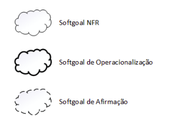
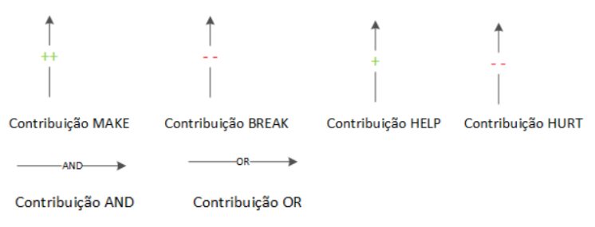
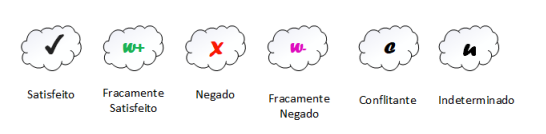
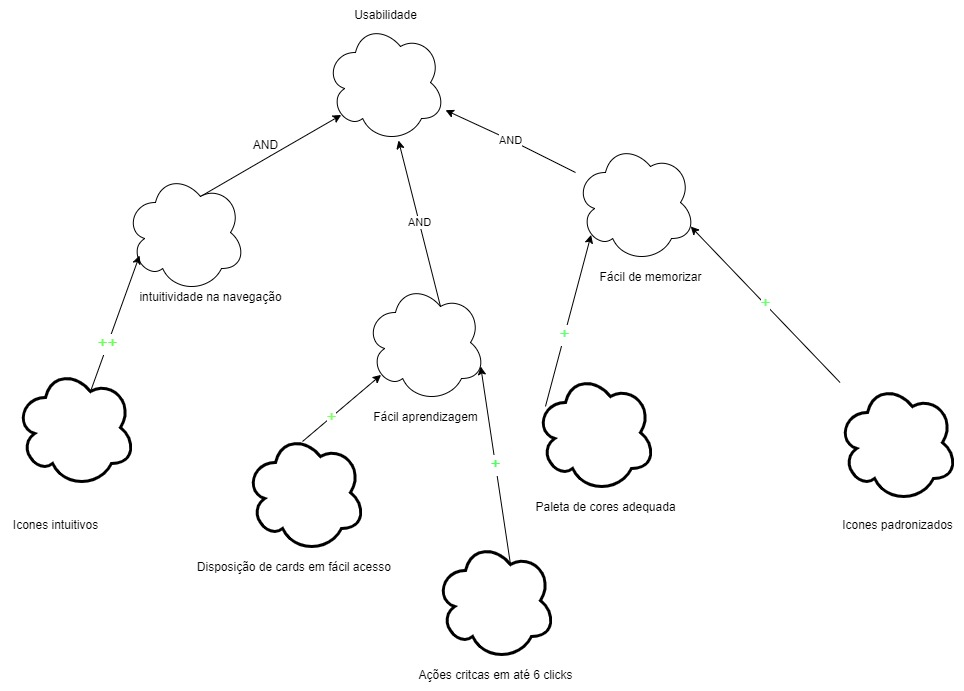
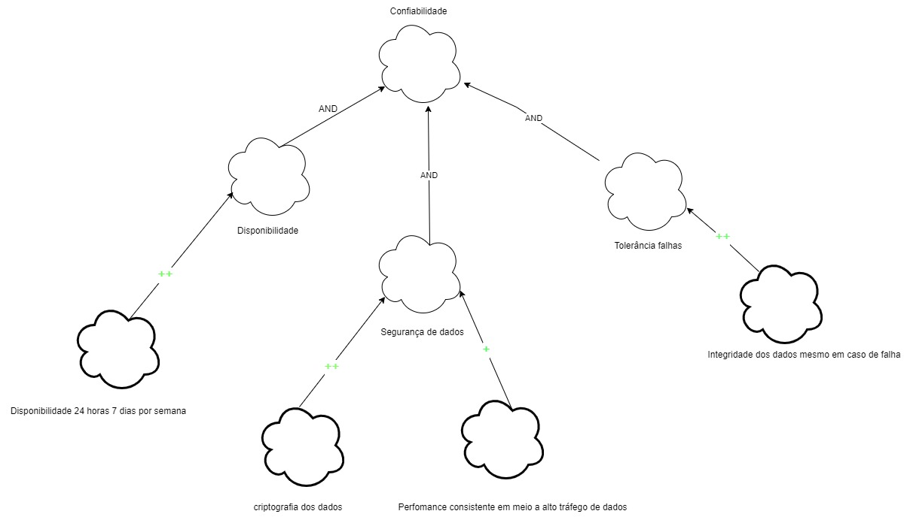

# NFR Framework

## 1. Introdução

O NFR Framework, sigla para Non-Functional Requirements Framework, é uma abordagem estruturada para a gestão e análise de requisitos não funcionais em projetos de desenvolvimento de software. Requisitos não funcionais são critérios que descrevem as características do sistema que não estão diretamente relacionadas com sua funcionalidade, mas sim com sua qualidade, desempenho, segurança, usabilidade e outros aspectos que afetam sua eficácia e eficiência.
Ao utilizar o NFR Framework, os profissionais de desenvolvimento de software podem melhorar a compreensão e a especificação dos requisitos não funcionais, bem como garantir que esses requisitos sejam levados em consideração ao longo do ciclo de vida do projeto. Isso ajuda a evitar problemas e retrabalhos futuros, além de aumentar a qualidade e a satisfação dos usuários finais.

## 2. Metodologia 

Os diagramas SIG (softgoal interdependency Graph)  que serão representados adiante, foram elaborados a partir dos requisitos não funcionais já apresentados anteriormente no documento da [Especificação Suplementar](EspecificacaoSup.md).

Existem três tipos de softgoals: Softgoals NFR, Softgoals de Operacionalização e Softgoals de Afirmação. Estes são descritos a seguir:
* **Softgoals NFR**: representam os Requisitos Não- Funcionais  e podem estar interrelacionados, organizados em catálogos e apresentados de forma hierárquica no desenvolvimento do projeto.
* **Softgoals de Operacionalização**: representam soluções de implementação para satisfazer softgoals NFR ou outros softgoals de operacionalização. Essas soluções incluem operações, processos, representações de dados, struturações e restrições no sistema alvo para atender às necessidades indicadas pelos softgoals NFR e de operacionalização.
* **Softgoals de Afirmação**: permitem que as características do domínio (como prioridades e carga de trabalho) sejam consideradas e devidamente refletidas no processo de tomada de decisão. Eles servem como justificativa para apoiar ou negar a forma como os softgoals são priorizados, refinados e os componentes são selecionados. Os softgoals de afirmação fornecem as razões para as decisões de desenvolvimento, facilitando a revisão, a justificativa e a mudança do sistema, bem como o aprimoramento da rastreabilidade

No NFR framework é possível a utilização de diversos tipos de contribuições que descrevem como a satisfação ou não de um softgoal descendente contribui para a satisfação do softgoal ascendente. A seguir apresentamos os tipos de  contribuição utilizadas pelo framework.

O procedimento de avaliação determina o grau que os requisitos não funcionais são satisfeitos por um conjunto de decisões. Dessa forma, o procedimento de avaliação determina se cada softgoal ou interdependência do SIG foi suficientemente satisfeito. Para isso, são atribuídos rótulos para os softgoals. Os tipos de rótulos utilizados são: satisfeito, fracamente satisfeito, negado, fracamente negado, conflitante, indeterminado. Esses rótulos são ilustrados na figura a seguir.

## 3. NFR

## NFR de Usabilidade

## NFR de Usabilidade com propagação

## NFR de Confiabilidade

## NFR de Confiablidade com propagação

## NFR de Desempenho

## NFR de Desempenho com propagação

## NFR de Suportabilidade

## NFR de Suportabilidade com propagação

## 8. Bibliografia

> CASTRO, Jaelson - Requisitos Não funcionais. 2014. Disponivel em: [link](https://www.cin.ufpe.br/~if716/arquivos20152/experimentoBruno/Aula2/Aula2-Parte2-NFR%20Framework.pdf)
>  SILVA, Reinaldo Antônio da. NFR4ES: Um Catálogo de Requisitos Não-Funcionais para Sistemas Embarcados. 2019. Disponivel em: [link](https://repositorio.ufpe.br/handle/123456789/34150)

## 9. Histórico de versão

|  Versão  |   Data   |                      Descrição                      |    Autor(es)   |  Revisor(es)  |
| -------- | -------- | --------------------------------------------------- | -------------- | ------------- |
|  `1.0`   | 23/05/23 | Criação da versão inicial do NFR Framework | Vitor manoel | Samuel Sato  |

