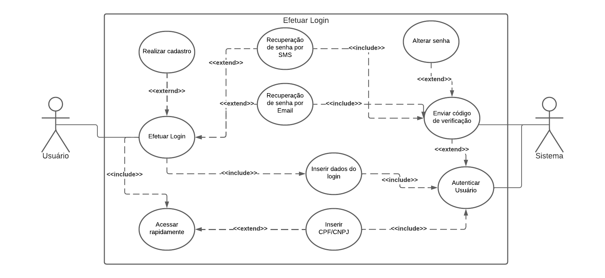

## 1. Introdução

O diagrama de casos de uso é uma ferramenta gráfica de modelagem utilizada na engenharia de software para representar as funcionalidades de um sistema a partir da perspectiva do usuário. É uma das técnicas mais utilizadas para elicitação e documentação de requisitos funcionais, pois permite identificar os atores envolvidos no sistema e descrever como eles interagem com o mesmo.

## 2. Metodologia

Para a realização da atividade de diagramação no artefato, foi utilizada a ferramenta de representação de diagramas [LucidChart](https://www.lucidchart.com/pages/pt). O diagrama de casos de uso irá demonstrar os casos de uso principais do sistema, que são representados por elipses, e os atores envolvidos no sistema, que são representados por retângulos. Os casos de uso são conectados aos atores através de linhas, que indicam a interação entre eles. Além disso, é possível incluir descrições detalhadas de cada caso de uso, com informações sobre pré-condições, pós-condições, fluxos alternativos e exceções.

## 3. Representação do Diagrama UML - Casos de Uso

### 3.1 Ator(es)

 Atores são caracterizados por serem os usuários do sistema ou um tipo de usuário[1].
<h6 align = "center">

 

 </h6>

<h6 align = "center"> Figura 1: Ator </h6>
<h6 align = "center"> Fonte: Autor, 2023 </h6>

### 3.2 Caso de uso

Caso de uso é uma tarefa ou funcionalidade realizada pelo ator[1].
<h6 align = "center">

 

 </h6>

<h6 align = "center"> Figura 2: Caso de uso </h6>
<h6 align = "center"> Fonte: Autor, 2023 </h6>

### 3.3 Cenário 

Cenário é uma sequência de eventos que estão acontecendo enquanto o usuário interage com o sistema[1].

<h6 align = "center">

 

 </h6>

<h6 align = "center"> Figura 3: Cenário </h6>
<h6 align = "center"> Fonte: Autor,2023 </h6>

### 3.4 Pontos de extensão

Ponto de extensão é a especificação de um caso de uso base, sendo referido por um relacionamento de extensão entre o caso de uso e base e o de extensão[2].

<h6 align = "center">

 

 </h6>

<h6 align = "center"> Figura 4: Pontos de extensão </h6>
<h6 align = "center"> Fonte: Autor, 2023 </h6>

### 3.5 Comunicação 

É o procedimento que liga o ator ao caso de uso, como demonstrado na Figura 5, possui variações. A comunicação apresenta duas notações de relacionamentos:

**Include**: Relação de um caso de uso que necessita executar o caso de uso através da chamada de outro caso de uso[1]. 
- Notação na diagramação: <<include\>\>

**Extend**: Relação de um caso de uso que executa sem necessidade de outro caso de uso, entretanto, pode ter novas etapas. Sendo assim o caso de uso extendido pode ou não ser executado[3].
- Notação na diagramação: <<extend\>\>

<h6 align = "center">

 
    
 </h6>

<h6 align = "center"> Figura 5: Comunicação </h6>
<h6 align = "center"> Fonte: Autor, 2023 </h6>

## 4. Diagrama de Casos de Uso

<h6 align = "center">

 

 </h6>

<h6 align = "center"> Figura 6: Caso de uso geral </h6>
<h6 align = "center"> Fonte: Autor, 2023 </h6>

## UC01 - Realizar Cadastro

<h6 align = "center">

 

 </h6>

<h6 align = "center"> Figura 7: Realizar cadastro </h6>
<h6 align = "center"> Fonte: Autor, 2023 </h6>

| UC01	| Realizar cadastro |
| ----- | ------------- |
| **Descrição** |Funcionalidade que permite o cadastro do usuário na aplicação.	 |
| **Ator(es)**	| Usuário. |
| **Pré-Condições** | O Usuário não deve estar logado na aplicação. |
| **Pós-Condições** | O Usuário deve acessar conseguir acessar a conta cadastrada.|
| **Fluxo Principal** |	**[FP01] Realizar cadastro**   1. O Usuário seleciona " Ainda não tem conta? Clique aqui".   2. O Usuário preenche os dados cadastrais.   3. O Sistema valida os dados preenchidos.   4. O Sistema autentica o usuário.   5. O Usuário é redirecionado para a página de Login.|
| **Fluxo(s) Alternativo(s)** | - | 
| **Ponto(s) de Extensão**	|**[PE01] Efetuar Login**   1. O Usuário acessa a página de Login.|
| **Fluxo(s) de Exceção** | **[FE01] Dados cadastrais inválidos**   1. O Sistema apresenta uma mensagem informando os campos inválidos.|

<h6 align = "center"> Tabela 1: Realizar cadastro </h6>
<h6 align = "center"> Fonte: Autor, 2023 </h6>

## UC02 - Efetuar Login

<h6 align = "center">

 

 </h6>

<h6 align = "center"> Figura 8: Efetuar Login </h6>
<h6 align = "center"> Fonte: Autor, 2023 </h6>

| UC02	| Efetuar Login |
| ----- | ------------- |
| **Descrição** |	Funcionalidade que possibilidade o usuário efetuar login |
| **Ator(es)**	| Usuário e Sistema(Aplicação Petz) |
| **Pré-Condições** | O Usuário não deve estar logado na aplicação |
| **Pós-Condições** |  O Usuário estará logado na aplicação   O Usuário tem acesso as funcionalidades que requerem login |
| **Fluxo Principal** |	**[FP02] Efetuar Login**  1. O Usuário inicia a aplicação.  2. O Usuário preenche com Email ou CPF e com a senha o campo de login.   3. O Usuário clica em "Entrar".   4. O Sistema autentica o usuário.   5. O Sistema redireciona o usuário para a aplicação principal |
| **Fluxo(s) Alternativo(s)** | - | 
| **Ponto(s) de Extensão**	| **[PE02] Alterar Senha**  1. O Usuário clica em " Esqueci minha senha".   2. O Usuário escolhe a forma de recuperar a senha(Email ou SMS).   3. O Sistema envia um código de recuperação através do meio escolhido.   4. O Usuário preenche o campo com o código de vericação.   5. O Usuário altera a senha.  **[PE03] Realizar Cadastro**   1.  **UC01**| 
| **Fluxo(s) de Exceção** |  |

<h6 align = "center"> Tabela 2: Efetuar Login </h6>
<h6 align = "center"> Fonte: Autor, 2023 </h6>

## UC03 - Compra de produto

<h6 align = "center">

 

 </h6>

<h6 align = "center"> Figura 9: Compra de produto </h6>
<h6 align = "center"> Fonte: Autor, 2023 </h6>

| UC03	| Compra de produto |
| ----- | ------------- |
| **Descrição** | Funcionalidade que permite efetuar a compra de produtos |
| **Ator(es)**	| Usuário e Sistema(Aplicação Petz)|
| **Pré-Condições** | O Usuário deve estar logado na aplicação.  |
| **Pós-Condições** | O Usuário deve ter o pedido realizado. |
| **Fluxo Principal** |	**[FP03] Compra de produto**  1. O Usuário seleciona item.   2. O Usuário adiciona o item ao carrinho.   3. O Usuário preenche o campo de CEP.   4. O Usuário seleciona como receber o produto(Retirar na loja ou solicitar envio).   5. O Sistema redireciona o usuário para a página de pagamento.|
| **Fluxo(s) Alternativo(s)** | - | 
| **Ponto(s) de Extensão**	| **[PE04] Inserir Cupom**   1. O Usuário insere um cupom no campo válido.   2. O Sistema valida o cupom.   3. O Sistema retorna o novo valor do produto.|
| **Fluxo(s) de Exceção** | **[FE02] Produto Esgotado**   1. O Sistema informa que o item não está disponível para compra.   **[FE03] Cupom inválido**   1. O Sistema informa que o cupom não é válido.|

<h6 align = "center"> Tabela 3: Compra de produto </h6>
<h6 align = "center"> Fonte: Autor, 2023 </h6>

## UC04 - Efetuar Pagamento

<h6 align = "center">

 

 </h6>

<h6 align = "center"> Figura 10: Pagamento </h6>
<h6 align = "center"> Fonte: Autor, 2023 </h6>

| UC04| Efetuar Pagamento |
| ----- | ------------- |
| **Descrição** |	Funcionalidade que permite a realização de pagamentos na aplicação |
| **Ator(es)**	| Usuário e Sistema(Aplicação Petz) |
| **Pré-Condições** | O Usuário deve estar logado na aplicação.   O Usuário deve ter realizado um pedido. |
| **Pós-Condições** | O Usuário deve ter realizado o pagamento do pedido.   O Usuário deve se capaz de acomapanhar o pedido.|
| **Fluxo Principal** |	**[FP04] Efetuar Pagamento**  1. O Usuário deve ter escolhido o meio de entrega(Retirar na loja ou solicitar envio).  2. O Usuário seleciona o método de pagamento.   3. O Usuário realiza o pagamento.   4. O Sistema autentica o pagamento.   5. O Usuário pode acompanhar o pedido. |
| **Fluxo(s) Alternativo(s)** |  | 
| **Ponto(s) de Extensão**	| **[PE05] Retirar na loja**   1. O Sistema não adiciona taxa de entrega.   2. O Sistema sinaliza a loja que pode ocorrer a retirada.   **[PE06] Solicitar envio**   1. O Usuário adiciona o endereço de envio.   2. O Sistema retorna o valor de envio.|
| **Fluxo(s) de Exceção** | **[FE03] Pagamento Inválido**   1. O Sistema informa uma mensagem de erro sobre a situação do pagamento. |

<h6 align = "center"> Tabela 4: Efetuar pagamento </h6>
<h6 align = "center"> Fonte: Autor, 2023 </h6>

## UC05 - Consultar conta 

<h6 align = "center">

 

 </h6>

<h6 align = "center"> Figura 11: Conta </h6>
<h6 align = "center"> Fonte: Autor, 2023 </h6>

| UC05	| Consultar conta |
| ----- | ------------- |
| **Descrição** | Funcionalidade que permite consultar os dados atrelados a conta do usuário. |
| **Ator(es)**	| Usuário e Sistema(Aplicação Petz).|
| **Pré-Condições** | O Usuário deve estar logado na aplicação. |
| **Pós-Condições** | O Usuário visualiza as informações pretendidas.   O Usuário edita as informações pretendidas.  O Usuário pode sair da conta.|
| **Fluxo Principal** |	**[FP05] Consultar dados da conta**  1. O Usuário seleciona "Minha Conta".   2. O Usuário seleciona a opção em "Meus dados" (cadastro, alterar senha, endereço, pets, favoritos, carteira).   3. O Usuário visualiza ou edita os dados. |
| **Fluxo(s) Alternativo(s)** | **[FP01] Acompanhar pedido**   1. O Usuário seleciona "Acompanhar pedido".   2. O Sistema retorna as informações dos pedidos realizados.  **[FP02] Editar assinaturas**   1. O Usuário seleciona "Editar assinaturas".   2. O Sistema retorna as assinaturas vigentes.   3. O Usuário seleciona a assinatura para editar.   **[FP03] Serviços**   1. O Usuário seleciona entre "Banho e Tosa" e "Lojas".   2a. O Usuário seleciona o agendamento de "Banho e Tosa"   2b. O Usuário visualiza as lojas Petz.| 
| **Ponto(s) de Extensão**	| **[PE07] Código de verificação**   1. O Sistema envia o código de verificação para alterar a senha. |
| **Fluxo(s) de Exceção** |  |

<h6 align = "center"> Tabela 5: Consultar conta </h6>
<h6 align = "center"> Fonte: Autor, 2023 </h6>

## 5. Referências Bibliográficas

> [1] DevMedia. O que é UML e Diagramas de Caso de Uso: Introdução Prática à UML. 2012. DevMedia. Disponível em: https://www.devmedia.com.br/o-que-e-uml-e-diagramas-de-caso-de-uso-introducao-pratica-a-uml/23408. Acessado em 16 de maio de 2023.

> [2] IBM. Pontos de extensão. IBM. Disponível em: https://www.ibm.com/docs/pt-br/rational-soft-arch/9.6.1?topic=cases-extension-points. Acessado em 16 de maio de 2023.

> [3] SERRANO M., SERRANO M. Requisitos - Aula 13. Disponível na plataforma Aprender3. Acessado em 16 de maio de 2023.

## 6. Histórico de versão

| Versão | Data     | Descrição                                  | Autor(es)     | Revisor(es)   |
| ------ | -------- | ------------------------------------------ | ------------- | ------------- |
| `1.0`  | 16/05/23 | Criação do artefato de casos de uso | Magno Luiz |  Pedro Muniz |