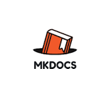
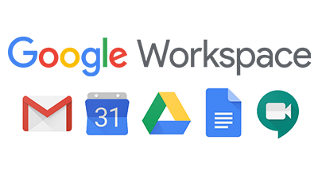
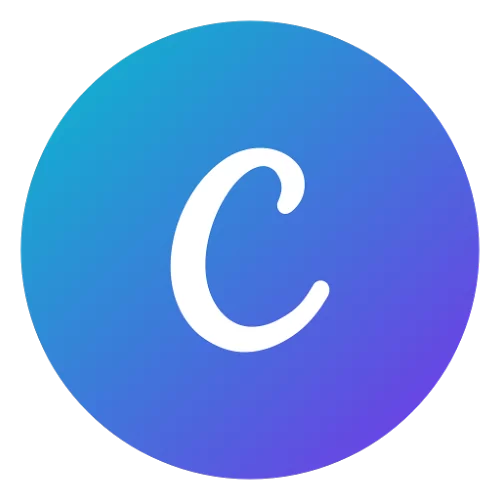

# Ferramentas do Projeto

## Introdução

Para realizar a análise do aplicativo Petz, serão necessários softwares para auxliiar o grupo no decorrer do projeto. As ferramentas estão apresentadas na [Tabela 1](#ferramentas-utilizadas).

## Ferramentas utilizadas

|           | Ferramenta | Objetivo |
| --------- | :--------: | -------- |
| { align=center, width="100" } | [GitHub](https://www.github.com) | Armazenar a documentação e os artefatos do projeto. |
| { align=center, width="100" } | [MkDocs](https://www.mkdocs.org) | Gerar páginas de documentação do projeto. |
| { align=center, width="100" } | [Telegram](https://web.telegram.org/) | Comunicação assíncrona e remota entre os integrantes. |
| { align=center, width="100" } | [Microsoft Teams](https://www.microsoft.com/pt-br/microsoft-365/microsoft-teams/free) | Reuniões remotas e gravação de apresentações. |
| { align=center, width="100" } | [Google Workspace](https://workspace.google.com/intl/pt-BR/) | Gestão e criação de formulários e planilhas de dados. |
| { align=center, width="100" } | [Figma](https://www.figma.com) | Elaboração de protótipos e elementos visuais. |
| { align=center, width="100" } | [Youtube](https://www.youtube.com) | Hospedagem das gravações das reuniões e apresentações |
| { align=center, width="100" } | [Canva](https://www.canva.com) | Criação de elementos visuais e slides. |
| { align=center, width="100" } | [Trello](https://www.trello.com) | Gestão de tarefas e datas. |

 Tabela 1: Ferramentas utilizadas (Fonte: Do autor, 2023).

## Referências bibliográficas

> Github, disponível no [link](https://www.github.com).

> MkDocs, disponível no [link](https://www.mkdocs.org).

> Telegram, disponível no [link](https://web.telegram.org/).

> Microsoft Teams, disponível no [link](https://www.microsoft.com/pt-br/microsoft-365/microsoft-teams/free).

> Google Workspace, disponível no [link](https://workspace.google.com/intl/pt-BR/).

> Figma, disponível no [link](https://www.figma.com).

> Youtube, disponível no [link](https://www.youtube.com).

> Canva, disponível no [link](https://www.canva.com).

> Trello, disponível no [link](https://www.trello.com).

## Histórico de versão

|  Versão  |   Data   |                      Descrição                      |    Autor(es)   |  Revisor(es)  |
| -------- | -------- | --------------------------------------------------- | -------------- | ------------- |
|  `1.0`   | 13/04/23 | Criação e organização do artefato | Pedro Muniz | Felipe Corrêa |