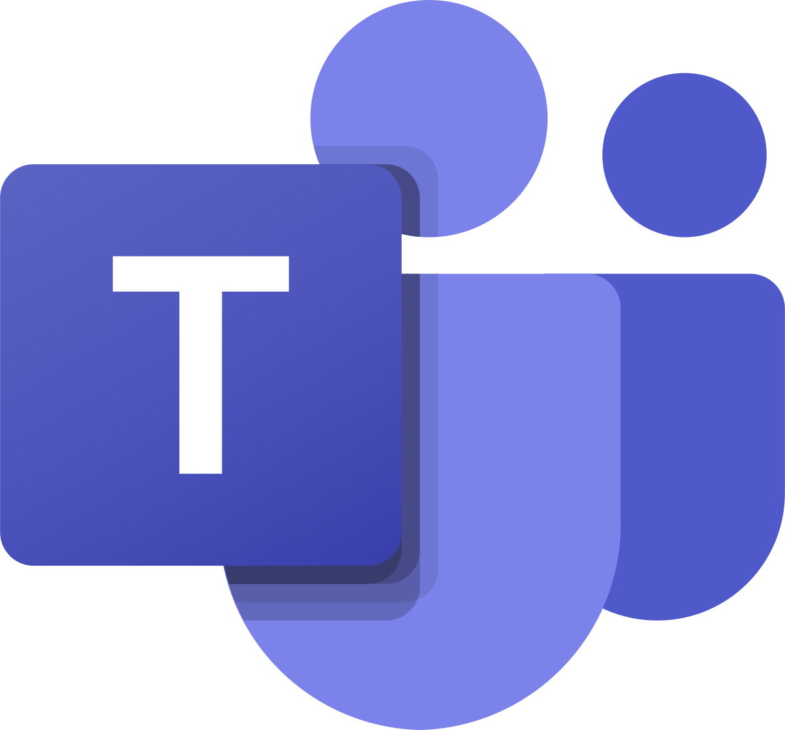

# Ferramentas do Projeto

## 1. Introdução

Para realizar a análise do aplicativo Petz, serão necessários softwares para auxiliar o grupo no decorrer do projeto. As ferramentas estão apresentadas na [Tabela 1](#ferramentas-utilizadas).

## 2. Ferramentas utilizadas

|                                                                                             |                                      Ferramenta                                       | Objetivo                                              |
| ------------------------------------------------------------------------------------------- | :-----------------------------------------------------------------------------------: | ----------------------------------------------------- |
| { align=center, width="100" }              |                           [GitHub](https://www.github.com)[1]                            | Armazenar a documentação e os artefatos do projeto.   |
| { align=center, width="100" }              |                           [MkDocs](https://www.mkdocs.org)[2]                            | Gerar páginas de documentação do projeto.             |
| { align=center, width="100" }          |                         [Telegram](https://web.telegram.org/)[3]                         | Comunicação assíncrona e remota entre os integrantes. |
| { align=center, width="100" }      | [Microsoft Teams](https://www.microsoft.com/pt-br/microsoft-365/microsoft-teams/free)[4] | Reuniões remotas e gravação de apresentações.         |
| { align=center, width="100" } |             [Google Workspace](https://workspace.google.com/intl/pt-BR/)[5]              | Gestão e criação de formulários e planilhas de dados. |
| { align=center, width="100" }    |               [Fake Name Generator](https://www.fakenamegenerator.com/)[6]               | Criação de identidades geradas aleatoriamente.        |
| { align=center, width="100" }                |                            [Figma](https://www.figma.com)[7]                             | Elaboração de protótipos e elementos visuais.         |
| { align=center, width="100" }            |                          [Youtube](https://www.youtube.com)[8]                           | Hospedagem das gravações das reuniões e apresentações |
| { align=center, width="100" }                |                            [Canva](https://www.canva.com)[9]                             | Criação de elementos visuais e slides.                |
| { align=center, width="100" }              |                           [Trello](https://www.trello.com)[10]                            | Gestão de tarefas e datas.                            |
| { align=center, width="100" } | [This Person Does Not Exist](https://this-person-does-not-exist.com/en)[11] | Geração de imagens para as personas. |
| { align=center, width="100" } | [Miro](https://miro.com)[12] | Criação de elementos visuais colaborativos. |

<h6 align = "center"> Tabela 1: Ferramentas utilizadas </h6>
<h6 align = "center"> Fonte: Autor, 2023 </h6>

## 3. Referências Bibliográficas

> [1] Github, acesso em: 19 de abril de 2023. Para mais informações acesse:[link](https://www.github.com).

> [2] MkDocs, acesso em: 19 de abril de 2023. Para mais informações acesse:[link](https://www.mkdocs.org).

> [3] Telegram, acesso em: 19 de abril de 2023. Para mais informações acesse:[link](https://web.telegram.org/).

> [4] Microsoft Teams, acesso em: 19 de abril de 2023. Para mais informações acesse:[link](https://www.microsoft.com/pt-br/microsoft-365/microsoft-teams/free).

> [5] Google Workspace, acesso em: 19 de abril de 2023. Para mais informações acesse:[link](https://workspace.google.com/intl/pt-BR/).

> [6] Fake Name Generator, acesso em: 17 de abril de 2023. Para mais informações acesse:[link](https://www.fakenamegenerator.com/).

> [7] Figma, acesso em: 19 de abril de 2023. Para mais informações acesse:[link](https://www.figma.com).

> [8] Youtube, acesso em: 19 de abril de 2023. Para mais informações acesse:[link](https://www.youtube.com).

> [9] Canva, acesso em: 19 de abril de 2023. Para mais informações acesse:[link](https://www.canva.com).

> [10] Trello, acesso em: 19 de abril de 2023. Para mais informações acesse:[link](https://www.trello.com).

> [11] This Person Does Not Exist, acesso em: 24 de abril de 2023. Para mais informações acesse: [link](https://this-person-does-not-exist.com/en).

> [12] Miro, acesso em: 30 de abril de 2023. Para mais informações acesse: [link](https://miro.com).

## 4. Histórico de versão

| Versão | Data     | Descrição                               | Autor(es)     | Revisor(es)   |
| ------ | -------- | --------------------------------------- | ------------- | ------------- |
| `1.0`  | 13/04/23 | Criação e organização do artefato       | Pedro Muniz   | Felipe Corrêa |
| `1.1`  | 29/04/23 | Adição da ferramenta Fake Name Generator | Felipe Corrêa | Magno Luiz    |
|  `1.2`   | 30/04/23 | Padronização de legendas | Pedro Muniz | Felipe Corrêa |
|  `1.3`   | 30/04/23 | Adição da ferramenta Miro | Felipe Corrêa | Pedro Muniz |

