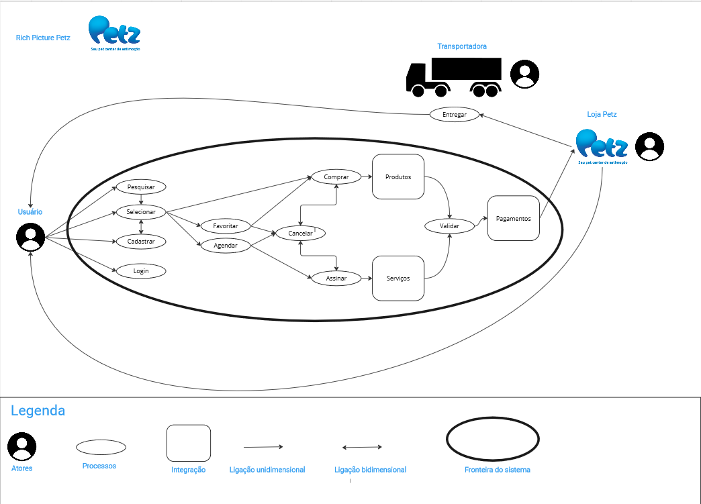

# Rich Picture do aplicativo

## Introdução

Rich Pictures são usadas para retratar situações complexas. Sendo uma ferramenta efetiva para análise de problemas e situações, além de ser um meio de transmissão de ideias. As Rich Pictures podem ajudar a identificar requisitos, processos, atores, relacionamentos, problemas e conflitos quando formulando ideias sobre o projeto. Assim, torna-se necessária a construção de um Tich Picture do aplicativo analisado.

## Sobre a aplicação

O aplicativo retrata as necessidades comerciais da Petz, um dos maiores petshops do Brasil, que apresenta diversas lojas no território nacional e grande demanda de seus produtos e serviços. 

O aplicativo da Petz foi selecionado após cada integrante do grupo ter revisado as especificações para o projeto, em que foi realizada uma Rich Picture para cada aplicação. 

Os critérios que colaboraram para a escolha da aplicação foram:

- A aplicação não havia sido trabalhada no curso de Requisitos de Software.
- A aplicação demonstra funcionalidades de comércios eletrônicos e facilmente identificáveis.
- A aplicação possui grande quantidade de usuários baseada na popularidade da Petz no Brasil como petshop.
- Um dos integrantes do grupo já possui familiaridade com a aplicação em relação ao uso e suas funcionalidades.

## Metodologia

As Rich Pictures concretizadas para a avaliação de aplicações e sistemas postos nas escolhas para projeto do curso de Requisitos de Software apresentam características em comum, com aspectos facilmente identificados:

- Atores;
- Operações e processos;
- Integrações e conceitos de banco de dados;
- Fronteiras do sistema;
- Ligações para relacionamento de atores, processos e integrações através de linhas e setas;

## Primeira versão do Rich Picture da Petz

A figura 1 mostra a primeira versão do Rich Picture do aplicativo da Petz, entregue como atividade individual por Lucas Rodrigues.

Figura 1: primeira versão do Rich Picture da Petz (Fonte: Lucas Rodrigues, 2023).

## Rich Picture Final da Petz

A figura 2 mostra uma versão refinada da Rich Picture do aplicativo da Petz, realizada em conjunto por todos os integrantes e que será usada para a construção de artefatos futuros.

Figura 2: Versão final do Rich Picture da Petz (Fonte: Todos os integrantes, 2023).

## Legenda da Rich Picture

A tabela 1 descreve a legenda da Rich Picture final do aplicativo da Petz, a fim de delinear o que significa cada componente utilizado em sua confecção.

| Componentes | Descrição |
|-------------|-----------|
|Atores       |São os usuários e operadores do sistema, podendo realizar diversas operações.
|Processos    | É um processo específico do sistema. São desencadeadas a partir de atores, outros processos ou requisitos de outras integrações.|
|Integração   | São a base de dados em que processos necessitam acesso para realização de suas operações.|
|Ligação unidimensional | Relacionam de um ator, processo ou integração a outro componente.|
|Ligação bidimensional | Relacionam de um ator, processo ou integração a outro componente e deste mesmo componente ao inicial.|
|Fronteira do sistema| É o delimitador do sistema e a responsabilidade de seus processos.|

Tabela 1 - Legenda (Fonte: Do autor, 2023).

## Histórico de versão

|  Versão  |   Data   |                      Descrição                      |    Autor(es)   |  Revisor(es)  |
| -------- | -------- | --------------------------------------------------- | -------------- | ------------- |
|  `1.0`   | 16/04/23 | Criação da página de Pré-Rastreabilidade | Magno Luiz e Pedro Ferreira Muniz      | Felipe Mastromauro  |

## Referências Bibliográficas

> MONK, Andrew; HOWARD, Steve. Methods & tools: the rich picture: a tool for reasoning about work context. Interactions, Nova Iorque, v. 5, n. 2, p. 21-30, mar. 1998. Disponível em: https://dl.acm.org/doi/10.1145/274430.274434. Acesso em: 8 abr. 2023.
